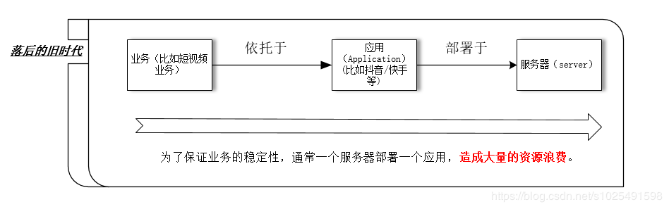
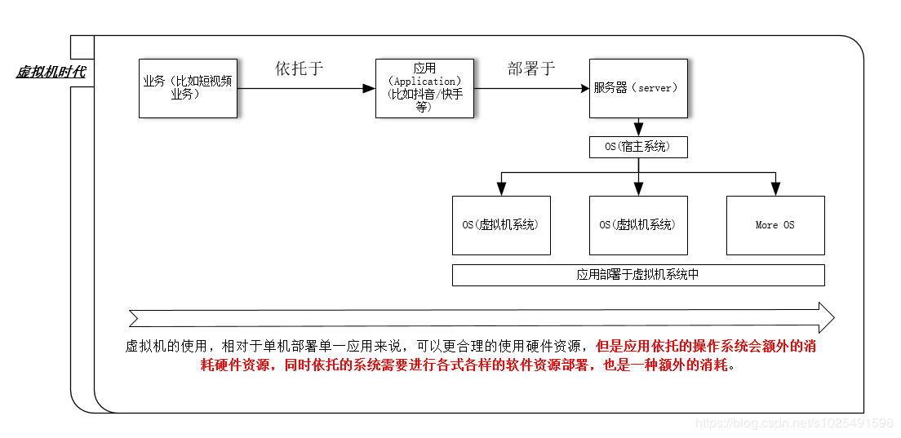
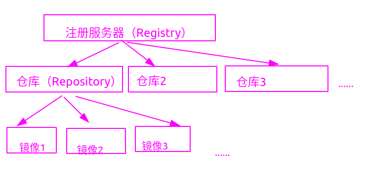
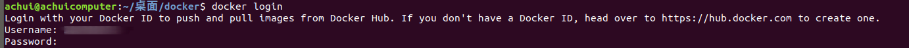
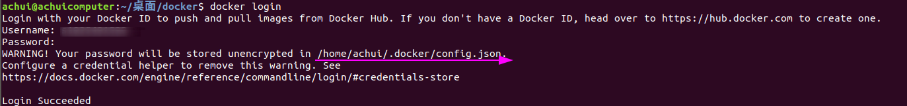

# docker学习笔记（一） docker基础

[TOC]

## 0 前言

**参考资料**

- 《深入浅出docker》
- 《第一本Docker书》
- 《docker技术入门与实战》

## 1 docker简介

### 1.1 容器的发展过程

#### 1.1.1 单服务器承载单一应用的时代

这种承载形式，如下图所示，虽然可以满足承载业务的需求，但是极大的浪费了计算机的硬件资源，造成了额外的资源消耗，毕竟硬件资源和电力等的消耗，极大的增加了项目成本。



#### 1.1.2 虚拟机时代

虚拟机的诞生，使得在单一服务器中稳定的部署多个应用，成为可能，通过虚拟机的使用，可以极大的增加硬件资源的利用率，极大的降低了公司和项目中的硬件资源开销。虚拟机的应用形式如下所示：



虽然虚拟机的出现极大程度上，帮助我们更好，更合理的使用硬件资源，但是，虚拟机在宿主系统之上，依托于专用操作系统，来承载不同的应用，承载哟应用的虚拟机系统可能需要授权，比如windows系列的系统，在商业领域都是需要付费的，否则容易吃到律师函，当然家庭领域也是需要付费的。如果你使用linux的免费发行版如Ubuntu server，Centos这类系统去承载应用，虽然免去了付费的过程，但是操作系统本身就是一个软件，它也会消耗硬件资源，同时虚拟机的构建本质上依托于各种虚拟机管理平台，所以针对不同管理平台，虚拟机的移植性较差，而且虚拟机的启动也较为缓慢。所以，虚拟机去承载应用的做法依然不是一个完美的解决办法。

#### 1.1.3 容器时代

对于大型的公司，它们使用容器技术来代替虚拟机方案，容器可以共享宿主机系统的资源，这样我们就省去了部署应用的专用操作系统，如虚拟机中的虚拟操作系统，这样做的好处更进一步提升了硬件利用率，同时节省了软件资源的开销。容器还具有快速启动，方便移植等多种优点，但是容器技术虽然很好，但是容器技术的实现却很复杂，不是每个公司都可以承载这样的技术落地，造成的结果就是饱汉子不知饿汉子饥，容器技术无法大面积普及，所以，我们依旧停留在虚拟机时代，直到Docker技术的出现。

容器可以理解为运行在操作系统上的用户空间，所以也被称之为操作系统级虚拟化（因为这种依赖于宿主系统内核的特性，导致容器只能运行与底层宿主系统相同或相似的操作系统）。

以下为传统的软件虚拟化与容器的基本架构对比。


#### 1.1.4 Docker时代

Docker是现代容器技术中的一种，意味着现代容器技术有很多中，不仅是Docker，只是Docker比较流行，Docker是一个能够把开发的应用程序自动部署到容器中的开源引擎，在进行学习Docker前，我们先进行一些相关内容理解，如下所示：

- 运行中的容器共享宿主机的内核，意味着Linux系统下的容器，是不能在windows上应用的，但是目前windows版本下的容器，会在windows上系统上产生一个虚拟的linux系统，用来承载容器，这样本质上容器调用的还是linux的内核；
- kubernetes是一种，容器编排软件，默认采用Docker作为默认容器运行时，可以简单的理解为容器的管理软件；
- Docker从17.03 版本之后分为 CE（Community Edition: 社区版） 和 EE（Enterprise Edition: 企业版），我们用社区版就可以了；
- docker基于go语言,采用C/S架构；

### 1.2 Docker简介

####  1.2.1 Docker架构简介

> 类似于js一样，容器有多种实现，所以出现了OCI组织来发布标准，规范容器基础架构中的基础组件，不同的容器实现技术去实现这些规范，来保证

> ce 社区版
> ee 企业版
- docker


查看docker是否正确安装，使用如下命令，可输出容器和镜像数量，docker基本配置信息等。

```shell
docker info
```

####  1.2.3 镜像的基础概念

Docker 镜像是用于创建 Docker 容器的模板，比如 Ubuntu 系统。

Docker的每个镜像都有自己的唯一ID，我们可以通过引用镜像的ID或者镜像的名称来使用镜像。

docker镜像实际上等价于未运行的容器，通俗的讲镜像可以看作类，而容器是他的实例

容器是基于镜像启动的，一个容器中可以运行一个或者多个应用程序的进程

容器是独立运行的一个或一组应用，以及它们的运行态环境。

Docker 使用客户端-服务器 (C/S) 架构模式，使用远程API来管理和创建Docker容器。

Docker 容器通过 Docker 镜像来创建。
**注意事项：**
> 镜像是分层的，当不同的镜像包括相同的层时，本地仅存储了层的一份内容，减小了存储空间;  
> 
镜像
容器
仓库

ocker 镜像(Images)
	


Docker 容器(Container)
	


Docker 客户端(Client)
	

Docker 客户端通过命令行或者其他工具使用 Docker SDK (https://docs.docker.com/develop/sdk/) 与 Docker 的守护进程通信。

Docker 主机(Host)
	

一个物理或者虚拟的机器用于执行 Docker 守护进程和容器。

Docker Registry
	

Docker 仓库用来保存镜像，可以理解为代码控制中的代码仓库。

Docker Hub(https://hub.docker.com) 提供了庞大的镜像集合供使用。

一个 Docker Registry 中可以包含多个仓库（Repository）；每个仓库可以包含多个标签（Tag）；每个标签对应一个镜像。

通常，一个仓库会包含同一个软件不同版本的镜像，而标签就常用于对应该软件的各个版本。我们可以通过 <仓库名>:<标签> 的格式来指定具体是这个软件哪个版本的镜像。如果不给出标签，将以 latest 作为默认标签。

Docker Machine
	

Docker Machine是一个简化Docker安装的命令行工具，通过一个简单的命令行即可在相应的平台上安装Docker，比如VirtualBox、 Digital Ocean、Microsoft Azure。


通过`docker version`的运行可以检测客户端和服务端是否正常运行，以及是否可以正常通信。

```console
$ docker version
--------------------------------------------------------------------------------
Client: Docker Engine - Community
 Version:           19.03.8
 API version:       1.40
 Go version:        go1.12.17
 Git commit:        afacb8b7f0
 Built:             Wed Mar 11 01:25:46 2020
 OS/Arch:           linux/amd64
 Experimental:      false

Server: Docker Engine - Community
 Engine:
  Version:          19.03.8
  API version:      1.40 (minimum version 1.12)
  Go version:       go1.12.17
  Git commit:       afacb8b7f0
  Built:            Wed Mar 11 01:24:19 2020
  OS/Arch:          linux/amd64
  Experimental:     false
 containerd:
  Version:          1.2.13
  GitCommit:        7ad184331fa3e55e52b890ea95e65ba581ae3429
 runc:
  Version:          1.0.0-rc10
  GitCommit:        dc9208a3303feef5b3839f4323d9beb36df0a9dd
 docker-init:
  Version:          0.18.0
  GitCommit:        fec3683
```

### 1.3 安装Docker

较新的docker版本，是跨平台的，在Linux，Mac，Windows都是可以安装运行的。在不同的平台上通过不同的方式都可以安装docker，以下介绍最常用的安装方式。

#### 1.3.1 windows下安装docker

##### 1.3.1.1 windows下安装docker的注意事项

1. windows上安装docker，要求windows的版本为windows10（不包括家庭版，因为家庭版不支持Hyper-V），并且要且为64位版本，同时docker的版本只提供CE版本。

2. 需要启用操作系统的Hyper-V和容器特性，并且BIOS设置中需要开启硬件虚拟化支持（教新的电脑，一般都是默认支持和开启的）。

> 注： 
>  
> 开启容器特性和Hyper-v 的方式：  
> 
> 应用和功能 -> 程序和功能 -> 启用或关闭windows功能 -> 确认Hyper-V和容器已勾选。 

#### 1.3.2 linux下安装docker

##### 1.3.2.1 ubuntu下安装docker

通过官方脚本安装docker

```shell
wget -qO- https://get.docker.com/ | sh
```

将指定的普通用户添加到docker组中，以通过普通用户去使用docker

```shell
sudo usermod -aG docker your-user
```

通过以下命令确认安装是否成功

```shell
docker --version
```

显示结果如下所示：

```console

```
$ sudo usermod -aG docker your-user

在终端中输入docker可以获得所有参数，使用`docker command --help`可以获取某一个具体的命令使用方法,


docker info 或者docker version

## 2 镜像，容器，仓库的基本操作

- docker运行容器前需要在本地存在对应的镜像，如果镜像不存在，docker会尝试先从默认镜像仓库下载（默认使用docker hub公共注册服务器中的仓库），用户也可以通过配置，使用自定义的镜像仓库；
- 镜像是只读的，容器在启动的时候创建一层可写层作为最上层
- 

/var/lib/docker

```shell
docker container ls #查看正在运行中的容器
```

### 2.1 镜像

docker镜像是由文件系统叠加而成的，最底层是一个引导文件系统，即bootfs，第二层是root文件系统rootfs，rootfs可以是一种或者多种操作系统。

#### 2.1.1 列出docker主机中的镜像

通常我们通过`docker images`或`docker image ls`命令列出当前docker主机中所包含的镜像（通常刚安装好的docker主机，是没有镜像存在的），如下所示：

```console
$ docker images
-----------------------------------------------------

REPOSITORY          TAG                 IMAGE ID            CREATED             SIZE
ubuntu              18.04               4e5021d210f6        3 days ago          64.2MB
```

> **REPOSITORY** : 镜像来源于哪一个仓库  
> **TAG** : 镜像标签，用于标识同一个仓库的不同镜像  
> **IMAGE ID** ： 镜像的ID，唯一标识镜像， ID相同证明指向了同一个镜像  
> **CREATE** ： 镜像最后的更新时间  
> **SIZE** ： 镜像的大小，由于docker会复用不同镜像中的相同的层，所以实际大小比该值小  

#### 2.1.2 获取镜像

通常通过`pull`命令获取想要的镜像，镜像是构建容器的基石，想要运行容器，就需要拥有对应的镜像。

```console
$ docker pull --help
------------------------------------------------------

Usage:docker pull [OPTIONS] NAME[:TAG|@DIGEST]

Pull an image or a repository from a registry

Options:
  -a, --all-tags                Download all tagged images in the repository
      --disable-content-trust   Skip image verification (default true)
  -q, --quiet                   Suppress verbose output

```

**注意事项：**
> NAME代表仓库名称，而TAG代表标签名，如我们不配置具体的注册服务器时，默认从docker hub中的仓库拉取镜像，而在不指定TAG的时候（TAG往往用来标识版本信息），默认下载latest版本的镜像。镜像的名称一般由仓库名和标签名两部分构成，中间以冒号进行间隔。

以下演示从官方仓库Docker Hub拉取ubuntu18.04的镜像：

```shell
docker pull ubuntu:18.04
```

过程大致如下所示：

```console
$ docker pull ubuntu:18.04
--------------------------------------------------------------------------------
18.04: Pulling from library/ubuntu
5bed26d33875: Pull complete 
f11b29a9c730: Pull complete 
930bda195c84: Pull complete 
78bf9a5ad49e: Pull complete 
Digest: sha256:bec5a2727be7fff3d308193cfde3491f8fba1a2ba392b7546b43a051853a341d
Status: Downloaded newer image for ubuntu:18.04
docker.io/library/ubuntu:18.04
```

由于从官方的注册服务器中拉取镜像的时候，可以省略注册服务器的地址，所有上述的拉取命令完整表述应为如下所示：

```shell
docker pull registry.hub.docker.com/ubuntu:18:04
```
****
#### 2.1.3 镜像别名

通过`tag`命令可以对当前已有镜像进行别名设置，示例如下所示：

```console
$ docker tag ubuntu:18.04 achuiubuntu:study
----------------------------------------------------

REPOSITORY          TAG                 IMAGE ID            CREATED             SIZE
achuiubuntu         study               4e5021d210f6        4 days ago          64.2MB
myubuntu            gaga                4e5021d210f6        4 days ago          64.2MB
ubuntu              18.04               4e5021d210f6        4 days ago          64.2MB
ubuntu              latest              4e5021d210f6        4 days ago          64.2MB
```

#### 2.1.4 查看镜像的详细信息

通过`inspect`命令可以获取镜像的详细信息包括，制作者，适用架构，镜像中的各个层级的相关信息等。

```console
$ docker inspect ubuntu:18.04
----------------------------------------------------------------------------------------------
[
    {
        "Id": "sha256:4e5021d210f65ebe915670c7089120120bc0a303b90208592851708c1b8c04bd",
        "RepoTags": [
            "achuiubuntu:study",
            "myubuntu:gaga",
            "ubuntu:18.04",
            "ubuntu:latest"
        ],
        "RepoDigests": [
            "ubuntu@sha256:bec5a2727be7fff3d308193cfde3491f8fba1a2ba392b7546b43a051853a341d"
        ],
-----------------内容太长省略----------------------------------------------------
```

#### 2.1.5 镜像的搜索

#### 2.1.6 镜像的载入和导出

#### 2.1.8 镜像的创建和推送

创建镜像的方法有三种：

- 基于已有镜像的容器创建
- 基于本地模板导入
- 基于Dockerfile创建

```shell
Usage:	docker commit [OPTIONS] CONTAINER [REPOSITORY[:TAG]]

Create a new image from a container's changes

Options:
  -a, --author string    Author (e.g., "John Hannibal Smith <hannibal@a-team.com>")
  -c, --change list      Apply Dockerfile instruction to the created image
  -m, --message string   Commit message
  -p, --pause            Pause container during commit (default true)
```


#### 2.1.9 镜像的删除和清理

使用`docker rmi `或者`docker image rm`可以删除镜像

```shell
$ docker image rm myubuntu:gaga  # 删除myubuntu:gaga这个镜像
$ Untagged: myubuntu:gaga  # 成功删除时的提示
```

**注意事项：**
>  1）当一个镜像在本地有多个别名的时候，删除并不会影响其他的别名，他们依然引用原有的镜像。  
> 2）适用参数`-f`,可以强制删除拥有容器的镜像。  

通过`prune`可以删除临时镜像，配合参数`-f`参数，可以将无用镜像也全部删除。

```shell
docker image prune -f
```

### 2.2 容器

#### 2.2.1 容器使用前的注意事项

1. Docker 运行容器前需要本地存在对应的镜像，如果镜像不存在本地，Docker 会从镜像仓库下载（默认是 从Docker Hub 公共注册服务器中的仓库下载，也可以设置自定义镜像仓库进行下载）;
2. 容器是独立运行的一个或一组应用，是镜像运行时的实体；
3. 容器的唯一标识是短UUID或者 长UUID， 或者容器的名称，三者都是可以唯一的标识一个容器的；

#### 2.2.2 容器的创建及启停操作

##### 2.2.2.1 容器的创建和运行

通过`create`命令可以创建一个容器，具体演示如下：

```console
docker create [OPTIONS] IMAGE [COMMAND] [ARG...]
```


```shell
docker run -it 
# -i 参数保证了容器中的STDIN是开启的（只有标准输入开启我们才可以进行交互）
# -t 参数会让docker为容器分配一个伪tty终端，用于交互

```

先在本地检查是否拥有该镜像，没有的话会去默认的官方仓库中拉取对应的镜像

#### 2.2.2 容器查看

通过`ps`命令可以查看当前容器的列表信息，具体用法如下所示：

```shell
docker ps # 查看当前正在运行的容器
docker ps -a # 查看当前系统中容器的列表
doker ps -l  # 列出最后一次运行的容器（不管是正在运行还是已经停止了）
```

docker在每次容器创建的时候，都会为这个容器生成一个随机的名称，

#### 容器的命名

在创建容器的时候，如果不显示的为容器指定一个名称，Docker会随机的为容器起一个名称，用于标识容器，使用参数`name`,可以在创建新容器时，为容器指定名称，而不是通过docker随机赋予，注意起名时应该注意命名规范，名称由大小写字母，数字，下划线和横线，圆点组成。容器的名称具有唯一性。如下所示：

```shell
docker run --name ahcui_container -it ubuntu:18.04
```

#### 容器的启动

一个已经创建的容器，如果处于停止状态，我们可以通过以下命令来重新启动它。

```shell
docker start <容器标识>
docker start achui_container
```

重新附着到一个容器上

```shell
docker attach <容器标识>
```

docker logs 容器标识  # 打印容器日志

#### 容器的进程查看

```shell
docker top <容器标识>
```

--restart 重启容器

attach 命令有时候并不方便。当多个窗口同时 attach 到同一个容器的时候，所有窗口都会同步显示。当某个窗口因命令阻塞时,其他窗口也无法执行操作了。

exec

### 2.3 仓库

#### 2.3.1 Docker Hub

##### 2.3.1.1 仓库与Docker Hub简介

1. 仓库注册服务器上往往存放着多个仓库，每个仓库中又包含了多个镜像，每个镜像有不同的标签（tag），用于区分镜像；
2. 目前Docker Hub这个注册服务器上维护着大量的仓库，是当前最大的镜像存放服务器，其地址为：<https://hub.docker.com>；
3. Docker Hub中的仓库大致分为两类，一类为官方维护的顶层仓库(其中的镜像被称为根镜像)，一类为用户自己的用户仓库，用户仓库通常的命名为userName/registorName;
  


##### 2.3.1.2  从Docker hub拉取和上传镜像

前面介绍过镜像默认是从Docker Hub中进行拉取的，而且并不需要进行任何的认证，我们通过`pull`命令就可以拉取到自己想要的镜像。

上传镜像到Docker Hub，则需要登录认证，才可以进行上传，在命令行中登录docker hub时需要先行进行注册，如果你还没有注册可以根据提示跳转到相关页面进行注册。（登录了docker hub后才可以把自己的镜像推送到docker hub上）



登录成功后，doker会把认证的信息保存在用户的家目录下



##### 2.3.1.3 在Docker Hub中搜索镜像

搜索操作并不需要提前登录，在不登录的状态下也可以进行正常的登录操作。以下演示搜索jenkins镜像：

```console
$ docker search jenkins
---------------------------------------------------------------------------
NAME                                   DESCRIPTION                                                                 STARS               OFFICIAL            AUTOMATED
jenkins                                Official Jenkins Docker image                                 4715                  [OK]                
jenkins/jenkins               The leading open source automation server    1971                                    
-----------------------------内容太多省略---------------------------------------
```

#### 2.3.2 第三方镜像市场

#### 2.3.3 私有仓库搭建

## 3 数据存储

在docker中实现数据持久化或者多容器共享数据，主要有以下两种方式:

- 数据卷 ： 容器内数据直接映射到本地主机环境
- 数据卷容器： 使用特定容器维护数据卷

### 3.1 数据卷

数据卷类似于linux系统中的挂载行为，将宿主机的目录直接映射在容器当中。


## 4 端口映射与容器互联

首先需要明确在启动容器的时候，如果不指定对应参数，在容器外部是无法通过网络来访问容器内的网络应用和服务的。

### 4.1 容器与宿主机器的端口映射

在通过`create`或者`run`命令创建一个容器的时候，可以通过参数`P`或`p`来指定容器与宿主机的端口映射。

- `P`


