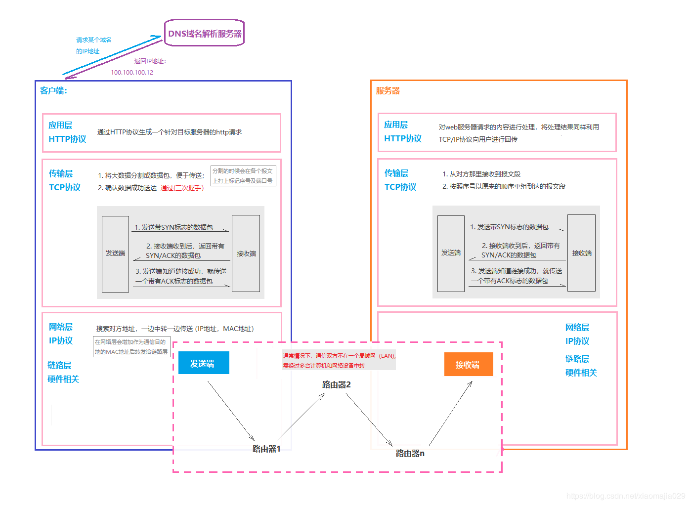

# http协议学习笔记

## 0 前言

**参考资料：**
- **《图解http》**
- **TCP/IP的分层管理** https://blog.csdn.net/xiaomajia029/article/details/83689531   

**深入资料：**

-  《HTTP权威指南》
-  《TCP/IP详解，卷I》

## 1 初始http协议

### 1.1 HTTP协议基本介绍

#### 1.1.1 什么是协议

​		协议的概念：计算机与网络设备要相互通信，双方就必须基于相同的方法，比如，如何探测到通信目标，由哪一边先发起通信，使用哪种语言进行通信，怎样结束通信等规则都需要事先确定，不同的硬件，操作系统之间的通信，所有的这一切都需要一种规则，这种规则称之为**协议**。

​		与互联网相关的协议的集合称为TCP/IP协议，而HTTP协议是TCP/IP协议的一个子集。

#### 1.1.2 TCP/IP的分层管理

​		为了方便管理和替换的需求，TCP/IP协议将其中的协议进行了层次化管理，一般可以分为四类，应用层， 传输层，网路层和数据链路层。下面我们使用HTTP在协议中的位置进行简单的举例，如下所示：

- HTTP协议称为超文本传输协议，是web应用的构建基础。

- HTTP协议是构建WWW的关键技术之一，文档页面由HTML语言实现，文档之间传递使用HTTP协议，文档位置定位使用URL标识。
- HTTP/1.1是当前主流的协议使用版本,HTTP协议是TCP/IP协议族的一个子集。
- 