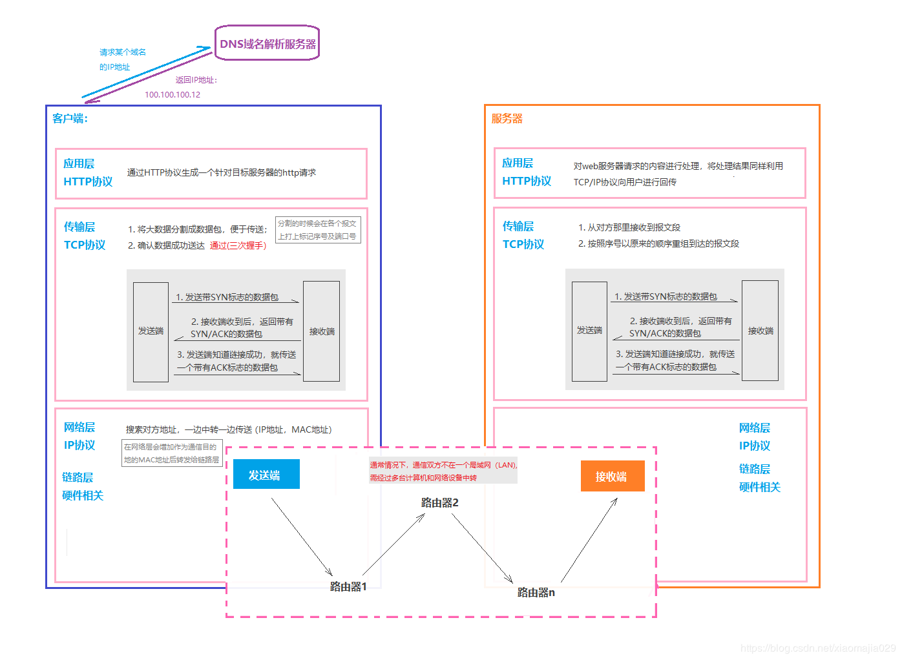

# http协议学习笔记

## 0 前言

**参考资料：**
- **《图解http》**
- **TCP/IP的分层管理** https://blog.csdn.net/xiaomajia029/article/details/83689531   

**深入学习的资料推荐：**

-  《HTTP权威指南》
-  《TCP/IP详解，卷I》

**www构成的三要素：**

- html ： 页面文档标记语言
- http ： 文档传输协议，当前主流的协议版本是1.1
- URL ： 文档所在地址

## 1 初始http协议

### 1.1 HTTP协议基本介绍

#### 1.1.1 什么是协议

> **协议的概念**：计算机与网络设备要相互通信，双方就必须基于相同的方法，比如，如何探测到通信目标，由哪一边先发起通信，使用哪种语言进行通信，怎样结束通信等规则都需要事先确定，不同的硬件，操作系统之间的通信，所有的这一切都需要一种规则，这种规则称之为**协议**。与互联网相关的协议的集合称为TCP/IP协议，而HTTP协议是TCP/IP协议的一个子集。

#### 1.1.2 TCP/IP的分层管理

​		为了方便管理和替换的需求，TCP/IP协议将其中的协议进行了层次化管理，一般可以分为四类，应用层， 传输层，网路层和数据链路层。下面我们使用HTTP在协议中的位置进行简单的举例，如下所示：

- 常用的应用层协议包括http,dns,ftp等协议，图中http协议在查询dns后，生成http请求，发送到传输层；
- 在传输层中有两种传输协议一种是tcp一种是udp，tcp协议在此处将http报文切割成多个数据包，在每个数据包打上标记，并添加端口号，将数据传向网络层；
- 网络层将添加MAC地址，然后发送给链路层；
- 链路层通过路由等网络中转工具，将数据传向服务端，服务端向上层层解包，读懂请求后生成响应报文，回传给客户端；
- 一般客户端的浏览器将响应中携带的html文本根据css等样式，渲染成我们最终看到的网页；

#### 1.1.3 TCP的三次握手

#### 1.1.4 URI和URL

URI：统一资源标识符
URL：统一资源定位符

URI用字符串标识某一个互联网资源，URL表示资源的地点，URL是URI的一种实现，是他的子集，因为我们使用URL描述的地址唯一的标识出了互联网上某处的一个资源。

