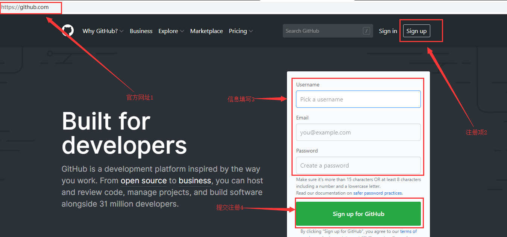
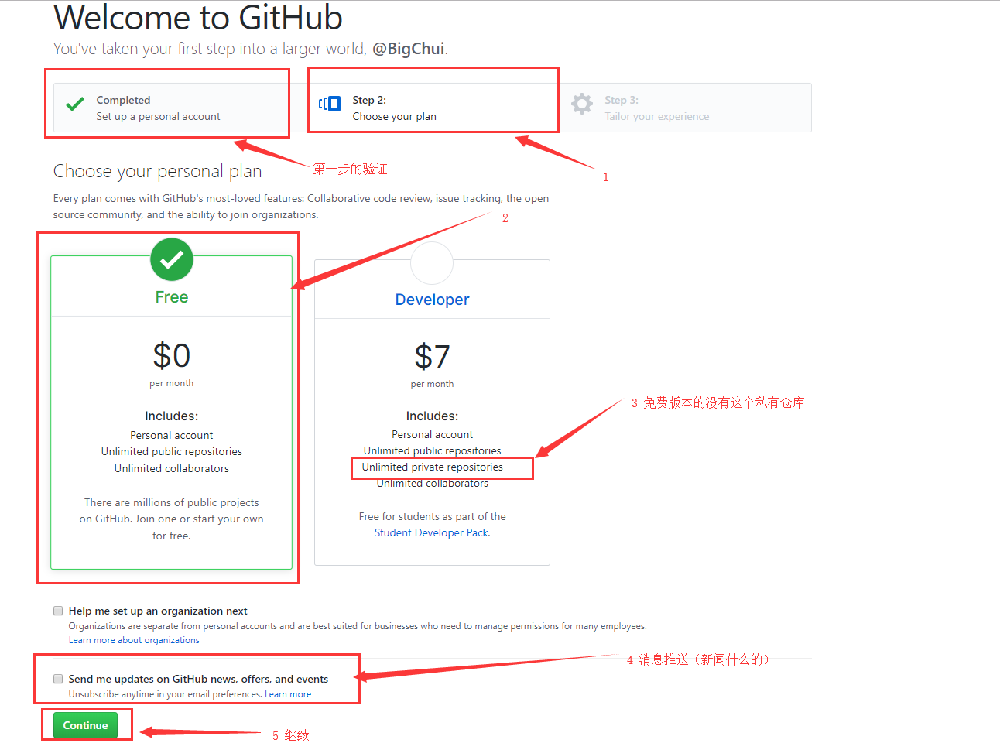
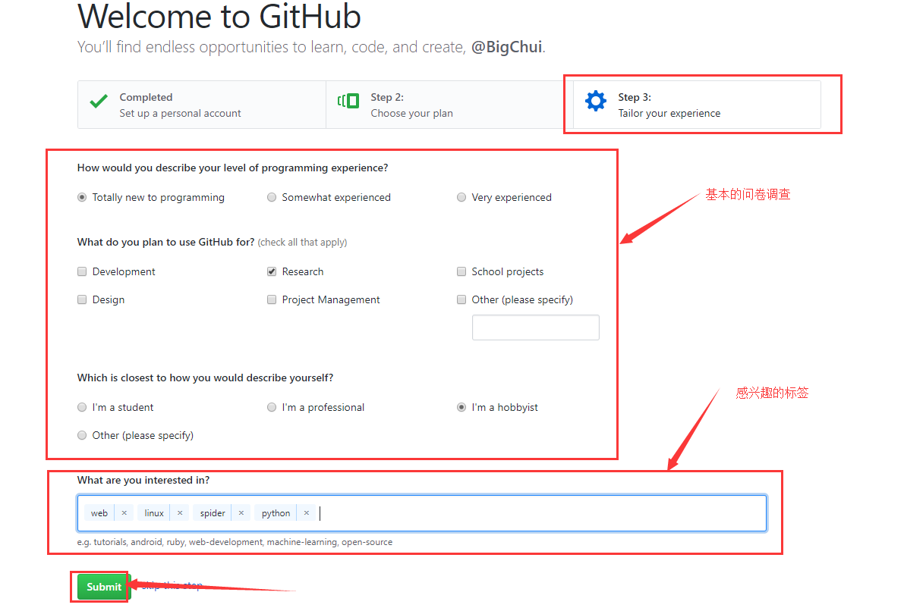
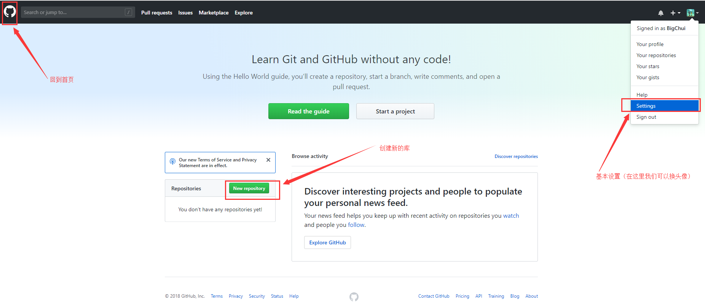
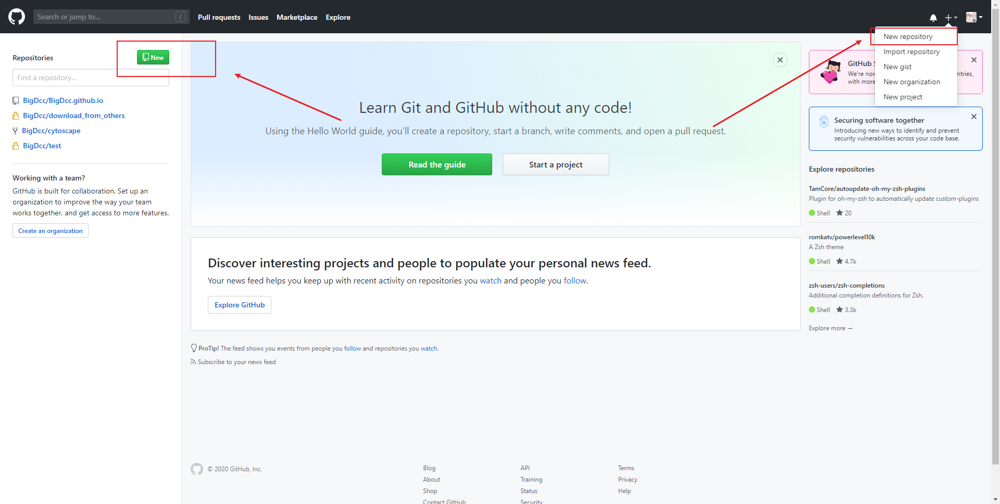
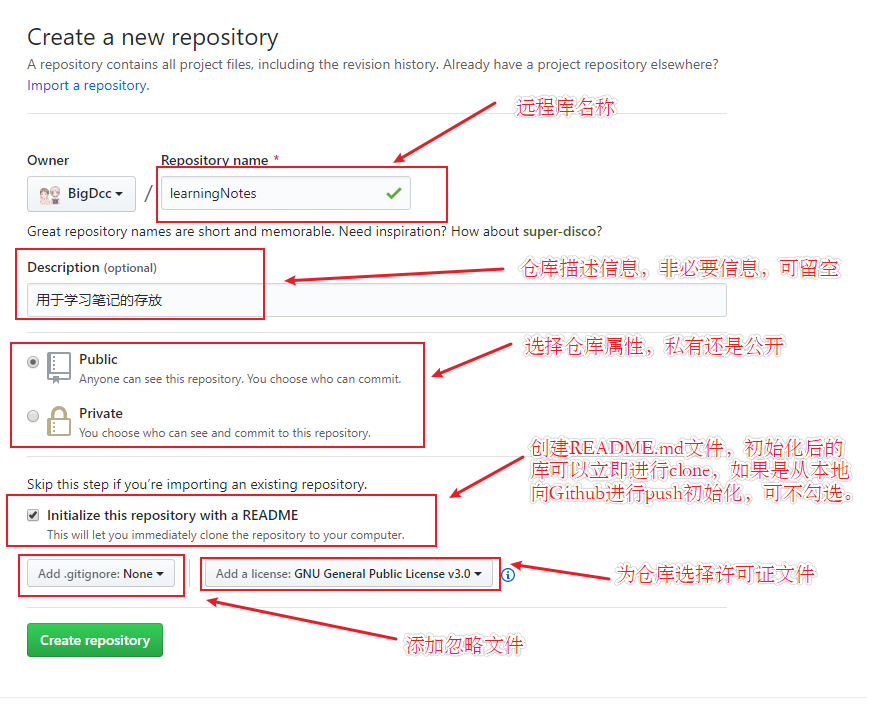
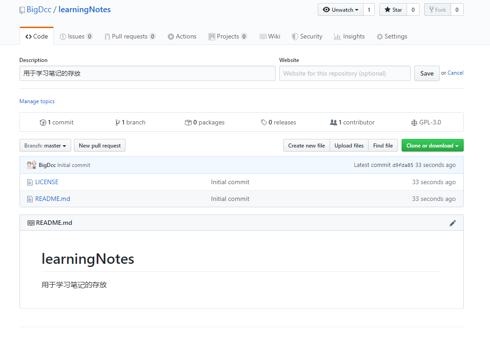
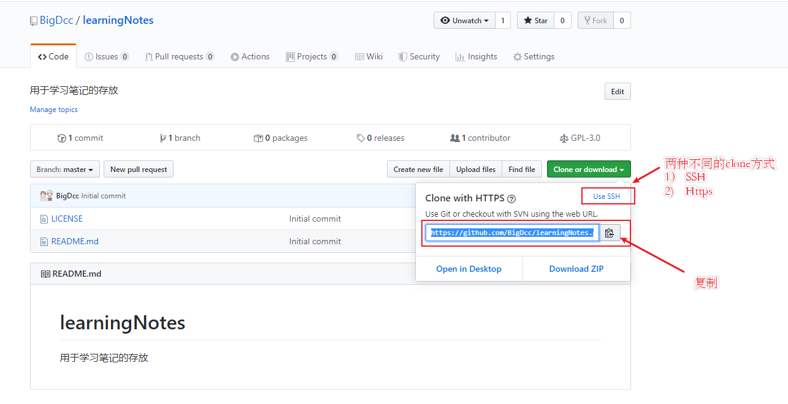
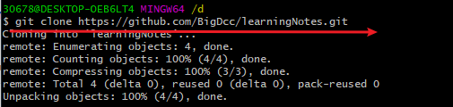
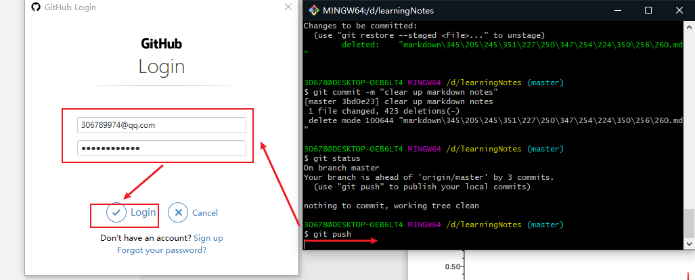

# GitHub学习笔记

[TOC]

## 0 前言

**参考资料：**  

- 《GitHub入门与实践》

## 1 GitHub简介

官方网址 : <https://github.com/>

### 创建账户并登陆GitHub

如果你没有账户可以从这里进行创建。

提交后我们进入下一步，中间有一个验证这里就不做介绍了(注意最新的版本私有仓库不在进行收费)。

接着我们进入第三步。

在刚才的官方页面进行登陆。

登陆后的界面布局基本如下所示。

### 创建属于自己的远程库

在GitHub首页中，下面两个红框处，都可以用于创建新的远程库。

点击其中一个创建仓库按钮，进入创建仓库界面。

创建成功以后会跳转到该页面。

到此远程库就创建完毕了。一般创建好的仓的路径如下所示（github地址+用户名+仓名）  
<https://github.com/BigDcc/learningNotes>

**注意事项:**  
README.md文件的内容会自动显示在仓库的首页当中，因此一般会在这个文件中标明，本仓库所包含的软件的概要，使用流程，许可证协议等信息。

### clone和push

刚才我们创建了一个自己的仓库，现在我们将刚才创建的远程库中的文件clone到我们本地，以下演示在windows上通过Https方式clone GitHub上的库。

选择克隆的方式

进行克隆

接下来将本地库中的文件推送到GitHub上。

