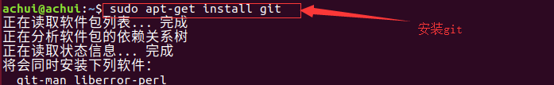

# Git 学习笔记

[TOC]

## 0 前言

**参考资料：**

- 《Pro Git 2nd Edition》

## 1 Git入门与设置

### 1.1 Git简介

- Git的主要作用是在开发过程中利用版本控制的思想管理代码的版本迭代；
- 通常的版本控制工具分为集中式版本控制工具（SVN）和分布式版本控制工具（Git）,集中式版本控制工具，容易在服务器脱机或者损坏的情况下，出现单点故障，严重时导致数据丢失。而分布时的版本控制工具避免了单点故障出现的严重后果；
- Linus利用C语言开发了Git工具，Git已成为当前最著名的版本控制工具，Git与Linux命令兼容；
- git的官方网址：<https://git-scm.com>；
- git可以对任何类型的文件进行版本控制，但是通常用来管理源代码，也就是纯文本的内容，图片等内容通常只能感知数据大小的变化；
- 通常我们使用git提供的命令行去管理仓库，而非GUI程序；
- 通常我们在使用Git版本控制的时候，利用集中式的思想，建立一个主仓，而在本地库进行开发，主仓又叫做远程库，在局域网环境下通常使用GitLab托管代码，在外网环境下通常使用GitHub或者码云进行托管。

### 1.2 安装Git

#### 1.2.1 windows环境下安装Git

​		进入官方网站后，下载windows安装包即可。


​		根据需求下载不同安装方式的包


​		安装git-组件的选择（按照默认的走）


​		环境变量的设置，选择第一种配置即可，只在git bash中使用git，第二个选项可以在windows dos中使用git。第三个选项会覆盖本地一些命令。不建议使用。


​		换行符设置，不同的操作系统，换行符不一样。


​		选择执行的终端。


​		剩下的步骤Next，等待安装完成即可。

#### 1.2.2 Ubuntu环境下安装Git

​		Ubuntu下安装git，使用apt进行安装即可。



​		检查是否安装成功。


#### 1.2.3 查看git版本

```shell
git --version
```

### 1.3 Git结构

​		git仓库中文件通常有两种状态，既已跟踪文件和未跟踪文件，而已跟踪文件又可以分为三种状态，如下所示：


- 已修改表示修改了文件，但还没保存到数据库中。
- 已暂存表示对一个已修改文件的当前版本做了标记，使之包含在下次提交的快照中。
- 已提交表示数据已经安全地保存在本地数据库中。

这些状态又分别对应了git的三种区域，如下所示：


### 1.4 Git基本设置

#### 1.4.1 设置签名

##### 1.4.1.1 系统签名设置

​		在进行git的相关操作之前我们需要对git进行一下简单的初始化设置，即设置一个用户名和邮箱，用于标识不同的开发人员的身份。(如果没有进行签名设置的话，git会报错！)

​		签名通常分为仓库级别（也叫做项目级别）和系统用户级别，我们通常使用系统用户级别的签名就可以了。

​		以下是设置命令：

```shell
git config --global user.name "用户名"
git config --global user.email "邮箱"
```

​		设置好的配置信息通畅保存在家目录下的`.gitconfig`文件当中，如下所示：


​		内容如下所示：


**注意事项:**

​		这里值得注意的是，设置的姓名和邮箱地址，会用在git的提交日志中，由于在GitHub上公开仓库时，这里的姓名和邮箱地址也会随着提交日志一同被公开，所以请不要使用不便公开的隐私信息。

##### 1.4.1.2 仓库签名设置

​		以下是设置命令：

```shell
git config user.name "用户名"
git config user.email "邮箱"
```

​		配置文件存放位置在当前仓库中的`.git/config`

#### 1.4.2 git 配置与帮助

​		git提供了配置工具`git config`，来设置 Git 外观和行为，这些设置项通常保存在以下的文件当中：

```shell
/etc/gitconfig  # 针对系统
~/.gitconfig  # 针对当前用户
./.git/config  # 针对当前仓库
```
​		低级别的配置文件会覆盖高级别的配置文件，既我们常说的就近原则，就像我们前面设置的签名，如果同时设置了用户签名和仓库签名，那git在管理文件的时候优先使用当前仓库的配置文件。

​		git在日常的使用当中会调用编辑器进行一些相关的操作，如提交时编写详细的编辑信息，这时我们可以为它指定一个我们熟悉的编辑器，如下所示（指定vim）

```shell
git config --global core.editor vim
```

​		以下命令可显示当前git的相关配置，可选项中会列出这些配置所存在的文件位置

```shell
git config --list [--show-origin]
```

​		获取帮助

```shell
git help command  # 获得全面的帮助信息
git command -h  # 获得command命令参数的快速参考
```

​		config可以配置git的显示效果，我们可以通过帮助命令来获取如何操作：

```shell
git help config  # 获得全面的帮助信息
git config -h  # 获得command命令参数的快速参考

# 如增加输出可读性
git config --global color.ui auto
```

### 1.5 Git仓库获取

​		通常有两种获取 Git 项目仓库的方式：

1. 将尚未进行版本控制的本地目录转换为 Git 仓库；
2. 从其它服务器 克隆 一个已存在的 Git 仓库；

#### 1.5.1 git init

​		要是用Git进行版本控制，首先要进行仓库初始化，Git通过`git init`进行仓库初始化，如下所示：

```shell
mkdir gitTest
cd gitTest
git init
```

​		如果初始化git仓库成功，就会新建一个.git文件，这个文件又叫做附属于该仓库的工作树,我们的操作都是基于工作树的。

> 注意事项
>
> **签名的初始化和仓库工作树的初始化，是不分前后顺序的。先建立哪一个都可以。但是必须保证这两个都进行了相关操作，再开启我们的git之旅，否则，git会报错哦。**

#### 1.5.2 git clone

​		当然初始化一个仓库的另一种方式就是`clone`一个别人的仓库，这样也可以拥有一个仓库。

​		克隆操作支持多种协议，它可以将远程仓库的数据全部拉取到本地，包括.git文件夹，这样我们在获取数据的同时，也就获取到了一个Git仓库，克隆操作支持多种协议，以下演示从GitHub上通过https协议获取一个远程仓库。

```shell
git clone https://github.com/BigDcc/learningNotes.git  # 获取名为learningNotes的仓库
```

​		克隆时也可以为仓库指定名称，语法如下：

```shell
git clone https://github.com/BigDcc/learningNotes.git  demo # 获取名为learningNotes的仓库,并将learningNotes改为demo
```

### 1.6  git基本操作

#### 1.6.1 git status

​		整个的命令操作流程是基于Git结构的，工作树和仓库在被操作的过程当中，状态会不断的发生变化，git通过`git status`实时的查看仓库的变化。

通过1.3节知道了Git的生命周期如下：


> **简洁模式**
>
>  使用`git status -s` 命令或 `git status --short` 命令；
>
> ```shell
> $ git status -s
>  M README
> MM Rakefile
> A  lib/git.rb
> M  lib/simplegit.rb
> ?? LICENSE.txt
> ```
>
> 新添加的未跟踪文件前面有 `??` 标记，新添加到暂存区中的文件前面有 `A` 标记，修改过的文件前面有 `M` 标记。 输出中有两栏，左栏指明了暂存区的状态，右栏指明了工作区的状态。例如，上面的状态报告显示： `README` 文件在工作区已修改但尚未暂存，而 `lib/simplegit.rb` 文件已修改且已暂存。 `Rakefile` 文件已修，暂存后又作了修改，因此该文件的修改中既有已暂存的部分，又有未暂存的部分。

#### 1.6.2 跟踪文件

- 使用命令 `git add` 开始跟踪一个文件，`git add` 命令使用文件或目录的路径作为参数；如果参数是目录的路径，该命令将递归地跟踪该目录下的所有文件；
- 是个多功能命令：可以用它开始跟踪新文件，或者把已跟踪的文件放到暂存区，还能用于合并时把有冲突的文件标记为已解决状态等；

#### 1.6.3 暂存文件

运行提交命令 `git commit`：

可以在 `commit` 命令后添加 `-m` 选项，将提交信息与命令放在同一行


 只要在提交的时候，给 `git commit` 加上 `-a` 选项，Git 就会自动把所有已经跟踪过的文件暂存起来一并提交，从而跳过 `git add` 步骤：

#### 1.6.4 忽略文件

​		一般我们总会有些文件无需纳入 Git 的管理，也不希望它们总出现在未跟踪文件列表。 通常都是些自动生成的文件，比如日志文件，或者编译过程中创建的临时文件等。 在这种情况下，我们可以创建一个名为 `.gitignore` 的文件，列出要忽略的文件的模式。

```shell
cat .gitignore

# -------------------------------------------------------

# 忽略所有的 .a 文件
*.a

# 但跟踪所有的 lib.a，即便你在前面忽略了 .a 文件
!lib.a

# 只忽略当前目录下的 TODO 文件，而不忽略 subdir/TODO
/TODO

# 忽略任何目录下名为 build 的文件夹
build/

# 忽略 doc/notes.txt，但不忽略 doc/server/arch.txt
doc/*.txt

# 忽略 doc/ 目录及其所有子目录下的 .pdf 文件
doc/**/*.pdf
```

​		文件 `.gitignore` 的格式规范如下：

- 所有空行或者以 `#` 开头的行都会被 Git 忽略。
- 可以使用标准的 glob 模式匹配(shell中的正则)，它会递归地应用在整个工作区中。
- 匹配模式可以以（`/`）开头防止递归。
- 匹配模式可以以（`/`）结尾指定目录。
- 要忽略指定模式以外的文件或目录，可以在模式前加上叹号（`!`）取反。

#### 1.6.5 移除文件

要从 Git 中移除某个文件，就必须要从已跟踪文件清单中移除（确切地说，是从暂存区域移除），然后提交。 可以用 `git rm` 命令完成此项工作，并连带从工作目录中删除指定的文件，这样以后就不会出现在未跟踪文件清单中了。

如果要删除之前修改过或已经放到暂存区的文件，则必须使用强制删除选项 `-f`（译注：即 force 的首字母）。

#### 1.6.6 移动文件

不像其它的 VCS 系统，Git 并不显式跟踪文件移动操作。 如果在 Git 中重命名了某个文件，仓库中存储的元数据并不会体现出这是一次改名操作。 不过 Git 非常聪明，它会推断出究竟发生了什么，至于具体是如何做到的，我们稍后再谈。

既然如此，当你看到 Git 的 `mv` 命令时一定会困惑不已。

#### 1.6.7 git diff

要查看尚未暂存的文件更新了哪些部分，不加参数直接输入 `git diff`：

此命令比较的是工作目录中当前文件和暂存区域快照之间的差异。 也就是修改之后还没有暂存起来的变化内容。

若要查看已暂存的将要添加到下次提交里的内容，可以用 `git diff --staged` 命令。 这条命令将比对已暂存文件与最后一次提交的文件差异

请注意，git diff 本身只显示尚未暂存的改动，而不是自上次提交以来所做的所有改动。 所以有时候你一下子暂存了所有更新过的文件，运行 `git diff` 后却什么也没有，就是这个原因。

像之前说的，暂存 `CONTRIBUTING.md` 后再编辑，可以使用 `git status` 查看已被暂存的修改或未被暂存的修改。 如果我们的环境（终端输出）看起来如下：

然后用 `git diff --cached` 查看已经暂存起来的变化（ `--staged` 和 `--cached` 是同义词）：

## 2 Git基础操作

### 2.1 一个完整的git提交流程

`git add`命令使用文件或目录的路径作为参数；如果参数是目录的路径，该命令将递归地跟踪该目录下的所有文件。主要作用是将未跟踪的文件变为已跟踪文件，并提交缓存区，以及将当前修改的文件提交到缓存区。

### 2.2 日志操作

`git log`命令在不传入任何参数的默认情况下，会按时间先后顺序列出所有的提交，最近的更新排在最上面。这个命令会列出每个提交的 SHA-1 校验和、作者的名字和电子邮件地址、提交时间以及提交说明。


