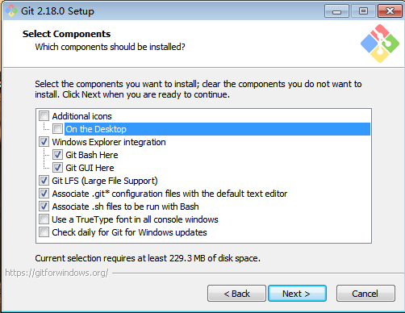

# Git 学习笔记

[TOC]

## 0 前言

**参考资料：**

- 《Pro Git 2nd Edition》

## 1 Git入门与设置

### 1.1 Git简介

- Git的主要作用是在开发过程中利用版本控制的思想管理代码的版本迭代；
- 通常的版本控制工具分为集中式版本控制工具（SVN）和分布式版本控制工具（Git）,集中式版本控制工具，容易在服务器脱机或者损坏的情况下，出现单点故障，严重时导致数据丢失。而分布时的版本控制工具避免了单点故障出现的严重后果；
- Linus利用C语言开发了Git工具，Git已成为当前最著名的版本控制工具，Git与Linux命令兼容；
- git的官方网址：<https://git-scm.com>；
- git可以对任何类型的文件进行版本控制，但是通常用来管理源代码；
- 通常我们使用git提供的命令行去管理仓库，而非GUI程序；
- 通常我们在使用Git版本控制的时候，利用集中式的思想，建立一个主仓，而在本地库进行开发，主仓又叫做远程库，在局域网环境下通常使用GitLab托管代码，在外网环境下通常使用GitHub或者码云进行托管。

### 1.2 安装Git

#### 1.2.1 windows环境下安装Git

进入官方网站后，下载windows安装包即可。


根据需求下载不同安装方式的包


安装git-组件的选择（按照默认的走）



环境变量的设置，选择第一种配置即可，只在git bash中使用git，第二个选项可以在windows dos中使用git。第三个选项会覆盖本地一些命令。不建议使用。


换行符设置，不同的操作系统，换行符不一样。


选择执行的终端。


剩下的步骤Next，等待安装完成即可。

#### 1.2.2 Ubuntu环境下安装Git

Ubuntu下安装git，使用apt进行安装即可。


检查是否安装成功。


#### 1.2.3 查看git版本

```shell
git --version
```

### 1.3 Git结构

git仓库中文件通常有两种状态，既已跟踪文件和未跟踪文件，而已跟踪文件又可以分为三种状态，如下所示：


- 已修改表示修改了文件，但还没保存到数据库中。
- 已暂存表示对一个已修改文件的当前版本做了标记，使之包含在下次提交的快照中。
- 已提交表示数据已经安全地保存在本地数据库中。

这些状态又分别对应了git的三种区域，如下所示：


### 1.4 Git基本设置

#### 1.4.1 设置签名

##### 1.4.1.1 系统签名设置

在进行git的相关操作之前我们需要对git进行一下简单的初始化设置，即设置一个用户名和邮箱，用于标识不同的开发人员的身份。(如果没有进行签名设置的话，git会报错！)

签名通常分为仓库级别（也叫做项目级别）和系统用户级别，我们通常使用系统用户级别的签名就可以了。

以下是设置命令：

```shell
git config --global user.name "用户名"
git config --global user.email "邮箱"
```

设置好的配置信息通畅保存在家目录下的`.gitconfig`文件当中，如下所示：


内容如下所示：


**注意事项:**

这里值得注意的是，设置的姓名和邮箱地址，会用在git的提交日志中，由于在GitHub上公开仓库时，这里的姓名和邮箱地址也会随着提交日志一同被公开，所以请不要使用不便公开的隐私信息。

##### 1.4.1.2 系统签名设置

以下是设置命令：

```shell
git config user.name "用户名"
git config user.email "邮箱"
```

配置文件存放位置`./.git/config`

#### 1.4.2 git 配置与帮助

git提供了配置工具`git config`，来设置 Git 外观和行为和行为，这些设置项通常保存在以下的文件当中：

```shell
/etc/gitconfig  # 针对系统
~/.gitconfig  # 针对当前用户
./.git/config  # 针对当前仓库
```
低级别的配置文件会覆盖高级别的配置文件，既我们常说的就近原则，就像我们前面设置的签名，如果同时设置了用户签名和仓库签名，那git在管理文件的时候优先使用当前仓库的配置文件。

git在日常的使用当中会调用编辑器进行一些相关的操作，如提交时编写详细的编辑信息，这时我们可以为它指定一个我们熟悉的编辑器，如下所示（指定vim）

```shell
git config --global core.editor vim
```

以下命令可显示当前git的相关配置，可选项中会列出这些配置所存在的文件位置

```shell
git config --list <--show-origin>
```

获取帮助

```shell
git help command  # 获得全面的帮助信息
git command -h  # 获得command命令参数的快速参考
```

config可以配置git的显示效果，我们可以通过帮助命令来获取如何操作：

```shell
git help config  # 获得全面的帮助信息
git config -h  # 获得command命令参数的快速参考
```

### 1.5 Git仓库获取

通常有两种获取 Git 项目仓库的方式：

1. 将尚未进行版本控制的本地目录转换为 Git 仓库；
2. 从其它服务器 克隆 一个已存在的 Git 仓库；

#### 1.5.1 git init

要是用Git进行版本控制，首先要进行仓库初始化，Git通过`git init`进行仓库初始化，如下所示：

```shell
mkdir gitTest
cd gitTest
git init
```

如果初始化git仓库成功，就会新建一个.git文件，这个文件又叫做附属于该仓库的工作树,我们的操作都是基于工作树的。

签名的初始化和仓库工作树的初始化，是不分前后顺序的。先建立哪一个都可以。但是必须保证这两个都进行了相关操作，再开启我们的git之旅，否则，git会报错哦。

当然初始化一个仓库的另一种方式就是`clone`一个别人的仓库，这样也可以拥有一个仓库。

#### 1.5.2 git clone

克隆操作支持多种协议，它可以将远程仓库的数据全部拉取到本地，包括.git文件夹，这样我们在获取数据的同时，也就获取到了一个Git仓库，克隆操作支持多种协议，以下演示从GitHub上通过https协议获取一个远程仓库。

```shell
git clone https://github.com/BigDcc/learningNotes.git  # 获取名为learningNotes的仓库
```

克隆时也可以为仓库指定名称，语法如下：

```shell
git clone https://github.com/BigDcc/learningNotes.git  demo # 获取名为learningNotes的仓库,并将learningNotes改为demo
```

### 1.6  git仓库状态

#### 1.6.1 git status

整个的命令操作流程是基于Git结构的。即1.3中的介绍。（这里提示一下，工作区，缓存区，版本库），工作树和仓库在被操作的过程当中，状态会不断的发生变化，git通过`git status`实时的查看仓库的变化。

通过1.3节知道了Git的生命周期如下：


#### 1.6.2 git status -s

## 2 Git基础操作

### 2.1 一个完整的git提交流程

`git add`命令使用文件或目录的路径作为参数；如果参数是目录的路径，该命令将递归地跟踪该目录下的所有文件。主要作用是将未跟踪的文件变为已跟踪文件，并提交缓存区，以及将当前修改的文件提交到缓存区。

### 2.2 日志操作

`git log`命令在不传入任何参数的默认情况下，会按时间先后顺序列出所有的提交，最近的更新排在最上面。这个命令会列出每个提交的 SHA-1 校验和、作者的名字和电子邮件地址、提交时间以及提交说明。

