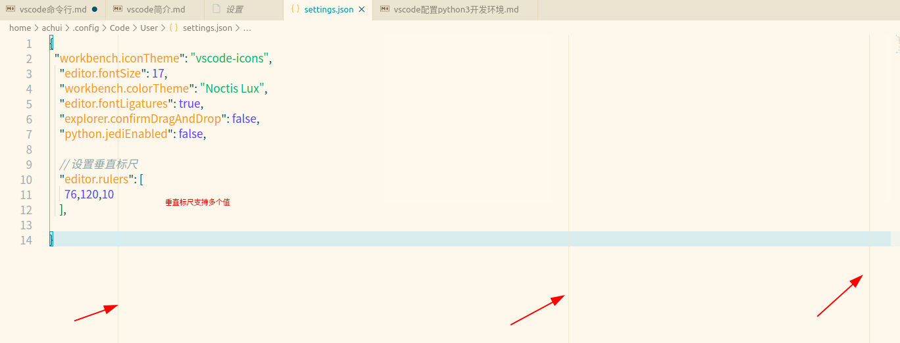

竖线则不一样了，它叫做垂直标尺。如果你的项目中有规定说每一行代码不得超过多少个字符，比如说120个字符，那么你就可以将标尺设置为 120，即 editor.rulers: [120]。这样的话编辑器就会在第120个字符所在的位置处画出这样一条垂直的竖线，所以你一眼就可以看出自己的代码是否达标。

光标是一条竖线，而在图2中光标则相对粗一些。编辑器中的光标样式有非常多种，你可以控制粗细，也可以控制它怎么闪烁。你需要调整的设置是 editor.cursorBlinking editor.cursorStyle 和 editor.cursorWidth

            通过这样一个背景色的改变**，你能够清楚地看到哪一行代码是当前光标所在的位置。

而在图 2 中，我则是通过更改设置 editor.renderLineHighlight: "all" 把当前代码行的行号下的背景色也修改了，所以你可以看到图 2 的行号 5 的背景色也成为了绿色，整体上看起来更统一。

在图2中你能够在不少代码行前面看到灰色的“点”，这每一个“点”都代表着一个空格符。你可以通过设置 editor.renderWhitespace: all 让编辑器将所有的空格符、制表符等全部都渲染出来。这样你就能够一眼看出这个文件中使用的究竟是制表符还是空格符，以及有没有在哪里不小心多打了一个空格等。

在VS Code中，你单击鼠标左键就可以把光标移动到相应的位置。而双击鼠标左键，则会将当前光标下的单词选中。连续三次按下鼠标左键，则会选中当前这一行代码。最后是连续四次按下鼠标左键，则会选中整个文档。

{
  "workbench.iconTheme": "vscode-icons",
  "editor.fontSize": 17,
  "editor.fontLigatures": true,
  "explorer.confirmDragAndDrop": false,
  "python.jediEnabled": false,
  // 设置垂直标尺
  "editor.rulers": [
    80, 120
  ],
  // 重新设定tabsize
  "editor.tabSize": 4,

  // 对自动补全进行设置，在注释和字符串中不显示自动补全功能
  "editor.quickSuggestions": {
    "other": true,
    "comments": false,
    "strings": false
  },
  //失去焦点后自动保存
  "files.autoSave": "onFocusChange",
  // #值设置为true时，每次保存的时候自动格式化；
  "editor.formatOnSave": false,
  "workbench.colorTheme": "Noctis Lux",
}

achui@achui-Lenovo-ideapad-700-15ISK:~$ code --list-extensions 
alefragnani.project-manager
DavidAnson.vscode-markdownlint
liviuschera.noctis
ms-azuretools.vscode-docker
MS-CEINTL.vscode-language-pack-zh-hans
ms-python.python
msjsdiag.debugger-for-chrome
mushan.vscode-paste-image
shd101wyy.markdown-preview-enhanced
tomoki1207.pdf
vscode-icons-team.vscode-icons
vscoss.vscode-ansible
yzhang.markdown-all-in-one
