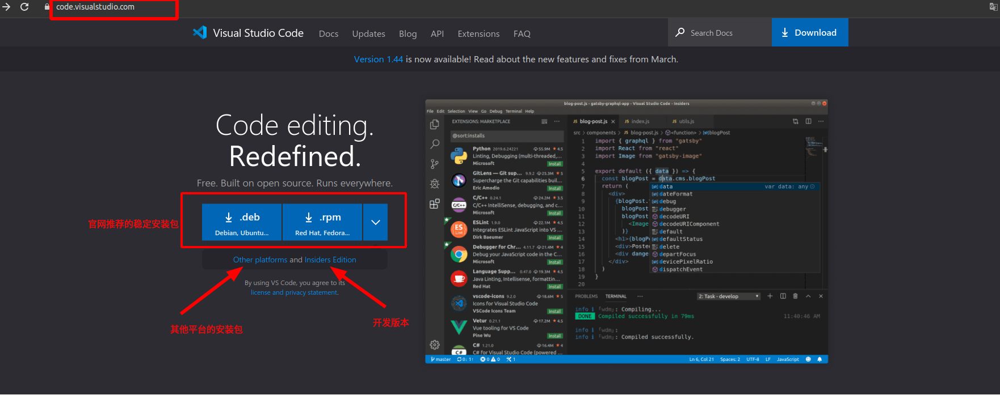
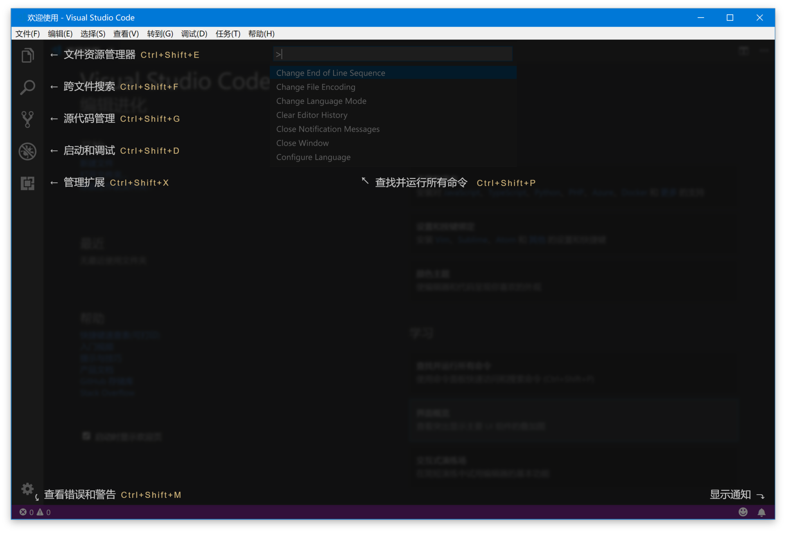

# vscode简介

## 1 什么是vscode

1. VS Code的全称是Visual Studio Code，很多用户喜欢叫它VS Code。官方定义它是一个免费的、开源的跨平台编辑器。通过插件扩充的方式可以实现多数语言开发环境的集成；

2. 它具有对JavaScript，TypeScript和Node.js的内置支持，在编写基于这些语言的程序的时候，自动提供智能感知等功能；

3. VS Code内置了对使用Git进行源代码控制的支持，但需要单独安装Git;

## 2 安装和重置

### 2.1 安装vscode

vscode一般分为开发版和稳定版本，通常的安装方式是到官方网站下载安装包进行安装

**官方网站：**<https://code.visualstudio.com/>

其他安装方式参考官网安装指导

*linux==>* <https://code.visualstudio.com/docs/setup/linux>
*windows==>*<https://code.visualstudio.com/docs/setup/windows>
*Mac==>*<https://code.visualstudio.com/docs/setup/mac>

### 2.2 重置vscode

通常vscode将它的设置和数据保存在`Code`目录和`.vscode`目录下，删除这些配置文件夹，就可以重置vscode，当然在卸载vscode的时候，记得删除这两个文件夹，达到完全删除的目的。

Linux通常将这两个文件夹保存在$HOME/.config/Code和~/.vscode路径下。

## 3 界面

### 3.1 编辑器布局

编辑器被分成了五个区域：

1. 文件资源管理器，主要用于浏览和管理文件和文件夹。
2. 跨文件搜索，用于在当前文件夹内进行跨文件的搜索。
3. 源代码管理，用于对当前文件夹下的代码进行版本管理，默认 VS Code 支持的版本管理软件是 Git。
4. 启动和调试，用于对当前文件夹下的项目进行运行和调试。
5. 扩展管理，用于下载和管理 VS Code 里的插件。

### 3.2 命令面板

命令面板，它是 VS Code 快捷键的主要交互界面，可以“Ctrl+Shift+P”打开

可以在命令面板中快速搜索命令并且执行。如果你的 VS Code 是简体中文版，那么你可以在命令面板里使用中文或者英文来搜索命令。VS Code 的绝大多数命令都可以在命令面板里搜到，所以熟练使用命令面板，你就可以摆脱鼠标，完全通过键盘操作来完成全部编码工作。

同时按住 Option 和方向键，那么光标移动的颗粒度就变成了单词，你就可以在文档中以单词为单位不停地移动光标了。
`

而图2中的竖线则不一样了，它叫做垂直标尺。如果你的项目中有规定说每一行代码不得超过多少个字符，比如说120个字符，那么你就可以将标尺设置为 120，即 editor.rulers: [120]。这样的话编辑器就会在第120个字符所在的位置处画出这样一条垂直的竖线，所以你一眼就可以看出自己的代码是否达标。