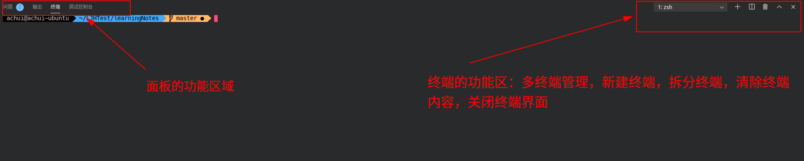
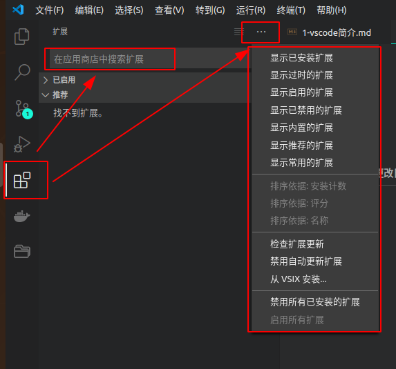
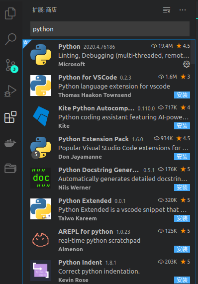
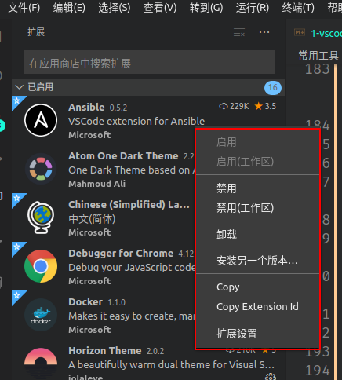
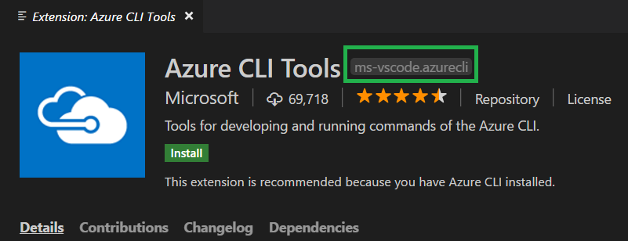

# vscode简介

## 1 什么是vscode(简介/安装/基础设置)

### 1.1 vscode简介

#### 1.1.1 vscode概述

1. VS Code的全称是Visual Studio Code，很多用户喜欢叫它VS Code,  他是一款由微软开发的免费且开源的现代化轻量级代码编辑器；
2. VS Code支持主流语言的语法高亮，代码自动补全，自定义快捷键，代码提示，对比，括号匹配等功能，内置Git支持，还支持通过插件的方式进行功能的扩展，支持高度定制，通过一些特定的扩展包，VS Code可以秒变IDE；
3. VS Code不仅可以通过界面进行相关操作，也提供了命令行模式的操作形式；
4. VS Code采用TypeScript编写，核心组件包括Electron , Monaco Editor , LSP, DAP, Xterm.js;

**注意事项：**

> - 它具有对JavaScript，TypeScript和Node.js的内置支持，在编写基于这些语言的程序的时候，自动提供智能感知等功能；
> - VS Code内置了对使用Git进行源代码控制的支持，但需要单独安装Git;（*ubuntu安装：* `sudo apt install git`）
> - VS Code基于文件和文件夹提供服务的，当你打开一个文件夹，VS Code 的核心功能就会对这个文件夹进行分析，并提供对应的功能。比如，在打开的文件夹下检测到有 .git 文件，就加载 Git 插件来提供版本管理的功能；
> - VS Code中支持键盘映射，如使用vim快捷键来操作vscode；(通过扩展来实现其他工具的快捷键映射，方便习惯使用其他编辑器的人员迁移)

#### 1.1.2 帮助文档

​		查看帮助文档

> <https://code.visualstudio.com/docs>

​		或者

>  点击vscode中的标题栏中的帮助 -> 文档可跳转到官方文档

#### 1.1.3 IntelliSense（智能提示）

- 对于JavaScript, TypeScript, JSON, HTML, CSS, SCSS, LESS这7种语言，提供内置的IntelliSense支持，其他语言通过语言插件进行智能提示的获取；

- 通过`Ctrl+Space`或者句点运算符，可以主动触发IntelliSense功能；


  关于**IntelliSense**的相关设置：

  ```json
"editor.quickSuggestions": {
    	"other":true,
    	"commnets":false,
    	"strings":false,
}

// 开启tab补全
"editor.tabCompletion":"on",
  ```

### 1.2 安装和卸载vscode

#### 1.2.1 安装vscode

​		vscode一般分为开发版和稳定版本，通常的安装方式是到官方网站下载安装包进行安装

> **官方网站：**<https://code.visualstudio.com/>


​		其他安装方式参考官网安装指导

> *linux:* <https://code.visualstudio.com/docs/setup/linux>  
> *windows:*<https://code.visualstudio.com/docs/setup/windows>  
> *Mac:*<https://code.visualstudio.com/docs/setup/mac>

#### 1.2.2 卸载vscode（包含重置）

- 在ubuntu下，如果是使用deb包的方式安装，卸载的时候通过`dpkg -r`的方式即可完成卸载，如果想进一步清除使用数据可以清除数据保存的文件夹；
- 通常vscode将它的设置和数据保存在`Code`目录和`.vscode`目录下，删除这些配置文件夹，就可以重置vscode，当然在卸载vscode的时候，记得删除这两个文件夹，达到完全删除的目的。
- Linux通常将这两个文件夹保存在$HOME/.config/Code和~/.vscode路径下。

#### 1.2.3 查看版本

​		通过命令行查看

```shell
code --version
```

​		通过ui方式查看

`标题栏 -> 帮助 -> 关于`

#### 1.2.4 vscode更新设置

​		VS Code 每月发布一个具有新功能和重要错误修复的新版本。大多数平台都支持自动更新，当新版本发布时，系统会提示安装新版本。

​		通过对设置文件配置以下选项，可以禁止启用自动更新。（在用户设置中进行设置）

```json
  "update.mode": "none"
```

​		如何手动更新，点击标题栏中的帮助 -> 检查更新

### 1.3 设置vscode

#### 1.3.1 用户设置和工作区设置

​		VS Code中几乎所有的内容都可以被设置，在设置上又有全局设置（用户设置）和工作区设置之分：

- **用户设置** ：全局设置针对任何打开的VS Code实例；
- **工作区设置** ：存储在工作区中的设置，仅在打开工作区时适用；
- 工作区设置将覆盖用户设置。工作区设置服务于特定的项目，并且可以在项目的开发人员之间共享（.vscode/setting.json）；
- 某些关于安全的设置项只能在用户设置中设置，无法在工作区中进行设置，如`git.path`,以及`terminal`相关的设置；

#### 1.3.2 json和gui的设置方式

​		VS Code提供了两种不同的设置方式`json`和`图形设置方式`，来针对用户设置或者工作区设置，通过`workbench.settings.editor`选项对设置默认打开json还是ui进行设置（图形化的设置方式，最终的更改项也会保存在json文件当中）。

```json
// 设置设置中心默认打开方式为json
  "workbench.settings.editor": "json", 
```

**注意事项:**

> json文件的存放位置(针对用户设置)
>
> - windows: %APPDATA%\Code\User\setting.json
> - Linux: $HOME/.config/Code/User/setting.json
>
> 工作区的设置文件存放在工作区的根目录下的.vscode下（这样-> .vscode/setting.json）

#### 1.3.3 如何针对特定语言进行设置

​		VS Code在设置中还支持对某一特定语言进行相关设置

```json
// 某些设置仅针对python生效
  "[python]": {

  },
```

​		或者在命令面板（`Ctrl + shift + P`）中通过`Preferences:Configure Language Specific Settings`来进行不同语言的设置。

#### 1.3.4 常用的设置项

```json
// 粘贴代码时，进行格式化
"editor.formatOnPaste": true,

// 保存代码时，进行格式化
"editor.formatOnSave": true,

// 延迟自动保存代码
"files.autoSave": "afterDelay",
"files.autoSaveDelay": 1000,

// 设置一个tab键为四个空格
"editor.tabSize": 4,
```

### 1.4 主题与美化

#### 1.4.1 自定义vscode标题栏

​		在linux和mac上可能由于系统原因导致vscode标题栏显示的不和谐，如下所示


​		可以通过设置该参数`window.titleBarStyle`,启用自定义标题栏


### 1.5 用户界面

​		编辑器被分成了五个区域：


五个区域的含义分别为以下内容：

- **编辑器** :用于编辑文件的主要区域。可以在垂直和水平方向上并排打开任意多个编辑器(即支持网格编辑)
- **边栏** :包含诸如资源管理器之类的不同视图，为项目提供辅助操作
- **状态栏** -包含了打开的项目和编辑的文件的相关信息(如换行符格式，文件行数等)
- **活动栏** -位于最左侧，提供了文件列表，搜索，版本管理，Debug等快捷的功能组建进入方式，位置可调换，隐藏，有些新的扩展也会在这里显示一些基于扩展组建的操作信息(如Docker)
- **面板** -可以在编辑器区域下方显示不同的面板，以获取输出或调试信息，错误和警告或集成终端。面板也可以向右移动以获得更多垂直空间。

### 1.6 命令面板

​		根据您的当前上下文访问所有可用命令

- 命令面板，它是 VS Code 快捷键的主要交互界面，可以`Ctrl+Shift+P`打开,根据当前上下文访问所有可用命令；

- 可以在命令面板中快速搜索命令并且执行。如果你的 VS Code 是简体中文版，那么你可以在命令面板里使用中文或者英文来搜索命令。VS Code 的绝大多数命令都可以在命令面板里搜到，所以熟练使用命令面板，你就可以摆脱鼠标，完全通过键盘操作来完成全部编码工作；

- 命令面板在我们使用vscode中是大量使用的一个功能模块；


​		命令面板是根据输入框里的第一个字符来决定提供什么功能的


```console
1. >（大于号） ，用于显示所有的命令。
2. @ ，用于显示和跳转文件中的“符号”（Symbols），在@符号后添加冒号：则可以把符号们按类别归类。
3. # 号，用于显示和跳转工作区中的“符号”（Symbols）。
4. ：（冒号）， 用于跳转到当前文件中的某一行。
```

## 2 vscode界面(界面功能)

### 2.1 首次进入vscode

#### 2.1.1 欢迎界面

VS Code 第一次启动后会显示一个“欢迎使用”的页面，这个界面主要是方便你快速打开文件、文件夹以及访问历史文件，同时还会附带一些帮助信息，比如“快捷键速查表”。（通过help->welcome界面可以再次打开这个界面）


#### 2.1.2 交互式演习场

打开这个界面，你会看到一个全英文的初学者教程，其中通过各种交互示例给出了 VS Code 的核心功能，展示了一些高级代码编辑功能的使用，每个功能都会有一个代码片段和编辑器供你实时使用。


### 2.2 界面概述

- 

#### 2.2.2 活动栏

活动栏中vscode默认自带了5个功能组件，以及一个齿轮按钮用于快速进行常用设置的启动


1. **文件资源管理器**，主要用于浏览和管理文件和文件夹。
2. **跨文件搜索**，用于在当前文件夹内进行跨文件的搜索。
3. **源代码管理**，用于对当前文件夹下的代码进行版本管理，默认 VS Code 支持的版本管理软件是 Git。
4. **启动和调试**，用于对当前文件夹下的项目进行运行和调试。
5. **扩展管理**，用于下载和管理 VS Code 里的插件。

如果有哪个功能是你不需要的话，你可以在 VS Code 的最左侧，右键打开上下文菜单，然后将那个组件隐藏。你还可以拖动这几个小图标，然后将这些功能按照你需要的方式排序。

在活动栏的最下角还有一个齿轮形状的按钮，它提供了一些 VS Code 系统管理常用的快捷键，点击打开后，你可以看到命令面板、设置、键盘快捷方式、管理扩展等等一系列快速入口。


该功能提供如图所示快捷功能


#### 2.2.3 终端

通过Ctrl与反引号一起使用可以快速打开面板界面中的终端页面如果需要终端在VS Code之外工作，可以使用`Ctrl + Shift + C`



## 3 活动栏的五大功能详解

### 3.1 资源管理器

### 3.2 多文件搜索

### 3.3 版本管理工具

### 3.4 DEBUG模式

### 3.5 扩展管理

#### 3.5.1 扩展管理简介

- vscode在活动栏内置的扩展管理按钮，主要是用来从`VS Code Marketplace`中下载插件和管理插件的，当然也可以直接从`VS Code Marketplace`中下载安装包，然后通过
插件管理中提供的方式进行离线安装；
- `VS Code Marketplace`的网站为<https://marketplace.visualstudio.com/VSCode>;
- 扩展的管理可以通过扩展界面进行管理，也支持通过命令面版或命令行进行管理;

#### 3.5.2 安装扩展的多种方式

- 在线安装，搜索出合适的插件，单击“安装”按钮，进行安装，安装完成后，“安装”按钮将变为“管理齿轮”按钮；
- 通过VSIX方式进行安装，通过VSIX包的方式离线安装vscode扩展，获取包的方式可以从官网扩展中心获取，或其他用户的本地；
- 通过扩展ID，利用命令行也可以安装扩展

#### 3.5.3 扩展管理界面的介绍和相关操作

通过以下按钮，进行扩展的相关管理工作


扩展功能的界面如下所示



图片中第一个箭头指向的文本框，就是用来对扩展进行搜索的，而第二个箭头指向的按钮主要是扩展功能中的具体功能按钮，带有`x`号的按钮，是清空搜索框内容的按钮，而它旁边的按钮主包含了扩展管理的全部功能；

以搜索`python`为例，结果列表中的每个扩展都包括简短说明，发布者，下载次数和五星级。可以单击扩展项目以显示扩展的详细信息页面，在其中了解更多信息。



对于已经安装了的扩展可以通过vscode提供的右键菜单功能进行进一步的管理，包括启用，卸载和禁用等



#### 3.5.4 扩展的ID和更新设置

一般在界面中我们通过扩展的详情页面中的信息可以或得扩展的ID



命令行中也提供了扩展的相关管理操作选项

```console
Extensions Management

  --list-extensions                                 列出已安装的扩展(扩展ID展示出来)

  --show-versions                                   使用--list-extension选项的时候
                                                    可以配合该参数使用，在列出扩展ID的同时
                                                    列出扩展的版本信息

  --install-extension <extension-id | path-to-vsix> 安装或者更新插件

  --uninstall-extension <extension-id>              Uninstalls an extension.
```

#### 3.5.5 关闭自动更新插件

通过对配置文件的下列设置，可以关闭自动更新，在需要的时候，手动更新插件

```json
//启用后，将自动安装扩展更新。更新将从 Microsoft 联机服务中获取。
"extensions.autoUpdate":true,
// 启用后，将自动检查扩展更新。若扩展存在更新，将在“扩展”视图中将其标记为过时扩展。更新将从 Microsoft 联机服务中获取。
"extensions.autoCheckUpdates": true
```

#### 3.5.6 分享工作空间的插件

通过在.vscode文件夹下设置extensions.json文件，填入以下内容，可触发vscode自动安装相关插件

```json
{
    // install extension from extension-id
    "recommendations" :[
        "alefragnani.project-manager",
        "DavidAnson.vscode-markdownlint",
        "liviuschera.noctis",
        "ms-azuretools.vscode-docker",
        "MS-CEINTL.vscode-language-pack-zh-hans",
        "ms-python.python",
        "msjsdiag.debugger-for-chrome",
        "mushan.vscode-paste-image",
        "shd101wyy.markdown-preview-enhanced",
        "tomoki1207.pdf",
        "vscode-icons-team.vscode-icons",
        "vscoss.vscode-ansible",
        "yzhang.markdown-all-in-one"
    ],
}
```

## 5 图型界面的功能设置

### 5.1 并排编辑


### 5.2  面包屑和小地图设置

1. 面包屑设置

   ​	VSCode面包屑，叫做Breadcrumb，主要是展示目前的代码在整个工程里的路径，同时还能够看出这个代码所在位置的结构层级并且可以快速跳转。


​		通过`breadcrumbs.enabled`选项可以关闭面包屑功能


2. 小地图设置

   vscode提供小地图功能，可提供代码导航，在地图里面显示缩小的代码


​		可以通过`editor.minimap.enabled`关闭小地图功能，可以通过`editor.minimap.renderCharacters`不显示代码，显示色块

## 6 命令行

​		VS Code拥有强大的命令行接口，通过命令行，可以快速的打开文件，安装插件，更改显示的语言，以及其他操作。

```shell
code --help

# -------------------console
Visual Studio Code 1.47.2

Usage: code.exe [options][paths...]

To read output from another program, append '-' (e.g. 'echo Hello World | code.exe -')

Options
  -d --diff <file> <file>           Compare two files with each other.
  -a --add <folder>                 Add folder(s) to the last active window.
  -g --goto <file:line[:character]> Open a file at the path on the specified
                                    line and character position.
  -n --new-window                   Force to open a new window.
  -r --reuse-window                 Force to open a file or folder in an
                                    already opened window.
  --folder-uri <uri>                Opens a window with given folder uri(s)
  --file-uri <uri>                  Opens a window with given file uri(s)
  -w --wait                         Wait for the files to be closed before
                                    returning.
  --locale <locale>                 The locale to use (e.g. en-US or zh-TW).
  --user-data-dir <dir>             Specifies the directory that user data is
                                    kept in. Can be used to open multiple
                                    distinct instances of Code.
  -h --help                         Print usage.

Extensions Management
  --extensions-dir <dir>
      Set the root path for extensions.
  --list-extensions
      List the installed extensions.
  --show-versions
      Show versions of installed extensions, when using --list-extension.
  --category
      Filters installed extensions by provided category, when using --list-extension.
  --install-extension <extension-id[@version] | path-to-vsix>
      Installs or updates the extension. Use `--force` argument to avoid prompts. The identifier of an extension is always `${publisher}.${name}`. To install a specific version provide `@${version}`. For example: 'vscode.csharp@1.2.3'.
  --uninstall-extension <extension-id>
      Uninstalls an extension.
  --enable-proposed-api <extension-id>
      Enables proposed API features for extensions. Can receive one or more extension IDs to enable individually.

Troubleshooting
  -v --version                       Print version.
  --verbose                          Print verbose output (implies --wait).
  --log <level>                      Log level to use. Default is 'info'.
                                     Allowed values are 'critical', 'error',
                                     'warn', 'info', 'debug', 'trace', 'off'.
  -s --status                        Print process usage and diagnostics
                                     information.
  --prof-startup                     Run CPU profiler during startup
  --disable-extensions               Disable all installed extensions.
  --disable-extension <extension-id> Disable an extension.
  --sync <on> <off>                  Turn sync on or off
  --inspect-extensions <port>        Allow debugging and profiling of
                                     extensions. Check the developer tools for
                                     the connection URI.
  --inspect-brk-extensions <port>    Allow debugging and profiling of
                                     extensions with the extension host being
                                     paused after start. Check the developer
                                     tools for the connection URI.
  --disable-gpu                      Disable GPU hardware acceleration.
  --max-memory                       Max memory size for a window (in Mbytes).
  --telemetry                        Shows all telemetry events which VS code
                                     collects.
```

### 6.1 常见用法

```shell
# 打开当前文件夹
code .

# 查看命令行帮助
code -h

# 查看版本
code -v

# 打开一个新的窗口
code -n

# 文件比较
code --diff <file1> <file2>

# 打开一个文件（不存在则新建）
code test # 打开或者新建一个名为test的文件


```

### 6.2 通过命令行管理插件

​		查看当前安装的插件列表：

```shell
code --list-extensions 
# -----------------------console
ahmadawais.shades-of-purple
MS-CEINTL.vscode-language-pack-zh-hans
ms-python.python
vincaslt.highlight-matching-tag
vscode-icons-team.vscode-icons
wix.vscode-import-cost
```

