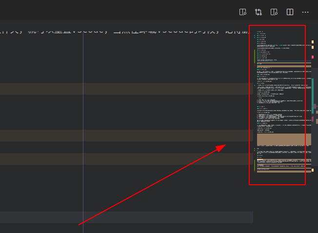

# vscode简介

## 1 什么是vscode

### 1.1 vscode简介

1. VS Code的全称是Visual Studio Code，很多用户喜欢叫它VS Code。官方定义它是一个免费的、开源的跨平台编辑器。通过插件扩充的方式可以实现多数语言开发环境的集成；
2. 它具有对JavaScript，TypeScript和Node.js的内置支持，在编写基于这些语言的程序的时候，自动提供智能感知等功能；
3. VS Code内置了对使用Git进行源代码控制的支持，但需要单独安装Git;（*ubuntu安装：* `sudo apt install git`）
4. VS Code基于文件和文件夹提供服务的，当你打开一个文件夹，VS Code 的核心功能就会对这个文件夹进行分析，并提供对应的功能。比如，在打开的文件夹下检测到有 .git 文件，就加载 Git 插件来提供版本管理的功能；
5. VS Code中支持键盘映射，如使用vim快捷键来操作vscode；(通过扩展来实现其他工具的快捷键映射)

### 1.2 vscode界面

编辑器被分成了五个区域：


用户界面分为五个区域：

- **编辑器** :用于编辑文件的主要区域。可以在垂直和水平方向上并排打开任意多个编辑器(即支持网格编辑)
- **边栏** :包含诸如资源管理器之类的不同视图，为项目提供辅助操作
- **状态栏** -包含了打开的项目和编辑的文件的相关信息(如换行符格式，文件行数等)
- **活动栏** -位于最左侧，提供了文件列表，搜索，版本管理，Debug等快捷的功能组建进入方式，位置可调换，隐藏，有些新的扩展也会在这里显示一些基于扩展组建的操作信息(如Docker)
- **面板** -可以在编辑器区域下方显示不同的面板，以获取输出或调试信息，错误和警告或集成终端。面板也可以向右移动以获得更多垂直空间。

## 1.3 帮助文档

<https://code.visualstudio.com/docs>

或者点击帮助 -> 文档可跳转到官方文档

## 2 安装和重置

### 2.1 安装vscode

vscode一般分为开发版和稳定版本，通常的安装方式是到官方网站下载安装包进行安装

**官方网站：**<https://code.visualstudio.com/>


其他安装方式参考官网安装指导

*linux==>* <https://code.visualstudio.com/docs/setup/linux>  
*windows==>*<https://code.visualstudio.com/docs/setup/windows>  
*Mac==>*<https://code.visualstudio.com/docs/setup/mac>

**注：**  
ubuntu通常可以通过deb包和snap包的方式进行安装

### 2.2 重置vscode

通常vscode将它的设置和数据保存在`Code`目录和`.vscode`目录下，删除这些配置文件夹，就可以重置vscode，当然在卸载vscode的时候，记得删除这两个文件夹，达到完全删除的目的。

Linux通常将这两个文件夹保存在$HOME/.config/Code和~/.vscode路径下。

### 2.3 设置vscode

VS Code提供了两种不同的设置范围：

- **用户设置** ：全局设置针对任何打开的VS Code实例。
- **工作区设置** ：存储在工作区中的设置，仅在打开工作区时适用。
- 工作区设置将覆盖用户设置。工作区设置服务于特定的项目，并且可以在项目的开发人员之间共享。

VS Code可以通过ui或者json方式进行设置,通过`workbench.settings.editor`选项对设置默认打开json还是ui进行设置

```json
// 设置设置中心默认打开方式为json
  "workbench.settings.editor": "json",
```

VS Code在设置中还支持对某一特定语言进行相关设置

```json
// 某些设置仅针对python生效
  "[python]": {

  },
```

vscode用户设置在linux中保存在如下配置文件当中
`$HOME/.config/Code/User/settings.json`
vscode工作区设置保存在项目中的如下位置
`.vscode/setting.json`

## 2.4 针对界面的常见设置

### 2.4.1 自定义vscode标题栏

在linux和mac上可能由于系统原因导致vscode标题栏显示的不和谐，如下所示


可以通过设置该参数`window.titleBarStyle`,启用自定义标题栏


### 2.4.2 面包屑设置

VSCode面包屑，叫做Breadcrumb，主要是展示目前的代码在整个工程里的路径，同时还能够看出这个代码所在位置的结构层级并且可以快速跳转。


通过`breadcrumbs.enabled`选项可以关闭面包屑功能


### 2.4.3 小地图设置

vscode提供小地图功能，可提供代码导航，在地图里面显示缩小的代码



可以通过`editor.minimap.enabled`关闭小地图功能，可以通过`editor.minimap.renderCharacters`不显示代码，显示色块

### 2.4.4 常用的显示设置

主要针对行号，光标，空格制表符，参考线等进行设置

```json
  // 控制光标样式
  "editor.cursorBlinking": "expand",
  "editor.cursorStyle":"block",
  // 选中当前行进行高亮显示
  "editor.renderLineHighlight": "all",
  // 渲染空格和制表符
  "editor.renderWhitespace": "all",
  // 值设置为true时，每次保存的时候自动格式化；
  "editor.formatOnSave": false,
  "files.autoSave": "afterDelay",
   // 资源管理器中拖拽文件，不进行确认提示
   "explorer.confirmDragAndDrop": false,
   // 设置垂直标尺
   "editor.rulers": [
     80,
     120
   ],
   // 重新设定tabsize
   "editor.tabSize": 4,
```

## 3 界面

### 3.1 欢迎界面与交互式演习场

#### 3.1.1 欢迎界面

VS Code 第一次启动后会显示一个“欢迎使用”的页面，这个界面主要是方便你快速打开文件、文件夹以及访问历史文件，同时还会附带一些帮助信息，比如“快捷键速查表”。（通过help->welcome界面可以再次打开这个界面）


#### 3.1.2 交互式演习场

打开这个界面，你会看到一个全英文的初学者教程，其中通过各种交互示例给出了 VS Code 的核心功能，展示了一些高级代码编辑功能的使用，每个功能都会有一个代码片段和编辑器供你实时使用。


### 3.2 命令面板

- 命令面板，它是 VS Code 快捷键的主要交互界面，可以“Ctrl+Shift+P”打开,根据当前上下文访问所有可用命令。；

- 可以在命令面板中快速搜索命令并且执行。如果你的 VS Code 是简体中文版，那么你可以在命令面板里使用中文或者英文来搜索命令。VS Code 的绝大多数命令都可以在命令面板里搜到，所以熟练使用命令面板，你就可以摆脱鼠标，完全通过键盘操作来完成全部编码工作；

- 命令面板在我们使用vscode中是大量使用的一个功能模块；


命令面板是根据输入框里的第一个字符来决定提供什么功能的


```console

1. >（大于号） ，用于显示所有的命令。
2. @ ，用于显示和跳转文件中的“符号”（Symbols），在@符号后添加冒号：则可以把符号们按类别归类。
3. # 号，用于显示和跳转工作区中的“符号”（Symbols）。
4. ：（冒号）， 用于跳转到当前文件中的某一行。

```

### 3.3 界面概览

#### 3.3.1 主界面概览

它展示了 VS Code 默认界面里的不同部件的位置、名称和快捷键。VS Code 强调无鼠标操作，这个界面恰好可以帮助你渡过最初的不适应阶段。


1. 文件资源管理器，主要用于浏览和管理文件和文件夹。
2. 跨文件搜索，用于在当前文件夹内进行跨文件的搜索。
3. 源代码管理，用于对当前文件夹下的代码进行版本管理，默认 VS Code 支持的版本管理软件是 Git。
4. 启动和调试，用于对当前文件夹下的项目进行运行和调试。
5. 扩展管理，用于下载和管理 VS Code 里的插件。

如果有哪个功能是你不需要的话，你可以在 VS Code 的最左侧，右键打开上下文菜单，然后将那个组件隐藏。你还可以拖动这几个小图标，然后将这些功能按照你需要的方式排序。

#### 3.3.2 快速操作区

在侧边栏的最下角还有一个齿轮形状的按钮，它提供了一些 VS Code 系统管理常用的快捷键，点击打开后，你可以看到命令面板、设置、键盘快捷方式、管理扩展等等一系列快速入口。


该功能提供如图所示快捷功能


同时按住 Option 和方向键，那么光标移动的颗粒度就变成了单词，你就可以在文档中以单词为单位不停地移动光标了。
`

飒飒

5
而图2中的竖线则不一样了，它叫做垂直标尺。如果你的项目中有规定说每一行代码不得超过多少个字符，比如说120个字符，那么你就可以将标尺设置为 120，即 editor.rulers: [120]。这样的话编辑器就会在第120个字符所在的位置处画出这样一条垂直的竖线，所以你一眼就可以看出自己的代码是否达标。

## 6 工作区

## 5 扩展

### 分享扩展
你可以通过在项目的 .vscode 文件夹下，创建一个文件 extensions.json。你很熟悉了，这又是一个 JSON 文件，在这个 JSON 文件里，你只需提供一个键（key） recommendations，然后将你想要推荐给这个项目的其他工程师的插件的 ID 们，全部放入到这个数组中。当他们打开这个项目，而且并没有安装这些插件时，VS Code就会给他们提示了。


.vscode文件夹
特定于工作区的.vscode文件位于根目录下的文件夹中。例如tasks.json对于任务运行launch.json器和调试器。


workbench.settings.editor


