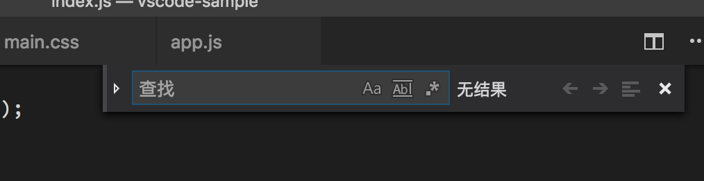

# vscode常见操作

## 代码行编辑

- 删除行操作：` Ctrl + Shift + K`
- 上下移动代码行：`Alt + 上下方向键`
- 复制当前代码，并上下粘贴：`Alt + shift + 上下方向键`

## 光标位置操作

- 光标位置回退：`Ctrl + U`
- 
- 剪切代码行：`Ctrl + x`

在调试代码时，肯定经常需要临时地把一些代码注释掉。如果你要将一行代码注释掉，你只需按下 Cmd + / （Windows 上时 Ctrl + /）。如果你需要把一整段代码注释掉，按下 Option + Shift + A即可。

VSCode 调整字符大小写
你可以选中一串字符，然后在命令面板里运行“转换为大写”或 “转换为小写”, 来变换字符的大小写。

VSCode 代码缩进，有的时候，你会觉得代码格式化太重了，需要的可能只是把代码里的缩进调整一下。这时你可以打开命令面板（快捷键“Cmd + Shift + P”），搜索 “缩进”，然后使用 “重新缩进行” 将整个文档的缩进进行调整，但更多时候，你只需要运行 “重新缩进选中行” 来调整部分选中代码行的缩进。

你可以按下 “Option + Shift + F” （Windows 上是 Alt + Shift + F）来对整个文档进行格式化，VS Code 也会根据你当前的语言，选择相关的插件。当然，前提条件是你已经安装了相关插件。


在最近打开的文件夹和工作区之间导航
最近开放

键盘快捷键：Ctrl + R


`Ctrl + p` 快速打开文件


缩放操作 `Ctrl + +/-`,通过命令面板中的`reset zoom`进行重置到原尺寸

```console
Esc + `打开
Ctrl + j 
``` 

禅模式键盘快捷键：Ctrl + KZ  按两次Esc退出Zen模式。


错误和警告
键盘快捷键：Ctrl + Shift + M

快速跳转到项目中的错误和警告。

通过F8或Shift + F8循环检查错误

并排编辑＃
键盘快捷键：Ctrl + \

在编辑之间切换
键盘快捷键：Ctrl + 1，Ctrl + 2，Ctrl + 3

导航历史
浏览整个历史记录：Ctrl + Tab


## 搜索和替换

`Ctrl + f`



除了搜索纯文本以外，搜索框还支持多种不同的搜索方式。比如，在搜索框的最右侧，就有三个配置按钮。
第一个是大小写敏感。
第二个是全单词匹配。
第三个，就是正则表达式匹配了。


`Ctrl + h`