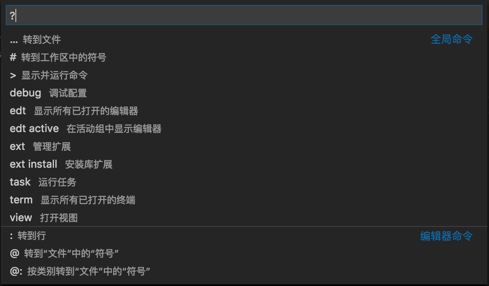

# vscode命令行使用
https://geek-docs.com/vscode/vscode-tutorials/introduction-to-vscode.html
通过使用`code --help`可以获取到vscode的命令行使用方法如下所示：（在linux 中外部命令通常使用command --help来获取帮助）

```console

$ code --help
------------------------------------------------------------------------------------------------------------------ 
Visual Studio Code 1.44.0

Usage: code [options][paths...]

To read from stdin, append '-' (e.g. 'ps aux | grep code | code -')

Options
  -d --diff <file> <file>           Compare two files with each other.
  -a --add <folder>                 Add folder(s) to the last active window.
  -g --goto <file:line[:character]> Open a file at the path on the specified
                                    line and character position.
  -n --new-window                   Force to open a new window.
  -r --reuse-window                 Force to open a file or folder in an
                                    already opened window.
  --folder-uri <uri>                Opens a window with given folder uri(s)
  --file-uri <uri>                  Opens a window with given file uri(s)
  -w --wait                         Wait for the files to be closed before
                                    returning.
  --locale <locale>                 The locale to use (e.g. en-US or zh-TW).
  --user-data-dir <dir>             Specifies the directory that user data is
                                    kept in. Can be used to open multiple
                                    distinct instances of Code.
  -h --help                         Print usage.

Extensions Management
  --extensions-dir <dir>                            Set the root path for
                                                    extensions.
  --list-extensions                                 List the installed
                                                    extensions.
  --show-versions                                   Show versions of installed
                                                    extensions, when using
                                                    --list-extension.
  --category                                        Filters installed
                                                    extensions by provided
                                                    category, when using
                                                    --list-extension.
  --install-extension <extension-id | path-to-vsix> Installs or updates the
                                                    extension. Use `--force`
                                                    argument to avoid
                                                    prompts.
  --uninstall-extension <extension-id>              Uninstalls an extension.
  --enable-proposed-api <extension-id>              Enables proposed API
                                                    features for extensions.
                                                    Can receive one or more
                                                    extension IDs to enable
                                                    individually.

Troubleshooting
  -v --version                       Print version.
  --verbose                          Print verbose output (implies --wait).
  --log <level>                      Log level to use. Default is 'info'.
                                     Allowed values are 'critical', 'error',
                                     'warn', 'info', 'debug', 'trace', 'off'.
  -s --status                        Print process usage and diagnostics
                                     information.
  --prof-startup                     Run CPU profiler during startup
  --disable-extensions               Disable all installed extensions.
  --disable-extension <extension-id> Disable an extension.
  --sync <on> <off>                  Turn sync on or off
  --inspect-extensions <port>        Allow debugging and profiling of
                                     extensions. Check the developer tools for
                                     the connection URI.
  --inspect-brk-extensions <port>    Allow debugging and profiling of
                                     extensions with the extension host being
                                     paused after start. Check the developer
                                     tools for the connection URI.
  --disable-gpu                      Disable GPU hardware acceleration.
  --max-memory                       Max memory size for a window (in Mbytes).
  --telemetry                        Shows all telemetry events which VS code
                                     collects.




包括已启用和已禁用的扩展

`--show-versions`要与`--list-extensions`参数一起使用,  

