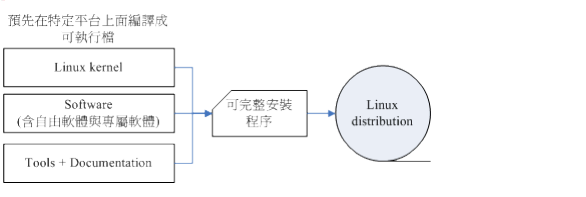
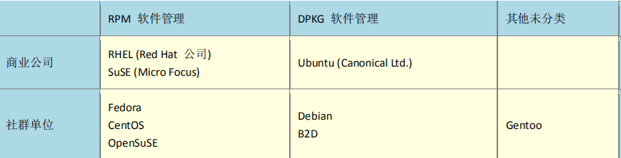
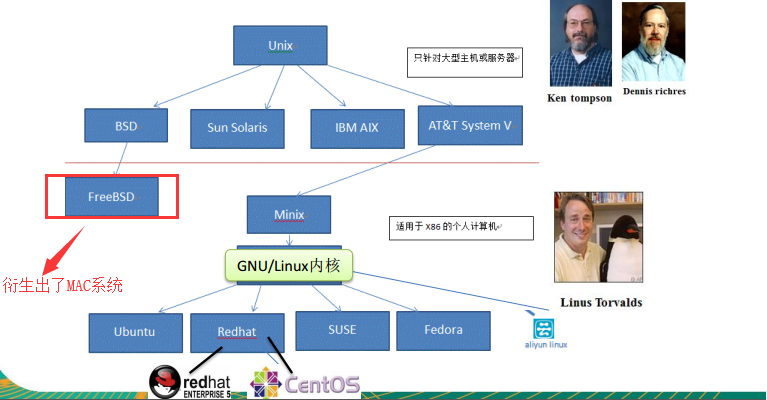
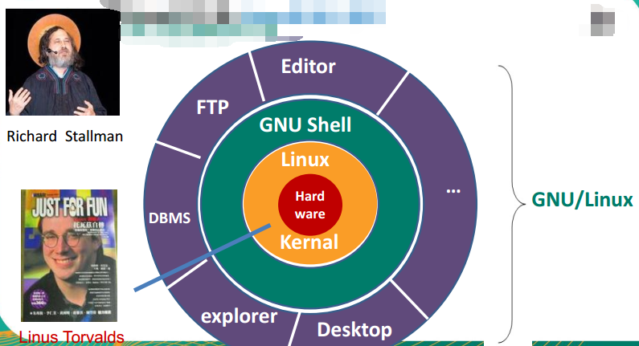
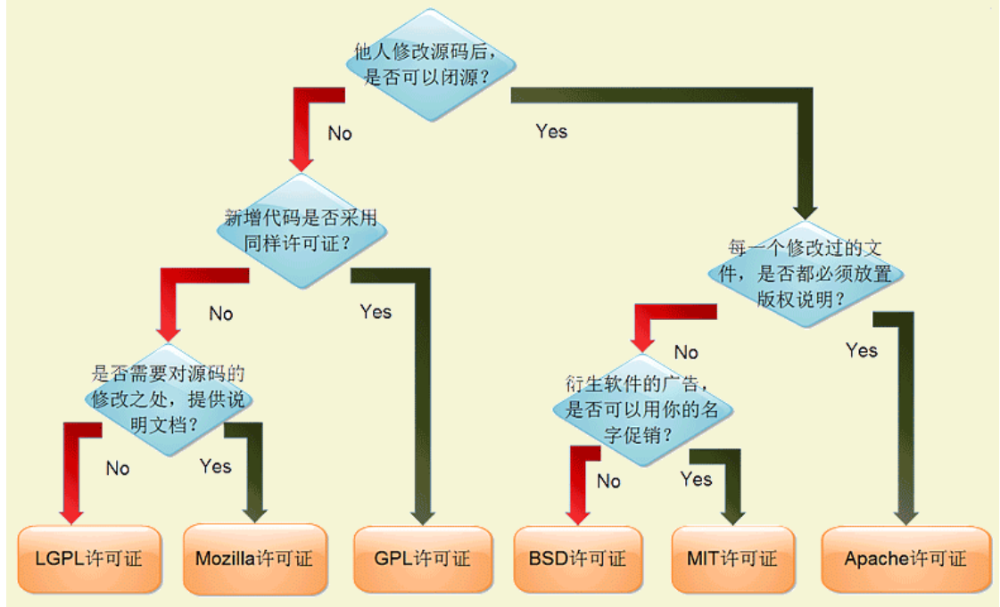
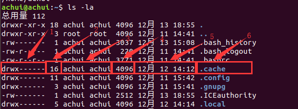

# Linux入门了解

## 0 参考资料

- 《跟着鸟哥学linux（第四版）》
- 韩顺平老师关于linux的公开课

## 1 关于Linux

### 1.1 linux简介

#### 1.1.1 什么是linux

操作系统是软件的一部分，它是硬件基础上的第一层软件，是硬件和其它软件沟通的桥梁，操作系统会控制其他程序运行，管理系统资源，以及提供一些基本的服务程序，为处于它之上的应用软件服务，如文件系统，设备驱动程序，用户接口等，linux就是一款流行的操作系统。

Linux是基于Unix的开源免费的操作系统，由于系统的稳定性和安全性几乎成为程序代码运行的最佳系统环境。Linux是由Linus Torvalds（林纳斯·托瓦兹）起初开发的，由于源代码的开放性，现在已经衍生出了千上百种不同的基于Linux内核的发行版系统。Linux的吉祥物是Tux，他是一只企鹅。  

Linux是专业的编程开发平台，也是服务器，手机（安卓基于Linux），嵌入式设备等平台的主要操作系统，服务器在国内常用Cent OS，python的专业开发平台是Ubuntu。他们都是Linux的发行版，都是基于Linux的内核的。

#### 1.1.2 常见的发行版

下图为一些市面上常见的Linux发行版系统的logo

这些发行版都是基于Linux内核（Kernel）的，但是经过发行商的包装组成了不同的具有厂商特色的发行版（有的书中也叫做发行套件），每一个发行版具体包括如下四部分内容。

每个发行版都是基于Linux Kernel内核的，只不过内核版本有区别，而software（软件）每家厂商采用的也都是比较热门的开源软件，所以每个发行版都差不多，重复率较高，可完整安装程序，就是我们自己需要安装的一些程序，因人而异，那么不同的发行版的区别就在于Tools这里，根据工具种类的不同，大致分为两个流派，如下所示：

#### 1.1.3 Linux和Unix的关系

#### 1.1.4 GUN计划

#### 1.1.5 开源许可证

由于GUN计划先开始执行，所以很多软件都是基于Unix平台运行的，Linux为了兼容这些自由开源的软件，所以采用了POSIX规范（这套规范主要是Unix用来规范其平台上的软件的）。

#### 1.1.6 bash

万能的帮助命令

- man 帮助
man 帮助分为9章用于区分查询的名称关于文件或者命令的帮助
man command
man number command
- help 帮助

- info 帮助

- 使用网络资源（搜索引擎和官方文档）
- |章节序号|描述|
|:-:|:-:|
|1|使用者在shell中可以操作的指令或可执行档|
|2|系統核心可呼叫的函数与工具等|
|3|一些常用的函数(function)与函数库(library)，大部分是C的函数库(libc)|
|4|装置档案的说明，通常在/dev下的档案|
|5|设定档或者是某些档案的格式|
|6|游戏(games)|
|7|惯例与协定等，例如Linux档案系统、网络协定、ASCII code等等的說明|
|8|系統管理員可用的管理指令|
|9|跟kernel有关的文件|

help 

内部命令使用help帮助
help cd
外部命令使用help帮助
cd --help

type命令区分外部内部命令

## 2 基础的操作命令

### 2.1 

#### 2.1.1 pwd

> 命令的作用  

该命令用于显示当前所处的目录位置

#### 2.1.2 ls

**1） 命令的作用**

该命令用于列出目录内容，支持传参，并且参数通配符

**2）常使用的参数**

|序号|参数|描述|
|:--:|:--:|:--:|
|1|-l|以列表的方式显示文件的详细信息|
|2|-a|显示指定目录下所有子目录与文件，包含隐藏信息|
|3|-r|逆序显示|
|4|-t|按照时间顺序显示|
|5|-R|递归显示|
|6|-h|配合-l参数以人性化的方式显示文件的大小|

**3）演示**

> 每行信息的具体含义如下图所示：

1. 文件类型与权限信息
   - 通常由10个字符组成，第一个字符代表类型，后面三个字符一组代表权限信息
   -  第一个字符中，`d`代表目录，`-`代表文件
   -  后面的3组字符分别代表了拥有者权限，所属组权限，以及其他人的权限
   -  每组3个字符又分别代表了读写以及是否可执行，分别为rwx，如果没有权限，则显示为-
2. 链接数
3. 文件拥有者和文件所属组
4. 文件大小
5. 文件最后修改时间 
6. 文件名

