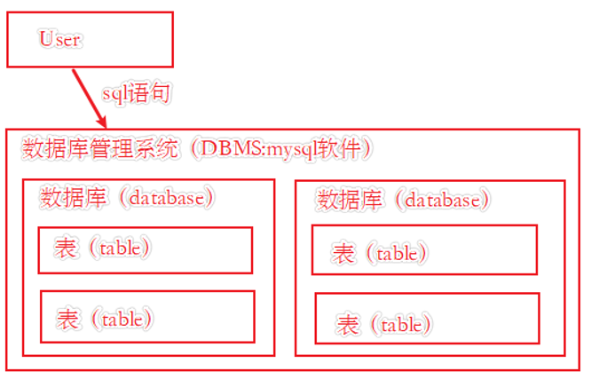
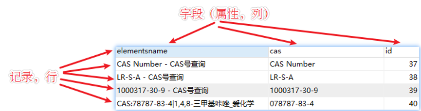
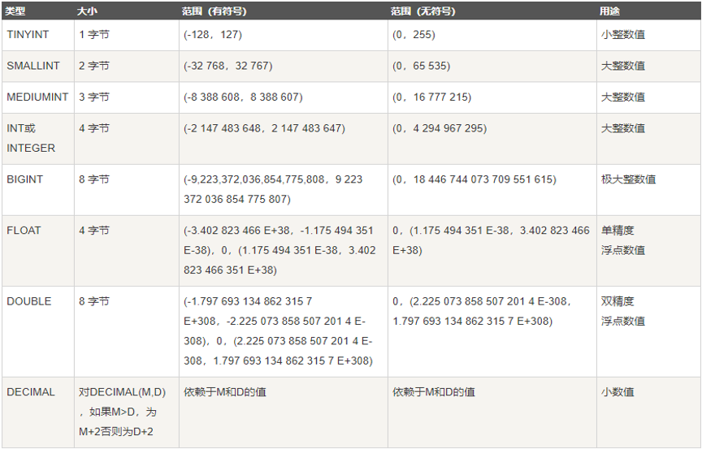
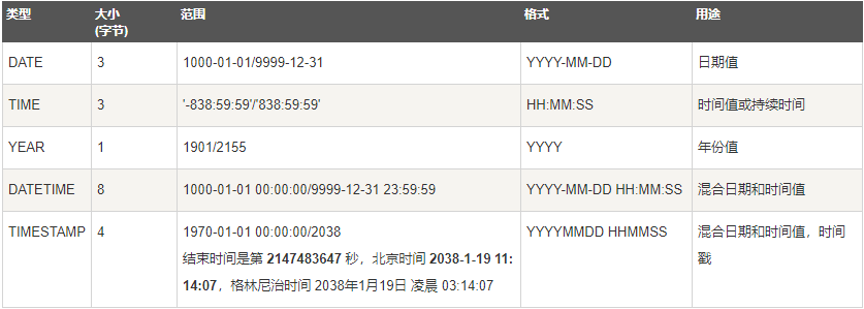
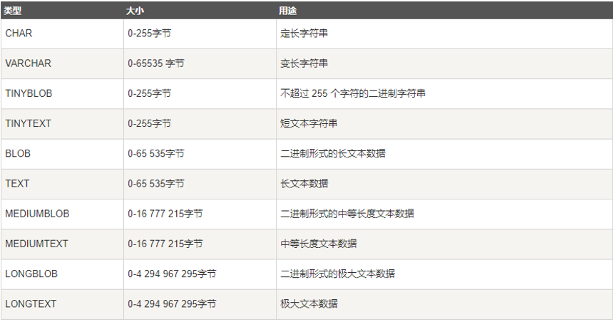
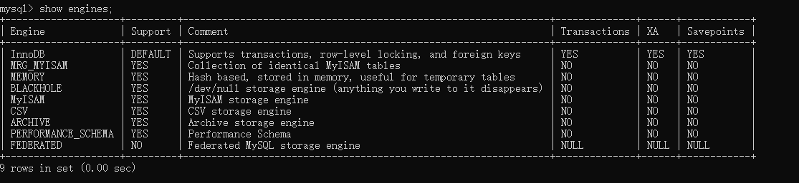

# mysql5.7学习笔记（快速入门）

## 0. 前言

参考资料：

- 《mysql5.7从零开始学》
- <https://www.cnblogs.com/kissdodog/p/4174421.html> 参考了其中数据库备份的章节
- <www.runoob.com> 菜鸟教程

## 1. 数据中基本的概念描述

### 1.1 SQL/DBMS/DB/TABLE之间的关系

用户通过sql语句和DBMS系统进行交流，而DBMS系统负责管理数据库中的各种数据，具体情况如下所示：



### 1.2 表中的基本概念

数据库中的表就像是Excel中的数据表，由行列组成，而在数据表中，行对应的是记录，列对应的是字段，如下所示：



### 1.3 结构化查询语言

#### 1.3.1 SQL语句概念

**SQL**：结构化查询语言，是一种特殊目的的编程语言，是一种数据库查询和程序设计语言，用于存取数据以及查询、更新和管理关系数据库系统；同时也是数据库脚本文件的扩展名。（注意：SQL中不区分大小写）

#### 1.3.2 SQL语言分类

1. 数据查询语言（DQL）:代表关键字：select
2. 数据操纵语言（DML）:代表关键字：update delete insert
3. 数据定义语言（DDL）:代表关键字：create drop alter
4. 事务控制语言（TCL）:代表关键字：commit rollback
5. 数据控制语言（DCL）:代表关键字：grant revoke

## 2. mysql与数据库的基本操作

### 2.1 数据库的相关操作

```sql
show databases;  -- 显示当前DBMS中所有的数据库
create database database_name;  -- 创建一个名为database_name的数据库
show create database database_name; -- 查看database_name数据库创建时的定义
use database_name; -- 选择要使用的数据库
drop database database_name; -- 删除指定的数据库，如果数据库不存在则报错
select database();  -- 查看当前使用的是哪个数据库
show tables; -- 查看当前数据库下存在的表
show tables from database_name; -- 显示其他数据库中存在的表
```

### 2.2 备份和恢复数据库（mysqldump）

mysqldump备份数据库的原理是,生成创建表的语句，以及插入数据的语句，备份数据库的基本语法如下所示：

```shell
mysqldump -u username -p dbname table1 table2 ...-> BackupName.sql -- 将某个数据库中的某些表备份成sql文件  
mysqldump -u username -p --databases dbname2 dbname2 > Backup.sql  -- 将多个数据库进行备份
mysqldump -u username -p -all-databases > BackupName.sql -- 对整个mysql下包含的数据库进行备份
```

还原数据库的基本语法如下所示：

```shell
mysql -u root -p < C:\backup.sql
```

### 2.3 mysql登录和退出

```sql
mysql -uroot -p -P3306 -h127.0.0.1 -- 登录本地的mysql
exit -- 退出mysql
select version() -- 查看mysql版本，也可以在命令行中使用mysql --version
select now() -- 查看当前的系统时间
```

## 3. 数据表的基本操作

### 3.1 定义数据表

创建数据表的基本语法

```sql
create table 表名 (
    字段名 数据类型 [列级约束条件] [默认值],
    字段名 数据类型 [列级约束条件] [默认值],
    ......
    [表级约束条件]
);
```

### 3.2 列级约束条件

#### 3.2.1 列级约束条件的分类

1. 非空约束 -> not null
2. 唯一约束 -> unique
3. 主键约束 -> primary key 简称PK
4. 外键约束	-> foreign key 简称FK

#### 3.2.2 非空约束

加了not null约束的字段，值不能为null 必须给定具体的数据，示例如下所示：

```sql
create table employee (
    id int(8),
    name varchar(25) not null -- 在向表中插入数据的时候，该字段值不可以为空
);
```

#### 3.2.3 唯一约束

unique约束指定的字段具有唯一性，不能重复，示例如下所示：

```sql
create table employee (
    id int(8) unique,  -- 所以在向表中插入数据的时候，该字段值不可以为重复值
    name varchar(25) not null -- 在向表中插入数据的时候，该字段值不可以为空
);
```

> 虽然加了唯一约束后，字段不可重复，但是可以为null值， 为了避免null值得出现，mysql允许非空约束和唯一约束一起作用到一个字段上面

```sql
create table employee (
    id int(8) unique not null,  -- 所以在向表中插入数据的时候，该字段值不可以为重复值,且不能为null值
    name varchar(25) not null -- 在向表中插入数据的时候，该字段值不可以为空
);
```

#### 3.2.4 主键约束

主键能够唯一地标识表中的一条记录，类似身份证与人的关系，它是唯一且要求非空的，主键分为两种类型分别为，单字段主键和多字段联合主键。

##### 3.2.4.1 单字段主键设置

在定义列时直接指出某一列时主键，如下所示：

```sql
create table employee (
    id int(8) primary key,  -- 设置id为主键
    name varchar(25) not null -- 在向表中插入数据的时候，该字段值不可以为空
);
```

在定义完列以后，指出某一列是主键，这与上面的用法是相同的，如下所示：

```sql
create table employee (
    id int(8),
    name varchar(25) not null, -- 在向表中插入数据的时候，该字段值不可以为空
    primary key(id) -- 设置id字段为主键
);
```

##### 3.2.4.2 多字段联合主键设置

可以将多个字段联合起来设置主键，实例如下所示：（多字段绑定为主键时，插入数据时，只要其中一个字段的值是不相同的，就可以插入数据）

```sql
create table employee (
    id int(8),
    name varchar(25) not null, -- 在向表中插入数据的时候，该字段值不可以为空
    telphone int(11),
    primary key(id, telphone) -- 设置id和telphone字段为联合主键
);
```

##### 3.2.4.3 关于主键的一点说明

1. 主键约束涉及到的术语：主键约束，主键字段，主键值，三者之间的关系：表中的某个字段添加主键约束以后，该字段称为主键字段，字段中出现的每一个数据都称为主键值。
2. 给某一个字段添加主键约束后，该字段不能重复，并且也不能为空，相当于not bull 和unique 联合使用，但是本质不同，主键约束除了做到了不重复不能为空之外，还会为该字段默认添加索引。
3. 一张表应该有主键字段，如果没有，证明该表是无效的，“主键值”是当前行数据的唯一标识，即便两行数据完全一样，但是只要主键值不一样，便认为这是两行不同的数据。
4. 主键添加分为单一主键和复合主键，无论是单一还是复合，一张表只能有一个主键。
5. 主键根据性质可以分为自然主键和业务主键，自然主键通常是一个自然数，与当前业务并无关联，如行号，而业务主键与当前业务有较深联系如身份证号，在实际开发中使用自然主键比较多。

#### 3.2.5 外键约束

和主键约束一样外键约束也可以分为单一外键约束和复合外键约束，不同的是，一张表中可以出现多个外键字段，外键的主要作用是建立两张数据表之间的链接。示例如下所示:

首先创建一个部门表

```sql
create table dept(
    id int(3),
    name varchar(24),
    des varchar(200),
    primary key(id)
);
```

将部门表关联到我们的职工表上

```sql
create table employee (
    id int(8),
    name varchar(25) not null, -- 在向表中插入数据的时候，该字段值不可以为空
    deptId int(3),
    primary key(id), -- 设置id字段为主键
    -- constraint 外键名 foreign key(字段1,字段2...) references 主表名(字段1，字段2...)
    constraint fk_emp_dept foreign key(deptId) references dept(id)
);
```

**注意事项**：子表的外键必须关联父表的主键，且关联字段的数据类型必须匹配。

删除一个表的外键约束可使用如下语句：

```sql
alter table <表名> drop foreign key <外键约束名>
```

### 3.3 默认值与自动增长

#### 3.3.1 设置字段的默认值

基本的语法`字段名 数据类型 [列级约束条件] [default 默认值]`，示例如下所示：

```sql
create table employee (
    id int(8),
    name varchar(25) not null,
    deptId int(3),
    jobTitle varchar(20) default '科员', -- 为职位设置默认值
    primary key(id),
    constraint fk_emp_dept foreign key(deptId) references dept(id)
);
```

#### 3.3.2 设置字段自增长

一般设置字段的自增长可以通过为字段后追加约束完成，自增长的约束条件是`auto_increment`, 示例如下所示：

```sql
create table employee (
    id int(8) auto_increment=1000000, -- 为员工的id字段设置自增长
    name varchar(25) not null,
    deptId int(3),
    jobTitle varchar(20) default '科员', -- 为职位设置默认值
    primary key(id),
    constraint fk_emp_dept foreign key(deptId) references dept(id)
);
```

**注意事项**：自增长的字段在插入数据的时候可以不显示的指定字段的值，mysql会自动的为该值加1，默认的自增的起始值为1。

以下演示在创建表的时候为自增长的字段设置初值：

```sql
create table employee (
    id int(8) auto_increment, -- 为员工的id字段设置自增长
    name varchar(25) not null,
    deptId int(3),
    jobTitle varchar(20) default '科员', -- 为职位设置默认值
    primary key(id),
    constraint fk_emp_dept foreign key(deptId) references dept(id)
)auto_increment=1000000;
```

如果一个表在创建的时候没有指定自增长，可以统一以下语句进行设置：

```sql
alter table tablename modify id int(11)  auto_increment; -- 为字段设置自增长
alter table 表名字 auto_increment = n; -- 为自增长的字段设置自增长初始值
```

### 3.4 数据类型

MySQL支持多种类型，大致可以分为三类：数值、日期/时间和字符串(字符)类型。

#### 3.4.1 数值类型

mysql中的数值类型如下所示：



**日期和时间类型**


**字符串类型**


### 3.5 表结构以及表的相关操作

针对表结构的相关操作如下所示：

```sql
show create table <表名\G>; -- 查看详细的表创建语句,加入\G参数，格式会很清晰
desc table_name; -- 查看表的结构
alter table <旧表名> rename <新表名>; -- 修改表名
alter table 表名 add 字段名字 字段类型（字段长度）字段约束; -- 增加表中某一字段
alter table 表名 modify 字段名字 字段类型（字段长度）字段约束; -- 修改表种某一字段
alter table 表名 drop 字段名字; -- 删除表种某一字段
alter table <表名> modfiy <字段1> <列级约束条件> first | aeter <字段2>-- 修改表中字段的位置
```

#### 3.5.1 对表中字段的位置进行更改

操作的表如下所示：

| Field        | Type        | Null | Key | Default | Extra |
|--------------|-------------|------|-----|---------|-------|
| id           | int(10)     | NO   | PRI | NULL    |       |
| elementsname | varchar(70) | YES  |     | NULL    |       |
| cas          | varchar(70) | YES  |     | NULL    |       |

将表中某个字段设置为第一个字段（在进行位置修改的时候，应该注意的需要将原有的列级条件都加上，mysql是不会自动进行添加的，需要自己手动的进行添加）

```sql
alter table t_cas modify cas varchar(70) first; -- 将cas字段设为表的第一个字段
alter table t_cas modify id int(10) aeter cas; -- 将id字段插在cas字段后面
```

为什么id为主键，进行字段位置更换的时候，没有在列级条件中将这个字段明确的加入约束中，因为主键添加的时候，不是依靠列级约束进行添加的，而是在字段定义完成后，追加的主键定义。

#### 3.5.2 删除表操作

前面说过通过外键可以将两个表关联在一起，删除的时候关联表是需要被考虑的，现在我们首先删除没有关联关系的单表：

```sql
drop table [if exist] 表名1,表名2...; -- 支持多表删除，if exist的作用是在表不存在的时候，不会产生错误信息，这种方式时mysql特有的方式。
```

关联表的删除，父表被子表关联的情况下，删除父表会产生错误，在外键约束的那个章节，dept表就是父表，employee就是子表。删除父表，可以先将子表删除，如果只想删除父表，也可以先将子表中的外键关联关系取消掉在删除父表。

## 5 数据引擎

### 5.1 查看当前系统支持的存储引擎

```sql
show engines; -- 查看前系统支持的储存引擎
```


support列表示某种引擎是否被支持，yes 表示被支持，no表示不被支持，default表示该引擎为当前默认存储引擎。

### 5.2 为表更换存储引擎

```sql
alter table <表名> enging=<更改后的存储引擎的名字>
```
