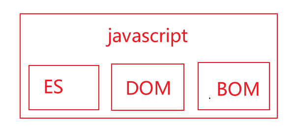
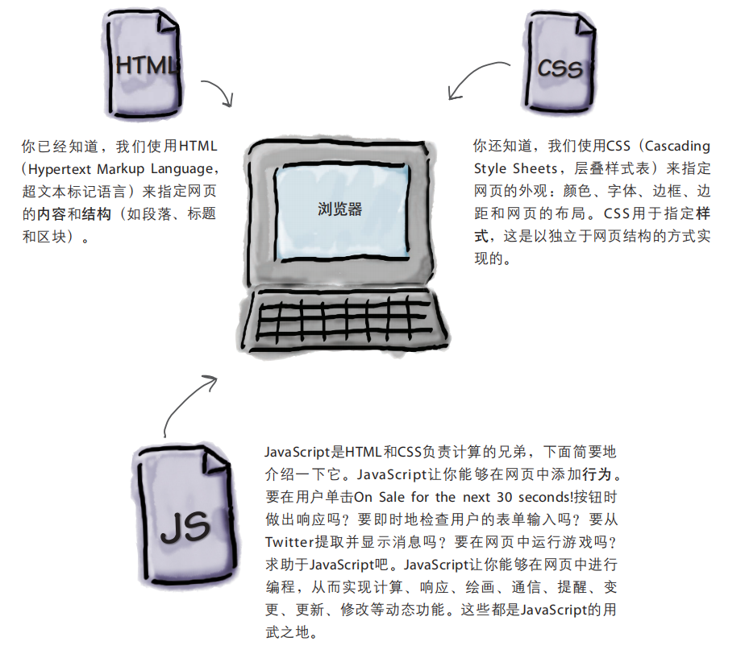
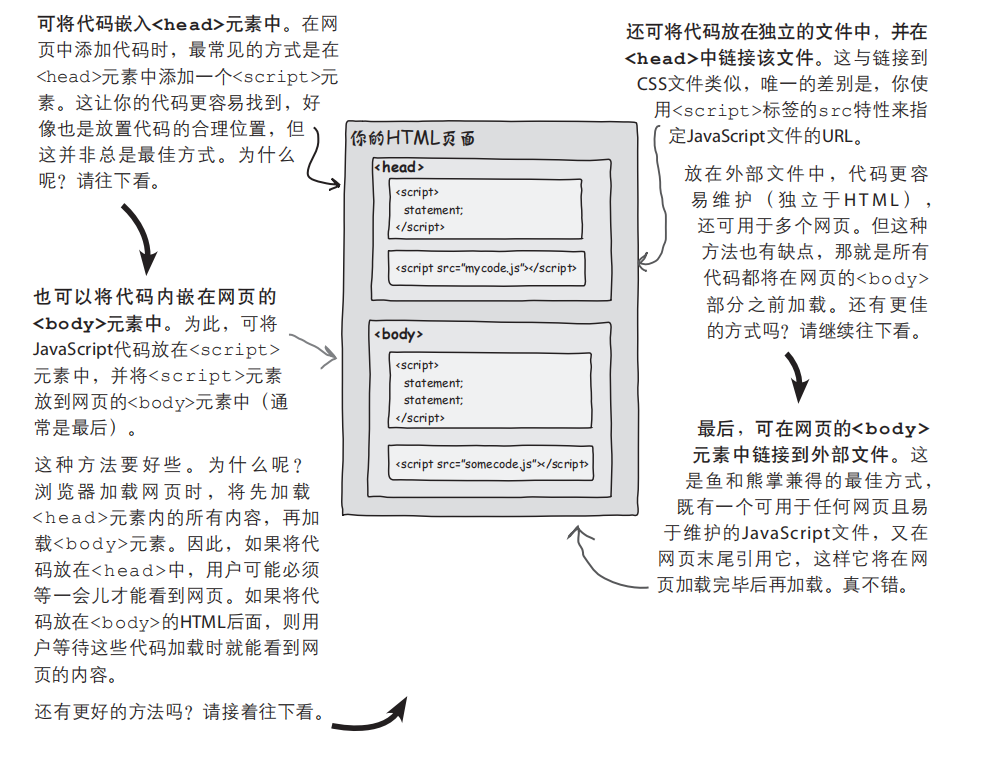

# 1. JavaScript简介

[TOC]

## 1 JavaScript简介

### 1.1 JavaScript简介

#### 1.1.1 JavaScript的诞生

>JavaScript诞生于1995年，由布兰登-艾奇创造，起初的主要用途是处理以前由服务器端语言负责的一些输入验证操作，解决了人们在操作页面时，漫长的服务器端校验回传所浪费的时间，如今，JavaScript的用途早已不再局限于简单的数据验证，而是具备了与浏览器窗口以及其内容等几乎所有方面交互的能力。

#### 1.1.2 JS与ES

​		由于 JavaScript 1.0 很受欢迎，Netscape 在 Netscape Navigator 3 中又发布了 JavaScript 1.1 版本。不久，微软在 Internet Explorer 3 中也加入了脚本编程功能。为了避免与 Netscape 的 JavaScript 产生纠纷，微软特意将其命名为 JScript。1997 年，欧洲计算机制造商协会（ECMA）以 JavaScript 1.1 为基础制订了脚本语言标准——ECMA-262，并命名为 ECMAScript。1998 年，国际标准化组织和国际电工委员会（ISO/IEC）采用了 ECMAScript 标准（即 ISO/IEC-16262）。自此，浏览器厂商就以 ECMAScript 作为各自 JavaScript 实现的规范标准。简单概括，ECMAScript 是 JavaScript 语言的规范标准，JavaScript 是 ECMAScript 的一种实现。

​		Web 浏览器只是 ECMAScript 实现的宿主环境之一。宿主环境不仅提供基本的 ECMAScript 实现，同时也会提供各种扩展功能(DOM和BOM)。ECMAScript 是 JavaScript 的标准，但它并不等同于 JavaScript，也不是唯一被标准化的规范。

#### 1.1.3 JavaScript如今的含义

​		实际上，现在我们所指的 JavaScript 实现由以下 3 个不同部分组成：

- 核心（ECMAScript）：语言核心部分。
- 文档对象模型（Document Object Model，DOM）：网页文档操作标准。
- 浏览器对象模型（BOM）：客户端和浏览器窗口操作基础。



#### 1.1.4 JS的能力和它的未来

- JavaScript是一款纯正的Web编程语言，让你能够给网页添加行为；

- JavaScript是最流行的编程语言之一，所有现代浏览器（和大多数古老的浏览器）都支持它；

- 当今的js已经被嵌入除浏览器外的其他众多环境中；

#### 1.1.5 浏览器中html,css,js的协同关系



#### 1.1.6  引入js代码

​		JavaScript程序不能够独立运行，只能在宿主环境中执行。一般情况下可以把 JavaScript 代码放在网页中，借助浏览器环境来运行（这是因为浏览器中包含js的解释器，如chrome浏览器使用的js引擎称为V8）

​		通过HTML标签中的`<script>`标签可以引入js代码(包含两种方式):

​		**1. 内嵌js代码：**

```html
<!DOCTYPE html>
<html lang="zh-CN">
<head>
    <meta charset="UTF-8">
    <title>Document</title>
    <script type="text/javascript">
        alert("hello js!")
    </script>
</head>
<body>
    hello
</body>
</html>
```

​		**2. 从外部引入js代码：**

```javascript
// hello.js
alert("hello js")
```

```html
<!DOCTYPE html>
<html lang="zh-CN">
<head>
    <meta charset="UTF-8">
    <title>Document</title>
    <script type="text/javascript" src="./hello.js"></script>
</head>
<body>
    hello
</body>
</html>
```

​		上述过程可概括成以下图示：



> **注意事项**

> - 不能在引用JavaScript文件的同时内嵌JavaScript代码，即script标签在使用src属性后，不能在标签中包含js代码，因为浏览器不会再去解析其中的代码；
> - `<script>`标签可以存放在`<body>`或者`<head>`中，最好是存放在`<body>`中的结尾处，这样不影响用户加载网页内容，否则可能会导致浏览器在下载js代码时，造成页面显示的延迟；
> - type属性以及其值text/javascript，不是必须设置的，现代浏览器默认 `<script>` 标签的脚本类型为 JavaScript，因此可以省略 type 属性；如果考虑到兼容早期版本浏览器，则需要设置 type 属性；
> - html文档中，script标签不能在开始标签中闭合，引入的外部文件的后缀名不是必须的，为其他语言动态生成js代码提供了可能性，不过省略的前提是保证服务器能正确的返回MIME类型；


#### 1.1.7 js中的输入输出

浏览器提供了一个内置函数，可以用来获取用户输入；这个函数就是prompt

```js
var name = prompt("Enter your name:");
```


**(Math.random()**

#### dsakjdkasjdkasjdkajskdjask


从语法上说，代码块是放在花

括号内的一组语句，可以只包含一条

语句，也可以包含任意数量的语句。


### 1.5 js中的对象

​		js中的对象大致可以分为三类：

- 用户自定义对象
- 内建对象（如Array, Math, Date）
- 宿主对象 (由浏览器提供的对象)
  - BOM(windows对象对应着浏览器本身，这个对象的属性和方法通称为BOM（浏览器对象模型）)
  - DOM(document（文档对象模型）对象主要的功能就是处理网页内容，是宿主对象中最常用的对象)

### 1.5 输入输出

​		js核心语法没有提供输入输出api，输入输出由宿主环境提供。

```js
// 直接写入 HTML 输出流,只能在 HTML 输出中使用 document.write。如果在文档加载后使用该方法，会覆盖整个文档
document.write("<h1>这是一个标题</h1>");

使用 window.alert() 弹出警告框。
使用 document.write() 方法将内容写到 HTML 文档中。
使用 innerHTML 写入到 HTML 元素。
使用 console.log() 写入到浏览器的控制台。
```


### 1.5 ES中一些注意事项

1. **大括号与分号**

   ​		与python通过缩进和冒号来识别代码块不同，ES中采用`{}`和`;`来区分代码块和语句，虽然实际操作中`;`不是必须的，但是最佳的实践是加上他，这样可以在文件中去除多余的空格来减少ES的体积，以及减少解释器智能添加`;`的性能损耗，增加代码性能。

2. **代码块**

   ​		从语法上说，代码块是放在花括号内的一组语句，可以只包含一条语句，也可以包含任意数量的语句。代码块中的所有语句被视为一个整体，要么都执行，要么都不执行

3. 


分隔符（空白符）就是各种不可见字符的集合，如空格（\u0020）、水平制表符（\u0009）、垂直制表符（\u000B）、换页符（\u000C）、不中断空白（\u00A0）、字节序标记（\uFEFF）、换行符（\u000A）、 回车符（\u000D）、行分隔符（\u2028）、段分隔符（\u2029）等。

在 [JavaScript](http://c.biancheng.net/js/) 中，分隔符不被解析，主要用来分隔各种记号，如标识符、关键字、直接量等信息。 在 [Java](http://c.biancheng.net/java/)Script 脚本中，常用分隔符来格式化代码

> **注意事项**

> - 分隔符虽然无实际意义，但是在脚本中却不能缺少。如果在标识符与关键字之间不使用分隔符分隔，JavaScript 就会抛出异常;

## 2 基础语法

### 2.1 标识符

​		标识符被用于语句，变量，参数，属性名，运算符和标记，ES中命名规范如下所示：

- ECMAScript的标识符区分大小写， test和Test是两个不同的标识符；
- 不能以数字开头，字符由字母，数字，下划线，美元符组成（除非有充分的理由，否则不要使用以_ 或**$**打头的变量名，它们通常被js库所占用。）;
- 标识符最好采用驼峰大小写的方式进行命名，如`sayHello`,当然也可以使用下划线的方式命名（Unix风格）；
- 不使用任何内置关键字和保留字；
- 除了第一个字符外，其他位置可以使用 Unicode 字符。一般建议仅使用 ASCII 编码的字母，不建议使用双字节的字符（如汉字等）;

### 2.2 注释

​		注释应该优先用来提高程序的可读性，js提供以下两种注释方式：

```javascript
// 单行注释

/*
 *	块注释（第一行和尾行的写法是必须的，中间的行首以星号开始不是必须的，这样写主要是提高可读性）
 *  与python等语言一样，解释器不会执行注释中的内容
 */
```

> **注意事项：**

> - 应该尽量避免在代码中出现块注释，因为块注释的语法字符可能会出现在正则表达式字面量中，导致代码不安全；
>
> ```js
> /*
> 	var rm_a = /a*/.match(s);
> */
> ```

### 2.3 严格模式

​		ES5引入了严格模式，定义了一种不同的解析与执行模型，在严格模式下，ES3中的不确定行为将得到处理，针对某些不安全操作，抛出错误，严格模式的`"use starict"`本质是一个编译指令,可以放在脚本的头部，或者函数的首行。

```js
"use strict"
```

### 2.4 语句

​		es中的语句由分号`;`结尾，省略分号，则由解释器确定语句结尾，分号不建议省略，会对解释器性能造成压力，也容易出现不可预知错误，同时对压缩操作造成影响。

## 变量

​		ES的变量是松散类型（可以用来保存任何类型的数据），在生命周期内可以随时改变，定义变量使用关键字`var`;

### 2.2 定义变量

​		在ES中定义一个变量常见的情况如下所示

```javascript
// 先声明在赋值
var name;
name = "achui";

// 声明和赋值同时进行
var age = 18;

// 声明后,在使用前没有赋值
var gender; // 变量在声明后没有赋值，保存一个默认的值undefined

// 给一个未声明的变量直接赋值，会导致该变量，为全局变量
// 这种情况在严格模式下会抛出ReferenceError错误
idCard = 1231231231312

// 定义多变量
var name = "achui",  // 换行可以提高可读性
    age = 18, 
    gender = "women";
```

> **注意事项**

> - 在函数外使用var声明的变量，都是全局变量，只有浏览器关闭页面时才会消逝；
> - 在函数内使用var声明的变量，都是局部变量，函数调用完成后消逝，而且该变量只能在函数中使用；
> - 使用未声明的变量时，它将自动被视为全局变量，即便你在函数中首次使用它亦如此；
> - 如果在函数内和函数外出现了相同命名的变量，一个为局部变量一个为全局变量，在函数内使用的时候，采取就近原则；
>
> 

> **定义变量的规范**

> - 在开头声明全局变量
>- 在函数开头声明全局变量

## 3 数据类型

​		typeof是一个内置的JavaScript运算符，可用于探测其操作数(要对其进行操作的东西)的类型

```javascript
var name = "achui";
var age = 123;
console.log(typeof name);
//-------------------------------------------
// string
// number
```

​		ES中有五种简单的数据类型（基础数据类型）

- Number

- String

- Boolean

- Undefined

- Null

- 不要用引号括起布尔值true和false

  一种复杂的数据类型`Object`

### 3.1 数字

### 3.2 字符串

#### 3.3 undefined

在任何不确定的情况下——使用未初始化的变量、访问不存在(或已删除)的属性、使用不存在的数组元素时——你都将遭遇undefined。

对于任何还没有值(即还未初始化)的东西，都会将undefined赋给它

undefined的类型是undefined


在应该提供一个对象，但无法创建或找到时，将提供null；在变量未初始化、对象没有指定属性或数组没有指定元素时，将返回undefined。

#### 

js中只有一个数字类型，它在内部被表示为64位的浮点数，并没有分离出整数类型，所以1和1.0的值相同，避免了短整型的溢出问题；

```javascript
var testStr = "122121212"
console.log(isNaN(testStr))  // 如果不是数字，返回true
```

NaN


无法表示的数字

var test = 0/0
isNaN(test)
true

typeof test

"number"


因为NaN指的是无法表示的数字，但并非所有无法表示的数字都相同


将两个类型不同的值进行比较时，JavaScript会把一个值转换为另一个值的类型，再进行比较。你可能觉得这很奇怪，因为在其他语言中，这通常不是自动进行的，而需要编写代码显式地进行转换。不过，不用担心，JavaScript自动类型转换通常是件好事，只要你明白转换是在何时以及如何进行的。下面就来了解这一点：转换是何时以及如何进行的。


比较字符串和数字时，都将把字符串转换为数字，再对两个数字进行比较

比较布尔值和其他类型

将把布尔值转换为数字，再进行比较。这看起来有点怪，但只要记住true将被转换为1，而false将被转换为0

比较null和undefined

这两个值的比较结果为true。这好像有点怪，但规则就是这样的。你可以这么理解，它们其实表示的都是“没有值”(没有值的变量和没有值的对象)，因此认为它们相等


在JavaScript中，假值有5个：
undefined
null
0
空字符串
NaN
因此，前一页的每个条件测试都为false


### 字符串

字符串是不可变的

### 3.2 数组

### 3.3 对象

```js
var person = {
    gender: "women",
};
如果在最后一个属性值后面加上了逗号，结果将如何？
答:在大多数浏览器中，这不会导致错误。然而，在一些浏览器的旧版本中，这会导致JavaScript停止执行。因此，要确保代码能够在尽可能多的浏览器中运行，千万不要添加多余的逗号。
```

如何访问属性。要访问对象的属性，可依次指定对象名、句点和属性名。这通常被称为句点表示法

如何修改属性。随时都可修改属性的值，只需将一个新值赋给它即可

如何添加新属性。可随时扩展对象，给它们添加新属性

要删除属性，可使用一个特殊的关键字delete

访问不存在的对象的时候结果为undefined


变量像是容器，用于存储值。数字、字符串和布尔值都很小，对象怎么样呢？变量可存储任何规模的对象，不管它包含多少属性吗？
变量并不实际存储对象。
变量存储指向对象的引用。
引用就像指针，是对象的存储地址。


基本类型变量存储的是实际值 引用变量存储的是引用


函数传递的时候，对象传递的是对象引用，原始类型传递的是值

## 4 函数

可以向函数传递哪些东西

- 可通过实参传递任何JavaScript值，如字符串、布尔值或数字

- 可以将变量作为实参传递

- 可以将表达式用作实参

- JavaScript按值传递实参

- 向函数传递实参时，首先复 

  制其值，再将这个值赋给相应的形参按值传递的真正意义在于，在函数中修改形参的值时，只会

  影响形参，而不会影响传递给函数的变量

- 在函数中处

  理形参时，其影响范围将限制在函数中

- 没有return语句的函数返回

  undefined

- 这被称为变量的作用域

  （scope）。作用域分两种：全局（global）和局部

  （local）。

- 如果变量是在函

  数外声明的，它

  就是全局变量；

  如果变量是在函

  数中声明的，它

  就是局部变量。

- 将i用作迭代变量的做法历史悠久。这种约定始于空

  间有限的年代


如果传递的实参太多，结果将如何？

在这种情况下，JavaScript将忽略多余的实参


如果传入的实参不够，结果将如何？

这样做好像很危险，但实际情况只是将没有相应实参的形参设置为未定义

变量的定义位置决定了其作用域，即变量在代码的哪些地方可见，哪些地方不

可见

​		ES中的函数结构如下所示：

```javascript
// 1. 使用function关键字声明函数
// 2. 形参支持传递表达式，按值传递实参，即在函数中使用参数，不会影响函数外的变量值
// 3. 没有return语句的函数返回undefined
// 4. 不在乎函数是在使用前还是使用后声明的,shell中函数需要在使用前定义, 这是因为浏览器分两遍读取网页：第一遍读取所有的函数定义，第二遍开始执行代码，所以可以将函数放在文件的任何地方。
function sayHello(name) {
    console.log("hello " + name)
    return "successful"
}
```
​		通常使用如下方式，声明函数和调用函数；

```javascript
function quack(num) {  // 声明函数
    for (var i = 0; i < num; i++) {
        console.log("Quack!");
    }
}

quack(3); // 调用函数
```

​		函数的另一种用法，函数表达式(在语句(如赋值语句)中以这样的方式使用关键字function时，创建的是函数表达式)；

```javascript
var fly = function(num) {
    for (var i = 0; i < num; i++) {
        console.log("Flying!");
    }
}

fly(3);
```

​		在分析网页期间(执行任何代码之前)，浏览器查找函数声明。找到函数声明时，浏览器创建相应的函数，并将得到的函数引用赋给与函数同名的变量

无论是使用函数声明还是函数表达式来定义函数，得到的都是指向这个函数的引用。


全局变量的寿命与网页一样长。全局变量在

JavaScript代码加载到网页之后降生，并在网页

消失后死去。


局部变量通常在函数结束时消失。局部变量是

在函数被调用后创建的，并一直活到函数返回

（无论函数是否返回值）。然而，在局部变量的

大限到来前，可从函数返回它们的值


使用未声明的变量

时，它将自动被视

为全局变量，即便

你在函数中首次使

**function playTurn(player, location) {** 

用它亦如此


它将“遮住”（shadow）全局变量。


我在网页中使用了一些全局变量，同时加载了其

他JavaScript文件。请问这些文件的全局变量是独立的

吗？ 

答: 

只有一个全局作用域，因此加载的每个文件看

到的变量都相同（它们创建的全局变量位于同一个空间

内）。因此，避免使用的变量发生冲突（并尽可能少用

甚至不用全局变量）至关重要。


与全局变量一样，可在函数中首次需要局部变量

时声明它。然而，在函数开头声明局部变量是一种良好

的编程实践，


可将函数放在JavaScript文件的任何地方。

JavaScript不在乎函数是在使用前还是使用后声明的


实际情况是，浏览器分两遍

读取网页：第一遍读取所有的函数定义，第二遍开始

执行代码。这让你可以将函数放在文件的任何地方。


在开头声明全局变量！


函数喜欢扎堆。

### 匿名函数

所谓匿名(anonymous)，指的是没有名称的函数，匿名函数是没有名称的函数表达式，用于通常需要函数引用的地方

要获取函数引用，一种方式是使用指向函数的变量

另一种方式与两页前的window.onload示例一样，使用函数表达式