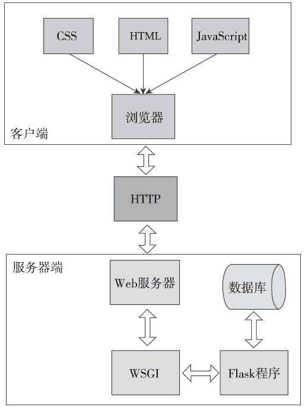

# Flask框架入门

## 1 Flask框架介绍

### 1.1 Flask框架

- Flask是使用Python编写的Web微框架，Web框架可以让我们不用关心底层的请求响应处理，更方便高效地编写Web程序。Flask是使用Python编写的Web微框架，Flask仅保留了Web框架的核心，其他的功能都交给扩展实现；

- Flask有两个主要依赖：一个是WSGI工具集（Web Server Gateway Interface，Web服务器网关接口）,基于Werkzeug工具实现；另一个是Jinja2模板引擎Flask只保留了Web开发的核心功能，其他的功能都由外部扩展来实现，比如数据库集成、表单认证、文件上传等；

**注意事项：**

> Werkzeug是德语单词“工具（tool）， Jinja指日本神社，因为神社（庙）的英文temple与template（模板）相近而得名;
>
> WSGI（Web Server Gateway Interface）是Python中用来规定Web服务器如何与Python Web程序进行沟通的标准;

1.2 Hello，Flask！

对于简单的程序来说，程序的主模块一般命名为app.py。你也可以使用其他名称，比如hello.p

传入Flask类构造方法的第一个参数是模块或包的名称，我们应该使用特殊变量__name__。Python会根据所处的模块来赋予__name__变量相应的值，对于我们的程序来说（app.py），这个值为app。除此之外，这也会帮助Flask在相应的文件夹里找到需要的资源，比如模板和静态文件。

Flask类是Flask的核心类，它提供了很多与程序相关的属性和方法。

）用户在浏览器输入URL访问某个资源。

2）Flask接收用户请求并分析请求的URL。

3）为这个URL找到对应的处理函数。

4）执行函数并生成响应，返回给浏览器。

5）浏览器接收并解析响应，将信息显示在页面中。

大部分都由Flask完成，我们要做的只是建立处理请求的函数，并为其定义对应的URL规则

需为函数附加app.route（）装饰器，并传入URL规则作为参数，我们就可以让URL与函数建立关联。这个过程我们称为注册路由（route

路由负责管理URL和函数之间的映射，而这个函数则被称为视图函数（view function）。

route（）装饰器的第一个参数是URL规则，用字符串表示，必须以斜杠（/）开始。这里的URL是相对URL（又称为内部URL），即不包含域名的URL。以域名[www.helloflask.com为例](http://www.helloflask.xn--com-f88d73d/)，“/”对应的是根地址（即[www.hell](http://www.hell/)

绑定多个URL到同一视图函数

我们不仅可以为视图函数绑定多个URL，还可以在URL规则中添加变量部分，使用“<变量名>”的形式表示。Flask处理请求时会把变量传入视图函数，所以我们可以添加参数获取这个变量值

将传入app.route（）的字符串称为URL规则

app.route('/greet', defaults={'name': 'Programmer'}

1.3 启动开发服务器

Flask内置了一个简单的开发服务器（由依赖包Werkzeug提供），足够在开发和测试阶段使用。

Flask通过依赖包Click内置了一个CLI（Command Line Interface，命令行交互界面）系统。当我们安装Flask后，会自动添加一个flask命令脚本，我们可以通过flask命令执行内置命令、扩展提供的命令或是我们自己定义的命令。其中，flask run命令用来启动内置的开发服务器：

的启动开发服务器的方式是使用app.run（）方法，目前已不推荐使用（deprecated）

当前目录寻找app.py和wsgi.py模块，并从中寻找名为app或application的程序实例。

从环境变量FLASK_APP对应的模块名/导入路径寻找名为app或application的程序实例。

因为我们的程序主模块命名为app.py，所以flask run命令会自动在其中寻找程序实例。如果你的程序主模块是其他名称，比如hello.py，那么需要设置环境变量FLASK_APP，将包含程序实例的模块名赋值给这个变量。Linux或macOS系统使用export命令：



$export FLASK_APP=hello



当安装了python-dotenv时，Flask在加载环境变量的优先级是：手动设置的环境变量>.env中设置的环境变量>.flaskenv设置的环境变量。

使用python-dotenv管理项目的环境变量

$flask run--host=0.0.0.0

flask run--port=8000

执行flask run命令时的host和port选项也可以通过环境变量FLASK_RUN_HOST和FLASK_RUN_PORT设置。事实上，Flask内置的命令都可以使用这种模式定义默认选项值，即“FLASK__

根据运行环境的不同，Flask程序、扩展以及其他程序会改变相应的行为和设置。为了区分程序运行环境，Flask提供了一个FLASK_ENV环境变量用来设置环境，默认为production（生产）。在开发时，我们可以将其设为development（开发），这会开启所有支持开发的特性。为了方便管理，我们将把环境变量FLASK_ENV的值写入.flaskenv文件中：

，这时执行flask run启动程序会自动激活Werkzeug内置的调试器（debugger）和重载器（reloader），它们会为开发带来很大的帮助。

如果你想单独控制调试模式的开关，可以通过FLASK_DEBUG环境变量设置，设为1则开启，设为0则关闭，不过通常不推荐手动设置这个值。

默认会使用Werkzeug内置的stat重载器，它的缺点是耗电较严重，而且准确性一般。为了获得更优秀的体验，我们可以安装另一个用于监测文件变动的Python库Watchdog，安装后Werkzeug会自动使用它来监测文件变动：



$pipenv install watchdog--dev

因为这个包只在开发时才会用到，所以我们在安装命令后添加了一个--dev选项，这用来把这个包声明为开发依赖。在Pipfile文件中，这个包会被添加到dev-packages部分。

如果项目中使用了单独的CSS或JavaScript文件时，那么浏览器可能会缓存这些文件，从而导致对文件做出的修改不能立刻生效。在浏览器中，我们可以按下Ctrl+F5或Shift+F5执行硬重载（hard reload），即忽略缓存并重载（刷新）页面。

1.4 Python Shell

我们并不会直接使用python命令启动Python Shell，而是使用flask shell命令：

1.5 Flask扩展

扩展（extension）即使用Flask提供的API接口编写的Python库，可以为Flask程序添加各种各样的功能

早期版本的Flask扩展使用flaskext.foo或flask.ext.something的形式导入，在实际使用中带来了许多问题，因此Flask官方推荐以flask_something形式导入扩展。在1.0版本以后的Flask中，旧的扩展导入方式已被移除。

1.6 项目配置

在Flask中，配置变量就是一些大写形式的Python变量，你也可以称之为配置参数或配置键。使用统一的配置变量可以避免在程序中以硬编码（hard coded）的形式设置程序。

这些配置变量都通过Flask对象的app.config属性作为统一的接口来设置和获取

2.2 HTTP请求

请求解析和响应封装实际上大部分是由Werkzeug完成的

程序实例中存储了一个路由表（app.url_map），其中定义了URL规则和视图函数的映射关系

当请求发来后，Flask会根据请求报文中的URL（path部分）来尝试与这个表中的所有URL规则进行匹配，调用匹配成功的视图函数。如果没有找到匹配的URL规则，说明程序中没有处理这个URL的视图函数，Flask会自动返回404错误响应（Not Found，表示资源未找到）

使用flask routes命令可以查看程序中定义的所有路由，这个列表由app.url_map解析得到

在输出的文本中，我们可以看到每个路由对应的端点（Endpoint）、HTTP方法（Methods）和URL规则（Rule），其中static端点是Flask添加的特殊路由，用来访问静态文件，具体我们会在第3章学习。

路由列表可以看到，每一个路由除了包含URL规则外，还设置了监听的HTTP方法。GET是最常用的HTTP方法，所以视图函数默认监听的方法类型就是GET，HEAD、OPTIONS方法的请求由Flask处理，而像DELETE、PUT等方法一般不会在程序中实现，在后面我们构建Web API时才会用到这些方法。

当某个请求的方法不符合要求时，请求将无法被正常处理。

。比如，在提交表单时通常使用POST方法，而如果提交的目标URL对应的视图函数只允许GET方法，这时Flask会自动返回一个405错误响应（Method Not

Allowed，表示请求方法不允许），如图2-6所示。

通过定义方法列表，我们可以为同一个URL规则定义多个视图函数，分别处理不同HTTP方法的请求，

第3章 模板

正确的做法是把HTML代码存储在单独的文件中，以便让程序的业务逻辑和表现逻辑分离，即控制器和用户

用户界面的分离。

在动态Web程序中，视图函数返回的HTML数据往往需要根据相应的变量（比如查询参数）动态生成。

借助模板引擎，我们可以在HTML文件中使用特殊的语法来标记出变量，这类包含固定内容和

动态部分的可重用文件称为模板（template）。

模板引擎的作用就是读取并执行模板中的特殊语法标记，并根据传入的数据将变量替换为实际值，输出最终的HTML页面，这个过程被称为渲染

Flask默认使用的模板引擎是Jinja2，它是一个功能齐全的Python模板引擎，除了设置变量，还允许我们在模板中添加if判断，执行for迭代，调用函数等，以各种方式控制模

模板的输出

对于Jinja2来说，模板可以是任何格式的纯文本文件，比如HTML、XML、CSV、LaTeX等

3.1 模板基本用法

1）语句

比如if判断、for循环等：



（2）表达式

1）语句

比如if判断、for循环等：







（2）表达式

比如字符串、变量、函数调用等：



{{ ... }}



（3）注释



{# ... #}



{{ movie.name }} - {{ movie.year }}



在模板中，Jinja2支持使用“.”获取变量的属性

渲染一个模板，就是执行模板中的代码，并传入所有在模板中使用的变量，渲染后的结果就是我们要返回给客户端的HTML响应

我们并不直接使用Jinja2提供的函数，而是使用Flask提供的渲染函数render_template（）

在render_template（）函数中，我们首先传入模板的文件名作为参数。

我们还以关键字参数的形式传入了模板中使用的变量值，以user为例：左边的user表示传入模板的变量名称，右边的user则是要传入的对象。

Flask还提供了一个render_template_string（）函数用来渲染模板字符串。

渲染一个模板，就是执行模板中的代码，并传入所有在模板中使用的变量，渲染后的结果就是我们要返回给客户端的HTML响应

第4章 表单

在Web程序中，表单是和用户交互最常见的方式之一。

WTForms是一个使用Python编写的表单库，

，

，它使得

表单的定义、验证（服务器端）和处理变得非常轻松

4.1 HTML表单

WTForms支持在Python中使用类定义表单，然后直接通过类定义生成对应的HTML代码

，这种方式更加方便，

而且使表单更易于重用。因

。因此，除非是非常简单的程序，或者是你想让表单的定义更加灵活，否则我们一般不会在模板中直接使用HTML编写表单，

4.2 使用Flask-WTF处理表单

扩展Flask-WTF集成了WTForms，使用它可以在Flask中更方便地使用WTForms

Flask-WTF将表单数据解析、CSRF保护、文件上传等功能与Flask集成，另外还附加了reCAPTCHA支持。

reCAPTCHA（https://www.google.com/recaptcha/）是Google开发的免费验证码服务，在国内目前无法直接使用。

$pipenv install flask-w

wtf

Flask-WTF默认为每个表单启用CSRF保护，它会为我们自动生成和验证CSRF令牌。默认情况下，Flask-WTF使用程序密钥来对CSRF令牌进行签名，所以我们需要为程序设置密钥：

app.secret_key='secret string'

4.3 处理表单数据

获取数据到保存数据大致会经历以下步骤：

1）解析请求，获取表单数据。

2）对数据进行必要的转换，比如将勾选框的值转换成Python的布尔值。

3）验证数据是否符合要求，同时验证CSRF令牌。

4）如果验证未通过则需要

需要生成错

错误消息，并在模板中显示错误消息。

5）如果通过验证，就把数据保存到数据库或做进一步处理。

Flask为路由设置默认监听的HTTP方法为GET。为了支持接收表单提交发送的POST请求，我们必须在app.route（）装饰器里使

使用methods关键字为路由指定HTTP方法，

来自京东读书