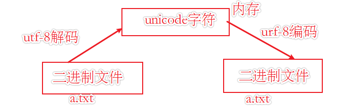

# 1. python3简介与安装

[TOC]

## 1.1 python3简介

### 1.1.1 python的诞生

　　从维基百科中我们可以了解到python的诞生：

> Python的创始人为吉多·范罗苏姆。1989年的圣诞节期间，吉多·范罗苏姆为了在阿姆斯特丹打发时间，决心开发一个新的脚本解释程序，作为ABC语言的一种继承。之所以选中Python作为程序的名字，是因为他是BBC电视剧——蒙提·派森的飞行马戏团的爱好者。ABC是由吉多参加设计的一种教学语言。就吉多本人看来，ABC这种语言非常优美和强大，是专门为非专业程序员设计的。但是ABC语言并没有成功，究其原因，吉多认为是非开放造成的。吉多决心在Python中避免这一错误，并获取了非常好的效果，完美结合了C和其他一些语言。就这样Python在吉多手中诞生了。

　　从这里我们可以了解到Python并不是蟒蛇的意思，而是电视剧男主的名字!

### 1.1.2 脚本与程序

　　python语言通常被描述为脚本语言，初次接触编程的同学可能会疑惑，人们常说的脚本语言是什么？这里引用《python学习手册》中的一句话来解释下脚本和程序：  

> “脚本”往往倾向于描述简单的顶层代码文件，而“程序”则用来描述那些相对复杂一些的多文件应用。  

　　其实在我看来python既可以充当脚本，也可以构建大型程序。

### 1.1.3 python3

　　Python的3.0版本，常被称为Python 3000，或简称Py3k。相对于Python的早期版本，这是一个较大的升级。为了不带入过多的累赘，Python 3.0在设计的时候没有考虑向下兼容。这里提一点python2.7版本是一个过渡版本，他和python3有些许差别，我们这里主要了解python3，并以python3.7为主要的版本进行演示。（当前Python的最新版本为3.8）,当然这里值得注意的是python2.x在2020年官方不在提供支持了，所以初学的话学python3。

### 1.1.4 python之禅

　　Python语言是优雅的，简单的，这里我们通过交互命令行，查看python程序的设计哲学  

```python
import this
```

　　这里我直接放一张中英文的对照表，方便大家体会


### 1.1.5 python的优点

　　既然选择学习了Python，当然需要了解一些它的一些优点，至于它的缺点运行缓慢等内容不在我们的考虑范围之内。

1. Python是一门强大的多范式计算机编程语言（多范式：多种编程方法的意思，目前大致有四种程序设计方式，面向过程，面向对象，泛型，函数式四种程序设计方法)；
2. Python是一门流行的开源编程语言，主要优点是，免费，可移植，优雅和简单；

### 1.1.6 python的标准实现方式的执行模型简介

　　目前python的标准实现方式是Cpython，换句话说从官方下载的python，里面的解释器用的就是Cpython，所以我们这里简单的介绍下它的执行模型。  

　　首先要明确的一点是，python严格的来说并不是解释性语言，它跟java一样是基于虚拟机的语言。所以单纯的以编译，解释来划分语言类型有点模糊。在标准实现下，python程序的执行过程是这样的，先将源代码编译为字节码的形式，之后再将字节码解释执行。如下图所示：

  

　　上图是python学习手册里面的一个配图，大致概括了执行模型，但是值得注意的是，解释器在加载源码生成字节码的过程中首先是发生在内存中的，根据Code Block生成pyCodeObject对象（可以理解为是字节码），而Code Block的划分是根据命名空间规则划分的，内存中的pyCodeObject对象被PVM加载执行，而PVM是python解释器的运行时引擎，是解释器的最后一个步骤，本质上是一个大循环，目的就是迭代运行字节码指令。在程序运行完以后，如果python解释器拥有对磁盘的写入权限，它会将内存中导入模块（import）的pyCodeObject对象，持久化到源码目录下的__pycache__目录下（python3.2版本以及以后的版本pyc文件都会这样生成在源码目录下），生成后缀为.pyc的文件，方便下次运行程序时复用这些字节码文件，加速程序的启动运行速度。  

　　而字节码是什么? 字节码是一种低级的与平台无关的表现形式，它的持久化，只发生在导入模块身上。剩下的顶层执行文件都是每次加载时重新生成pyCodeObject。具体复用的原则可以查看下图片中的示例  


　　所以经过上面的粗浅解释，我们可以大致知道，Python比传统的解释语言执行速度要快，但是比像C一样的编译语言执行速度要慢。

### 1.1.7 python的不同实现

　　针对python解释器的实现有多种，但是作为新手的我们主要了解Cpython就可以了，以下从廖雪峰先生的官网直接搬运了一些主要实现的介绍，可以简单的了解下。

1. **CPython**
当我们从Python官方网站下载并安装好Python 3.x后，我们就直接获得了一个官方版本的解释器：CPython。这个解释器是用C语言开发的，所以叫CPython。在命令行下运行python就是启动CPython解释器。
CPython是使用最广的Python解释器。教程的所有代码也都在CPython下执行。

2. **IPython**
IPython是基于CPython之上的一个交互式解释器，也就是说，IPython只是在交互方式上有所增强，但是执行Python代码的功能和CPython是完全一样的。好比很多国产浏览器虽然外观不同，但内核其实都是调用了IE。
CPython用>>>作为提示符，而IPython用In [序号]:作为提示符。

3. **PyPy**
PyPy是另一个Python解释器，它的目标是执行速度。PyPy采用JIT技术，对Python代码进行动态编译（注意不是解释），所以可以显著提高Python代码的执行速度。
绝大部分Python代码都可以在PyPy下运行，但是PyPy和CPython有一些是不同的，这就导致相同的Python代码在两种解释器下执行可能会有不同的结果。如果你的代码要放到PyPy下执行，就需要了解PyPy和CPython的不同点。

4. **Jython**
Jython是运行在Java平台上的Python解释器，可以直接把Python代码编译成Java字节码执行。

5. **IronPython**
    IronPython和Jython类似，只不过IronPython是运行在微软.Net平台上的Python解释器，可以直接把Python代码编译成.Net的字节码。

  

　　PyPy是一个非常值得关注的python实现，PyPy与CPython实现的主要区别在于以下几个方面。
- 使用垃圾回收，而不是引用计数；
- 集成跟踪JIT编译器，可以显著提高性能；
- 借鉴了Stackless Python在应用层的无栈特性（Stackless Python也是一种实现）；

### 1.1.8 Python的两种执行方式

　　交互式和文件式，交互式类似在Linux中输入命令的形式，只不过需要在python的解释器环境下进行，而文件式运行，就是把代码写在一个以.py结尾的文件中，然后通过解释器运行这个文件。（虽然Linux中文件的后缀不是必须的，但是加上后缀有助于一些IDE的语法高亮，以及项目中的文件辨识）


### 1.1.9 python程序的组成

1. 程序由模块组成。

2. 模块包含语句。

3. 语句包含表达式。

4. 表达式创建并处理对象。

5. 表达式：对象与运算符相结合，并被python在执行时计算为一个值。  

   > 语句是可以单独执行的、能够产生实际效果的代码；而表达式则是包含在语句中，根据某种条件计算出一个值或得出某种结果，然后由语句去判断和处理的代码。

### 1.1.10 代码编写规范

　　python遵循PEP8编写规范（PEP的全称是Python改进提案（Python Enhancement Proposal，PEP），PEP是其中一项建议），它规定了很多书写代码的规范，请你遵照它的建议开始你的python之路。（其中包括命名规范与代码风格）  

　　PEP8官方文档阅读地址：（全英文）
<https://www.python.org/dev/peps/pep-0008/>

　　中文版的网上有很多，可以参阅。（以下给出一个中文规范）
<https://blog.csdn.net/ratsniper/article/details/78954852>

　　**以下列举一些常见的规范，作为参考**

- 每个 import 语句只导入一个模块，尽量避免一次导入多个模块；

- 不要在行尾添加分号，也不要用分号将两条命令放在同一行；

- 建议每行不超过 80 个字符，如果超过，建议使用小括号将多行内容隐式的连接起来，而不推荐使用反斜杠 \ 进行连接；

- 使用必要的空行可以增加代码的可读性，通常在顶级定义（如函数或类的定义）之间空两行，而方法定义之间空一行，另外在用于分隔某些功能的位置也可以空一行；

- 通常情况下，在运算符两侧、函数参数之间以及逗号两侧，都建议使用空格进行分隔；

  **命名规范**

- 标识符是由字符（A~Z 和 a~z）、下划线和数字组成，但第一个字符不能是数字；

- 标识符不能和 Python 中的保留字相同；

- Python中的标识符中，不能包含空格、@、% 以及 $ 等特殊字符；

- 在 Python 中，标识符中的字母是严格区分大小写的，也就是说，两个同样的单词，如果大小格式不一样，多代表的意义也是完全不同的；

- Python 语言中，以下划线开头的标识符有特殊含义

  - 以单下划线开头的标识符（如 _width），表示不能直接访问的类属性，其无法通过 from...import* 的方式导入；
  - 以双下划线开头的标识符（如__add）表示类的私有成员；
  - 以双下划线作为开头和结尾的标识符（如 __init__），是专用标识符，代表魔法方法；

- 当标识符用作模块名时，应尽量短小，并且全部使用小写字母，可以使用下划线分割多个字母；

- 当标识符用作包的名称时，应尽量短小，也全部使用小写字母，不推荐使用下划线；

- 当标识符用作类名时，应采用单词首字母大写的形式；

- 函数名、类中的属性名和方法名，应全部使用小写字母，多个单词之间可以用下划线分割；

- 常量命名应全部使用大写字母，单词之间可以用下划线分割；

## 1.2 安装python3

　　要开始学习Python编程，首先就得把Python安装到你的电脑里。安装后，你会得到Python解释器（就是负责运行Python程序的,可以看作是代码与计算机硬件之间的一个软件逻辑层，官方的python解释器用C语言实现，名为Cpython），一个命令行交互环境，还有一个简单的集成开发环境(他的名字叫做IDLE)。当然还包括一些依赖的库和相关库文件的文档，以及Python文档。  

　　因为Python是跨平台的(其实是解释器跨平台)，它可以运行在Windows、Mac和各种Linux/Unix系统上（即：在Windows上写Python程序，放到Linux上也是能够运行的），所以python的安装又可分为windows下安装，Mac下安装，Linux下安装。

### 1.2.1 在windows下安装python3

#### 1.2.1.1 下载python3

　　这里安装的是python3.7.1

　　首先进入官方的下载界面


　　在页面底部选择对应的版本进行下载，推荐选择可执行文件,进行下载，版本与你的windows版本一致即可（64位系统，要下载64可执行程序，32位的系统，下载32的可执行文件即可）


#### 1.2.1.2 安装python3

　　在安装时可以选择自定义安装和默认安装方式，如下图，上面的是默认安装，下面的是自定义安装。根据需要进行安装即可,一般推荐自定义安装。在自定义安装中，基本都是next即可，有一点需要注意的是，你安装的时候，可以为电脑中所有用户都安装这个环境，如果有需要，勾选中即可，当然你忘记了也没有什么关系。


　　安装好后，试一试python是否安装成功。


　　当然你也可以直接进入到交互模式中查看python的版本号


#### 1.2.1.3 输出hello world

　　当你上面的都顺利进行完以后，你可以在交互模式中，编写一个简单的小程序，为你的python之旅开启一个良好的开端。（cmd控制台中，输入python进入交互模式）（传说它可以为你带来好运啊！）


　　当你顺利的输出了这个语句的时候，证明你的python环境无误的安装成功了，你可以进一步的开始你的学习之旅了。（在交互式命令行下输出是不需要额外的使用print函数的，交互式命令行在python语言中是很重要的调试测试工具，可以快速的验证进行一些验证和测试）

> `>>> `：意味着输出来自终端会话（Cpython解释器的提示符）。

#### 1.2.1.4 手动配置环境变量

　　在交互命令行中，你无法运行python，可能是安装时没有勾选添加环境变量的选择，导致你在控制台中输入python后，控制台提示你，类似没有发现该命令的一些提示，不要慌，这里教你如何手动配置环境变量。（当然老旧的版本的安装程序时不提供自动配置的，所以这个小节的配置还是很重要的）

　　1. 首先计算机右键属性


　　2.  选择高级系统设置


　　3. 选择环境变量


　　4. 编辑系统环境变量path


　　5. 将你的pyhton安装路径添加进去即可（第一行第二行都要添加）


### 1.2.2 在linux下安装python3

　　主要针对ubuntu进行安装，ubuntu和多数的发行版系统都会自带python环境，我使用的20.04版本自带版本为：

```console
python --version
Python 3.8.2
```

　　如果不想使用默认的环境可以自行安装其他的版本,官方文档中提供的是通过编译的方式进行安装，参考如下

<https://docs.python.org/zh-cn/3/using/unix.html>

　　在ubuntu上通过apt进行安装(这种感觉方便一点)，当然通过snap应该也是可以的

```shell
# 安装python3.7
sudo apt install python3.7
```

## 1.3 IDE的选择

　　IDE 是 Intergreated Development Environment 的缩写，中文称为集成开发环境，用来表示辅助程序员开发的应用软件。IDE是专为程序员设计的，就像白领使用office一样。

　　在开发过程中除了语言本身的必要环境，如解释器，编译器等，往往还需要很多其他辅助软件，例如语言编辑器、自动建立工具、除错器等等。这些工具通常被打包在一起，统一发布和安装，例如PyCharm 等，这种类型的工具就是IDE。

　　需要注意的是，虽然有一些 IDE 支持多种程序语言的开发（如 Eclipse、NetBeans、VS），但通常来说，IDE 主要还是针对某一特定的程序语言而量身打造的（如 VB）。		

　　python常用的IDE如下图所示：


　　在开发大型python项目时，建议使用PyCharm这个专业的开发工具进行开发，当然一些小型的脚本和前期的学习，建议你使用文本编辑器进行操作即可。文本编辑器类中的IDLE是安装python中自带的，官方支持的IDE ，当然你也可以使用其他的IDE，比如VSCode，它是一个轻量级的IDE，由微软开发，好处是它是开源免费的并且功能强大，越来越受人欢迎。

## 1.4 python的独特之处

### 1.4.1 行与缩进

　　Python中摒弃了分号和大括号这种语法形式，采用行缩进来组织代码块，而解释器按行执行python代码，不需要显式的使用分号。具体的注意形式如下所示：

- 缩进的空格数量是可变的，但是同一个代码块的语句必须包含相同的缩进空格数
- 一般使用四个空格的方式进行缩进(通常在IDE上将`Tab`键映射为四个空格)

### 1.4.2 魔法方法

　　Python解释器碰到特殊的句法时，会针对操作实例对象的运算符，自动调用一些特殊的方法，这些特殊的方法以两个下划线开头，两个下划线结尾。这些方法在进行特定的操作时会自动被调用，称之为魔法方法。如果我们在自定义的类中实现了这些方法（这个 实现的过程称之为运算符重载），那么在针对实例对象的一些特殊操作时，python会自动的调用这些在类中实现了的魔法方法，响应操作，如果没有定义这些魔法方法，就会报错，示例如下所示：(如下示例实现了两个魔法方法，一个是`__init__`，一个是`__repr__`，在进行print时，python自动调用`__repr__`方法)

```python
class Test:
    
    def __init__(self, name):
    	self.name = name
        
    def __repr__(self):
        return "This is MagicMethod!"
    
test = Test("achui")
print(test)  # This is MagicMethod!
```


　　具体涉及到的用法包括，为类编写构造方法，类的运算符重载（以实现一些类似于内置对象的功能），限制属性访问等。后面的内容我们将会对这些魔法方法中常用的部分进行一一介绍。

### 1.4.3 python内置函数

　　Python解释器自带的函数叫做内置函数，这些函数可以直接使用，不需要导入某个模块（类似于shell中的内置命令）。

　　内置函数是解释器的一部分，它随着解释器的启动而生效，常驻内存，以下为全部的内置函数

|     |     |     |     |     |
| --- | --- | --- | --- | --- |
|abs()|delattr()|hash()|memoryview()|set()|
|all()|dict()|help()|min()|setattr()|
|any()|dir()|hex()|next()|slicea()|
|ascii()|divmod()|id()|object()|sorted()|
|bin()|enumerate()|input()|oct()|staticmethod()|
|bool()|eval()|int()|open()|str()|
|breakpoint()|exec()|isinstance()|ord()|sum()|
|bytearray()|filter()|issubclass()|pow()|super()|
|bytes()|float()|iter()|print()|tuple()|
|callable()|format()|len()|property()|type()|
|chr()|frozenset()|list()|range()|vars()|
|classmethod()|getattr()|locals()|repr()|zip()|
|compile()|globals()|map()|reversed()|__import__()|
|complex()|hasattr()|max()|round()|

　　内置函数使用参考如下：  

<https://docs.python.org/zh-cn/3/library/functions.html>

### 1.4.4 dir()函数的使用

　　在浩如烟海的python库中，面对未知对象的使用总是恐惧的，我们可以通过dir()函数来查看这个对象拥有的方法，然后通过help()去查看一个对象的属性的具体用法，这对于学习来说是至关重要的。当然面向百度，谷歌编程可能比这个更直接一些。  

　　dir()函数的返回值是一个元素为字符串的列表。而这个列表中返回的内容取决于你为他传入的对象。  

1. 当传入一个模块对象时，返回的是模块里面所有的属性（变量名和方法）;
2. 当传入的对象是一个类时，返回这个类及其所有父类（包括父类的父类）的属性和方法；
3. 当传入的对象是一个实例对象时，则返回这个实例对象的属性和方法，以及生成实例对象的类的属性和方法，和这个类的所有父类的属性和方法；
4. dir()函数不带参数时，返回当前范围内的变量、方法和定义的类型列表；

### 1.4.5 traceback记录

　　程序存在错误的时候，python解释器将竭尽所能的帮助你找出问题的所在，程序无法运行成功的时候，解释器会提供一个traceback（它是一条记录信息，指出解释器尝试运行代码的时候在什么地方陷入了困境）。


　　在后期我们会使用异常处理机制，防止出现这种情况，导致程序不运行，但是这个在前期的练习当中，可以帮助你迅速的找到，你出错的原因。

### 1.4.6 str和repr的显示格式

　　通常我们在交互式命令行下，不需要显示的使用print()来向终端输出一些内容，但是有时候，输出的内容却和print()输出的格式不太一样，这是因为，交互式命令行通常调用的是repr()函数，print()调用的是str()函数，print输出的格式相对于用户比较友好，而repr输出的格式更贴近于代码中的表现形式，如下所示：


　　repr函数调用的是对象中的`__repr__`方法，str调用的是`__str__`方法，`__repr__`方法更具有通用性，因为如果没有实现`__str__`时，python会调用`__repr__`方法，所以我们在实现类中的显示方法时，可以只实现`__repr__`

str() 和 repr() 的区别
str() 和 repr() 函数虽然都可以将数字转换成字符串，但它们之间是有区别的：
str() 用于将数据转换成适合人类阅读的字符串形式。
repr() 用于将数据转换成适合解释器阅读的字符串形式（Python 表达式的形式），适合在开发和调试阶段使用；如果没有等价的语法，则会发生 SyntaxError 异常。
### 1.4.7 docstring

　　在编写python程序时，最好在调用的对象中写好docstring（帮助我们更好的解释程序）,自定义的docstring除了使用对象的`__doc__`方法查看文档说明，也可以通过help()函数进行查看，以下为自定义的文档字符串，查看示例：


## 1.5 python预备知识

### 1.5.1 注释

　　**注释的语法格式如下所示**：

```python
# 单行注释
'''多行注释'''
"""多行注释"""
```

　　一般的注释不会被解释器执行，无需担心代码膨胀。三个引号的形式其实是python串中的表达形式，不过python允许使用这种方式来进行注释的表达。

　　不管是多行注释还是单行注释，当注释符作为字符串的一部分出现时，就不能再将它们视为注释标记，而应该看做正常代码的一部分。

　　注释的主要用法是起到说明性描述，使得代码易读，另一个使用领域就是DEBUG的时候用于缩小错误范围，这个用法需要在实际开发过程中细细品味。

　　**注释的使用规范：**

- 说明多行代码的功能时一般将注释放在代码的上一行
- 说明单行代码的功能时一般将注释放在代码的右侧
- 多行注释通常用来为 Python 文件、模块、类或者函数等添加版权或者功能描述信息

### 1.5.2 关键字和保留字

```python
# python提供了一个关键字和保留字查看模块
import keyword
print(keyword.kwlist)
```

　　输出结果如下所示：

```console
['False', 'None', 'True', 'and', 'as', 'assert', 'async','await', 'break', 'class', 'continue', 'def', 'del', 'elif',  
 'else', 'except', 'finally', 'for', 'from', 'global',  'if', 'import', 'in', 'is', 'lambda', 'nonlocal', 'not', 'or',  
  'pass', 'raise', 'return', 'try', 'while', 'with', 'yield']
```

### 1.5.3 语句分行与同行

　　在python中一行的结束代表着一条语句的结束，但是我们可以通过下面两种方式，将多个语句写入同行，或者将一个语句拆分为多行。

　　如何将一行语句分割为多行：

- python通常是一行写完一条语句，但如果语句很长，我们可以使用反斜杠（\）来实现多行语句；
- 在[],{},()中的多行语句，不需要使用反斜杠；

实例：

```python
total = "1" + \
        "2" + \
        "3" + \
```

输出结果如下所示：

```console
123
```

**注**：
		这里值得注意的是\这种拆行的写法，风格偏向于C语言，并且如果后面出现诸如空格这样的多余字符会导致解释器报语法错误，所以在实际开发中尽量以括号（无论是什么括号）的方式进行拆行：（如下所示）

```python
a = 1
b = 2
c = 3
if (a == b and
    c == a
   ):
   print("hello achui!")
```

如何将多行不同的语句集中为一行？如下所示（但是尽量不要这样写，不符合pep8规范）

```python
str1 = "hello world!";print(str1)
```

输出结果如下所示：

```console
123
```

### 1.5.4 print()和input()函数

　　在我们刚学习一门语言的时候，语言自带的输入输出函数是很重要的，这里我们简单的介绍下python中常用的输出和输入函数。

#### 1.5.4.1 print()输出函数

　　print()函数可以在终端上显示，传入对象的结果，一般可以传入普通的对象，返回对象的值，传入表达式，输出表达式的结果，传入变量的名称，输出变量引用的对象的值。当然print()中可以接收多个表达式或者对象，变量，用逗号将这些传入的值隔开即可，print()在终端中会将逗号解析为空格显示。  


　　应该注意一点，print默认会在每次输出的时候添加一个换行符，如果，你不希望这种情况出现可以启用print()函数的参数end，为其传递你需要的间隔符。（end的双引号之间可以随意添加自己的分隔符，这里添加的是空格）


#### 1.5.4.2 input()输入函数

　　可以通过输入函数input收集用户输入的信息，生成一个对象，指明一个变量进行引用，当然input中可以向终端打印提示信息。示例如下所示：


### 1.5.5 编码和文件声明

```
#! /usr/bin/env python3
# - * - coding:utf-8 - * -
```

#### 1.5.5.1 文件声明

　　第一行注释是为了告诉Linux/OS X系统，这是一个Python可执行程序，Windows系统会忽略这个注释（一般windows上是通过文件的后缀名来标识文件的类型的），通过显示的声明shebang（可以查看shell笔记中关于此内容的更多介绍），明确的告诉类unix系统在特定执行方式下，执行python脚本时，该调用哪一个解释器。

　　而`#! /usr/bin/env python3`这种写法是为了防止操作系统用户没有将python3装在默认的/usr/bin路径里，当系统看到这一行的时候，首先会到env设置中查找python3的安装路径，在调用对应路径下的解释器程序完成操作，所以如果你在Linux开发环境下，最好用这种声明，灵活性和兼容性更高，更好。这里还有说明一下，python3是解释器的名字，有的直接叫python，这个在使用的时候，最好查看下你本地的python解释器具体的名字。防止出现莫名其妙的错误。

#### 1.5.5.2 编码

　　第二行注释是为了告诉Python解释器，按照UTF-8编码和解码源代码，否则，你在源代码中写的中文输出可能会有乱码。（默认情况下，Python 3 源码文件是支持UTF-8 编码的，所有字符串都是 unicode字符串。 当然你也可以为源码文件指定不同的编码，如果本身使用utf-8格式则可以省略该行）。

## 1.6 python赋值操作模型

### 1.6.1 变量

　　Python的变量赋值操作本质上是变量在一个特定的时间指向了一个特定的对象，而不是将一个值装入到变量中（理解这个概念很重要，因为这与大多的编译性语言是不同的）

#### 1.6.1.1 变量的基本定义

1. Python 中的变量不需要声明。每个变量在使用前都必须赋值，变量赋值以后该变量才会被创建。（python中没有给变量引入默认值的概念，所以必须先赋值）

2. 在 Python 中，变量就是变量，它没有类型，我们所说的"类型"是指变量所指向的内存中对象的类型。

3. 等号（=）用来给变量赋值。

4. 变量名必须是大小写英文、数字和_的组合，且不能用数字开头。

5. 变量名不能使用关键字和保留字。

     **注意事项：**
     1）变量在第一次赋值时被创建；
     2）变量在表达式中使用之前，必须已被赋值；
     3）变量引用对象，而且从不需要事先声明；

#### 1.6.1.2 多变量赋值

```python
# 多个变量赋同一个值

a = b = c = 1

# 多个变量赋不同的值

a, b, c = 1, 2, 3  # a=1, b=2, c=3
```

#### 1.6.1.3 常量

　　Python并没有关于常量的定义，如果你想显示的表示一个变量是常量，可以把变量的名称设置为大写字母和下划线的组合。

#### 1.6.1.4 del语句

　　del方法用于删除变量的对象引用（可以看做是赋值（=）操作的逆过程），具体操作如下所示：

```python
list1 = [1, 3, 5]

print(list1)  # [1, 3, 5]

del list1

print(list1)  # NameError: name 'list1' is not defined
```

### 1.6.2 a = 3时发生了什么？（变量与对象）

　　当我们写：a = 3时，Python解释器干了三件事情：

1. 在内存中创建了一个值为3的对象；

2. 在内存中创建了一个名为a的变量（如果变量不存在的话）；

3. 将变量与对象相连接（这个连接称为引用）。

   > 变量和对象分别存储在内存中的不同地方，上述执行步骤的结果如下图所示：
   >
   > 由上图我们可以知道类型和值其实是由对象决定的，而跟变量并没有关系，变量只是通过引用跟对象连接了起来（相当于指针，此时变量a指向了存储着值3的对象），而对象则是内存空间中开辟的一块空间，用于记录具体的值。
   >
   > 上图中大致是一个对象的结构，其中引用计数器用于python垃圾回收功能（一般情况下计数器为0时，对象的空间会被释放），而类型标识符指向了具体的数据类型。

### 1.6.3 共享引用
　　多个变量引用同一个对象的现象被称为共享引用，图示如下：


　　在共享引用中我们抛出了一个问题，b变量通过a变量获得了对a引用对象的引用，此时重新为a赋值，b引用的对象是否会被更改。如下图所示：


### 1.6.4 可变和不可变数据类型
　　共享引用会导致一个原位置修改变量引用对象的值，造成其他变量同步改变的问题，这个原位置修改同步改变的前提是修改的是可变类型的对象，所以我们先介绍一下python中的可变和不可变数据类型。

　　**关于什么叫做不可变：**

　　Python内置的数据类型分为，数字，字符串，列表，元组，字典和集合，并规定，对象的类型如果属于数字，字符串或者元组则为不可变类型，意思就是，当你对一个引用了不可变类型对象的变量，进行修改操作时，引用将会指向新的对象，而不会对原有对象作出更改。

　　这样我们就可以解释共享引用时，修改变量操作时，引发的同步修改问题，代码实例如下：


### 1.6.5 知识补充

#### 1.6.5.1 对象的id()和type()方法

　　对象是有一个身份标识的，python中实现这种标识的原理就是内存地址，我们通过内置函数id()可以得到，对象的身份标识，而通过type()函数可以知道对象的类型。（当然python还提供一个isinstance()方法用于判断，一个对象的类型是否是属于某一个类）


#### 1.6.5.2 对象比较==和is运算符

　　在比较两个变量（其实是比较引用的对象）是否一致时，通常可以通过`==`和`is`来进行比较，`is`比较两个变量是否引用的是同一个对象(id()函数得出一致结果的两个对象，使用`is`比较，一定是一致的（返回True）)，而`==`则比较的是对象的值，值相等返回的就是True,值不相等返回的就是False。

#### 1.6.5.3 再谈垃圾回收

　　一般而言，对象的引用计数器为0时，这个对象就会被回收（一般我们通过sys模块的getfcount函数可以得到引用计数器的值），但是python呢，为了效率的提升采用了一个对象缓存机制，就是在内存中缓存了一些小整型和字符串类型的对象，方便复用，缓存机制使得垃圾回收不会立即回收这些类型，同时如果对象的最后一次引用是弱引用，那么对象也不会被回收，关于垃圾回收这个相对高级的话题我们放到高级部分再去探索，包括循环引用，弱引用，垃圾回收的具体原理等相对高级的话题，等到我们对python有了深刻的认识的时候，再去关注他，这里就不在进行赘述了。

### 1.6.6 深拷贝和浅拷贝

　　浅拷贝和深拷贝区别的示例代码如下所示:


- **浅拷贝**：是指重新分配一块内存，创建一个新的对象，里面的元素是原对象中子对象的引用。以下为实现浅拷贝的多种方法：（浅拷贝在面对可变类型的引用时可能发生同步修改的情况）
  	- 不含参数的切片操作（L[:]）
  	- 内置对象的copy方法
  	- 内置函数，如list(),dict(),set()等
  	- 标准库中copy模块的copy方法

- **深拷贝**：是指重新分配一块内存，创建一个新的对象，并且将原对象中的元素，以递归的方式，通过创建新的子对象拷贝到新对象中，因此，新对象和原对象没有任何关联。

## 1.7 冻结二进制

　　在创建了独立应用（自包含该应用的依赖包）之后，还可以使用 PyInstaller 将 Python 程序生成可直接运行的程序，这个程序就可以被分发到对应的 Windows 或 Mac OS X或linux 平台上运行（在linux上打包只能在linux上运行，在win上打包只能在win上运行，mac亦如此）。pylnstaller工具可以在分发时设置很多参数，如可执行程序的图标等。

　　pylnstaller工具打包有个好处就是可以将python运行环境一起进行分发（如解释器等）

　　Python 默认并不包含 PyInstaller 模块，因此需要自行安装 PyInstaller 模块。安装 PyInstaller 模块与安装其他 Python 模块一样，使用 pip 命令安装即可。在命令行输入如下命令：

```shell
pip install pyinstaller
```

　　查看该工具的使用:
```python
pyinstaller --help
```

　　官方操作指南：<https://pyinstaller.readthedocs.io/en/stable/>
## 1.8 Unicode编码

### 1.8.1 编码历史

#### 1.8.1.1 ASCII字符集

​		计算机发展早期，美国人想在电脑中表示自己常用的字符，数字以及一些控制字符等，但是计算机本质上只可以表示0和1组成的二进制数据。所以美国人通过发明了ASCII字符集，用于对想要表示的


### 1.8.1 文本文件与二进制文件


默认采用 UTF-8 编码格式，有效地解决了中文乱码的问题。

　　根据我们以往的经验，文本文件通常用来保存肉眼可见的字符，比如 .txt 文件、.c 文件、.dat 文件等，用文本编辑器打开这些文件，我们能够顺利看懂文件的内容。而二进制文件通常用来保存视频、图片、音频等不可阅读的内容，当用文本编辑器打开这些文件，会看到一堆乱码，根本看不懂。

 		实际上，从数据存储的角度上分析，二进制文件和文本文件没有区别，它们的内容都是以二进制的形式保存在磁盘中的。

　　我们之所以能看懂文本文件的内容，是因为文本文件中采用的是 ASCII、UTF-8、GBK 等字符编码，文本编辑器可以识别出这些编码格式，并将编码值转换成字符展示出来。而对于二进制文件，文本编辑器无法识别这些文件的编码格式，只能按照字符编码格式胡乱解析，所以最终看到的是一堆乱码。图片视频等二进制文件有特殊的软件用于解码。

### 1.8.2 ASCII字符集了解

　　ASCII定义了从0到127的字符编码。并且规定一个字符存储在一个8位的字节中。（在计算机中我们使用二进制来表示各种字符，一个字节等于8bit，既一个字节是由8位二进制组成的，根据排列组合的原则，一个字节可以表示256种不同的东西，将一个字节转换为十进制，则分别对应0到255，这样，我们可以通过这些不同的类型，代表我们要表达的字符）对应关系如下图所示。


　　在相当长的一段时间内，人们使用剩下的128到255这段中的字符去表示各种各样不同的语言中的字符，如西欧的Latin-1字符集。它在ASCII的基础上对剩余位置进行了扩充。

### 1.8.3 Unicode字符集了解

　　由于各个国家都采用了不同的字符集去表示各自国家的文字，最后由unicode采用了统一的表现现实，可以通过通用的unicode来表示各个国家常用的字符。但是对于不同的字符来说占用的位置不同，所以产生了各种各样的编码形式，比如utf-8,一种可变长度的编码形式，采用不同的字节来保存不同的字节。



### 1.8.4 Python3中的字符表现形式


- str表示解码的Unicode文本
- bytes表示二进制数据
- bytearray ,一种可变的bytes类型

## 1.9 命名空间和作用域

　　命名空间(Namespace)是从名称到对象的映射，大部分的命名空间都是通过 Python 字典来实现的。命名空间提供了在项目中避免名字冲突的一种方法。各个命名空间是独立的，没有任何关系的，所以一个命名空间中不能有重名，但不同的命名空间是可以重名而没有任何影响。命名空间可以分为如下几种：


　　具体示例如下所示：


　　我们在采用句点运算访问一个变量时，其实句点前面的内容就是他的命名空间名称，而点号后面的内容就是这个命名空间中的变量。而在不使用句点运算时，针对一个文件中的内容，此时命名空间的主要作用是隔离各个变量，防止命名冲突，我们访问时采用的是LEGB原则，既不使用句点运算时，我们的访问变量是按照作用域进行的，而采用句点运算时，我们的访问是通过命名空间访问的。关于LEGB的作用域相关话题放在后面的内容中说明
作用域和命名空间的关系如下所示：

		- 无点号运算的名称对应于作用域
		- 带点号的属性名使用的是对象的命名空间
		- 有些作用域用于初始化对象的命名空间（用于模块和类）

> 这里值得注意的一点是，类中顶层的赋值操作产生的变量属于局部变量，但是函数中调用一个变量时使用的LEGB原则是不会访问类顶层变量的。
