# 2 python3数据类型

## 2.1 运算符

### 2.1.1 算术运算符

| 运算符 |                说明                 |    实例     |   结果    |
| :----: | :---------------------------------: | :---------: | :-------: |
|   +    |                 加                  | 12.45 + 15  |   27.45|   |
|   -    |                 减                  | 4.56 - 0.26 |    4.3  |  |
|   *    |                 乘                  |   5 * 3.6   |   18.0   | |
|   /    |     除法（和数学中的规则一样）      |    7 / 2    |    3.5    |
|   //   |     整除（只保留商的整数部分）      |   7 // 2    |     3     |
|   %    |       取余，即返回除法的余数        |    7 % 2    |     1     |
|   **   | 幂运算/次方运算，即返回 x 的 y 次方 |   2 ** 4    | 16，即2^4^ |

　　关于//运算符的取值解析：

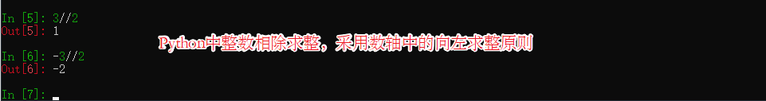

### 2.1.2 比较运算符

| 比较运算符 |                             说明                             |
| :--------: | :----------------------------------------------------------: |
|     >      | 大于，如果>前面的值大于后面的值，则返回 True，否则返回 False。 |
|     <      | 小于，如果<前面的值小于后面的值，则返回 True，否则返回 False。 |
|     ==     |   等于，如果==两边的值相等，则返回 True，否则返回 False。    |
|     >=     | 大于等于（等价于数学中的 ≥），如果>=前面的值大于或者等于后面的值，则返回 True，否则返回 False。 |
|     <=     | 小于等于（等价于数学中的 ≤），如果<=前面的值小于或者等于后面的值，则返回 True，否则返回 False。 |
|     !=     | 不等于（等价于数学中的 ≠），如果!=两边的值不相等，则返回 True，否则返回 False。 |

### 2.1.3 赋值运算符

| 运算符 | 说 明 | 用法举例 | 等价形式 |
|---|---|---|---|
|=|最基本的赋值运算|x = y|x = y|
|+=|加赋值|x += y|x = x + y|
|-=|减赋值|x -= y|x = x - y|
|*=|乘赋值|x *= y|x = x * y|
|/=|除赋值|x /= y|x = x / y|
|%=|取余数赋值|x %= y|x = x % y|
|**=|幂赋值|x **= y|x = x ** y|
|//=|取整数赋值|x //= y|x = x // y|

### 2.1.4 逻辑运算符

|逻辑运算符|含义|基本格式|说明|
|---|---|---|---|
|and|逻辑与运算，等价于数学中的“且”|a and b|当 a 和 b 两个表达式都为真时，a and b 的结果才为真，否则为假。|
|or|逻辑或运算，等价于数学中的“或”|a or b|当 a 和 b 两个表达式都为假时，a or b 的结果才是假，否则为真。|
|not|逻辑非运算，等价于数学中的“非”|not a|如果 a 为真，那么 not a 的结果为假；如果 a 为假，那么 not a 的结果为真。相当于对 a 取反。|

### 2.1.5 成员运算符

| 运算符 | 说明                                           |
| ------ | ---------------------------------------------- |
| in     | 如果在指定的序列中找到值返回True,否则返回False |
|not in |如果在指定的序列中没有找到值返回True，否则返回False|

### 2.1.6 身份运算符

|运算符|说明|
|---|---|
|is|判断两个变量所引用的对象是否相同，如果相同则返回 True，否则返回 False。 |
|is not|判断两个变量所引用的对象是否不相同，如果不相同则返回 True，否则返回 False。 |

　　这里值得注意的是==和is的区别，在python中，他两都是判断是否相等的运算符，但是，==判断的是值是否相等，is判断的是对象引用是否相等。

### 2.1.7 位运算符

|位运算符|说明|使用形式|举 例|
|---|---|---|---|
|&|按位与|a & b|4 & 5|
|||按位或|a | b|4 | 5|
|^|按位异或|a ^ b|4 ^ 5|
|~|按位取反|~a|~4|
|<<|按位左移|a << b|4 << 2，表示整数 4 按位左移 2 位|
|>>|按位右移|a >> b|4 >> 2，表示整数 4 按位右移 2 位|

### 2.1.8 运算符优先级

​		所谓优先级，就是当多个运算符同时出现在一个表达式中时，先执行哪个运算符

由上到下，优先级逐级递减。


## 2.2 数据类型转换

　　不同类型的对象在操作的时候，需要转换为相同的类型进行操作，比如字符串与整型进行相加，需要把整型转换为字符串（str()函数），这样就可以顺利的进行拼接操作了，再如数字类型进行运算时，自动向上转换类型，我们也可以手动的转换类型。

## 2.3 Number类型（数字类型）

### 2.3.1 Number类型简介

　　在python中，数字并不是真的只是一种对象类型，而是一组相似类型的分类。具体组成如下所示：

1. 整数（正整数，负整数，0）；

2. 布尔类型（整数类型的子类，逻辑表现为True和False，实际上对应1和0；

3. 浮点数（带有小数部分的数字）；

4. 使用十六进制，八进制，二进制字面量表示的整数；

5. 复数；  

   
   
   **注**：
- Python3中的整数类型在需要的时候，会自动的提供额外的精度，以用于较大的数值，这也就是python3中没有long类型的原因;
- Python3中允许整数具有无限的精度，只要内存空间允许，整数可以增长为任意位数的数字;
- Python3的浮点类型在cPython中采用双精度实现;
- Python3中如果一个数字带有小数点或者是带有幂的数字，均被认为是浮点数，如下所示：

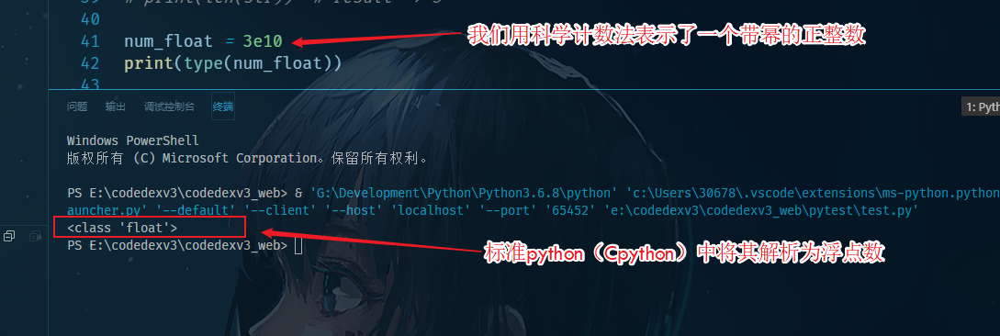

- 在python3中整数不光是十进制，也可以表示为其他进制，如二进制（0b,0B）,八进制（0o,0O）,十六进制（0x,0X）,如下图所示：

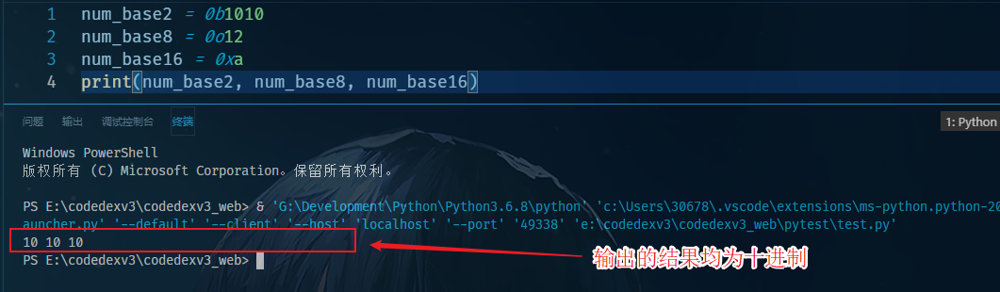

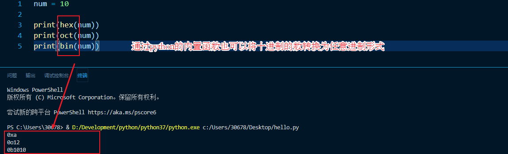

### 2.3.2 数字类型混合表达式的计算

　　**由数字对象和运算符构成的表达式当中，计算时会衍生出两两类问题。**

1. 第一类问题就是对象类型都是数字类型中的单一种类（如都是整型类型），但是运算符包括多种类型（加减乘除等）；

2. 第二类问题就是对象类型不单一（表达式中出现整数和浮点数进行运算）；

   
   
   **针对上述问题，python语言给出了相应规定：**

- 多种运算符出现在表达式当中，依据运算符的优先级进行计算；
- 可以使用括号分组的方式，强制指定优选的运算;
- 针对不同细分类型的数字类型，进行运算时，采用向上转换类型，后计算的方式；
- 
   自动转换原则如下所示：
>自动转换原则：会将低复杂度的数据类型转换为高复杂度的数据类型，用于计算：bool-->int-->float（浮点数）-->complex（bool中的True会被转换为1，False会被转换为0）


　　经过上述简单的介绍，我们在自动向上转换进行计算的过程引出了新的问题，既然可以自动转换，那么必然存在手动转换方式，而python3通过内置的函数完整的提供了手动转换的方式，手动转换的方式，主要用于计算不同类型对象的运算（如字符串类型和数字类型），以及不希望自动转换原则生效的运算中（整数和浮点数运算中，希望生成整数类型结果）

### 2.3.3 关于浮点数运算

　　由于计算机的硬件限制，通常使用浮点符数进行运算的时候，结果并不准确，通常我们会转化为整数进行计算。

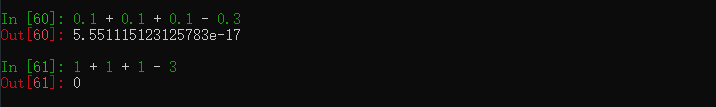

　　当然也可以通过python提供的decimal模块和fraction模块进行浮点数计算，以下为简单的示例，具体的用法可以查看这两个模块的具体使用。
　　以下为decimal模块简单使用示例（传参需要传入字符串类型）：

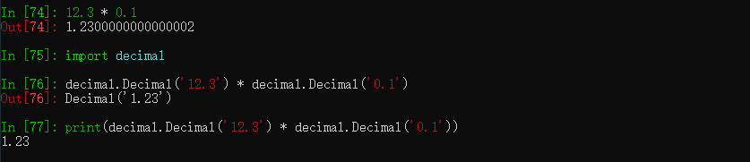

　　设置全局精度：示例如下所示：

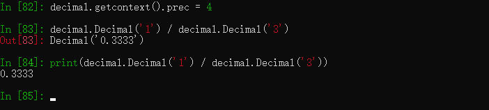

　　当然decimal模块也可以通过与with语句相结合的方式设置临时精度：

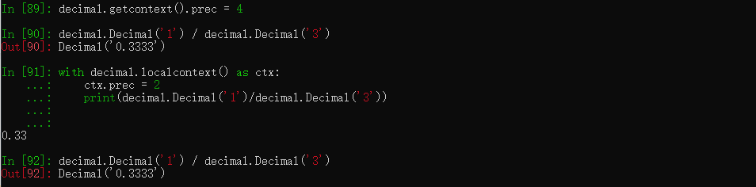

### 2.3.4 内置的处理数字类型的工具
　　在前面提到的运算符，多数可以用来处理我们的数字类型，同时python通过math模块提供了许多用来处理数学计算的函数，我们在需要使用的时候可以自行查阅。同时在数字类型中一个有用的模块是random模块，也可以用它来实现一些功能。random模块示例：

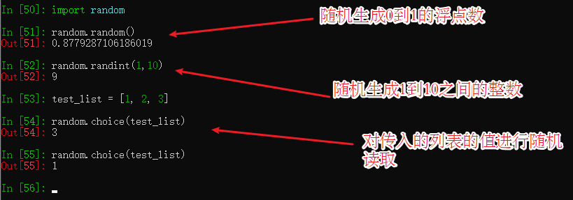

## 2.4 字符串（主要是str类型）

### 2.4.1 字符串简介
- 一个有序的字符集合，（字符：是指计算机中使用的字母、数字和符号）用来存储和表示基于文本和字节的信息。

- python中的字符串可分为三类，str类型用于Unicode文本(包括ASCII)，bytes用于二进制数据，而bytearray是bytes的一个可修改的变体。

- python没有为单个字符留有不同的类型，取而代之的是可以使用单字符的字符串（在java语言中，string表示字符串，char表示单个字符）

- python中的字符串属于不可变序列，不可变的类型包括，数字，字符串，元组，而序列包含，字符串，列表和元组，序列中包含一些通用的方法。

- python中使用`”`或`'`来标记字符串，通常在表示字符串的时候，单引号使用的比较多一些，这里值得注意的是python中字符串使用单引号和双引号，是相同的没有什么额外的区别(shell中的双引号和单引号可是有一定区别的)，这样的好处是，我们在双引号字符串中不必使用转义字符就可以引入单引号，而单引号字符也是如此。

- 如果字符串内部需要表示多行内容时，python提供使用三个引号，这种方式包含多行内容，python会为每行结尾都添加换行符。以下为用户友好模式下我们看到的结果：（三引号的方式也被用在python代码注释当中）

  - 通过交互模式，我们可以发现其本质是这样的：

    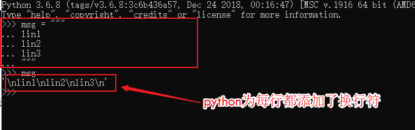

- 在使用字符串时也应该注意以下问题，就是多个字符串赋值给一个变量：

    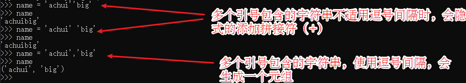

### 2.4.2 转义字符和原始字符串

#### 2.4.2.1 转义字符
　　在字符串中使用反斜杠`\`引入特殊的字符编码，这种方式被称为转义序列，转义序列让我们能够在字符串中嵌入不容易通过键盘输入的字符。\之后跟随的一个或多个字符，在生成的字符串对象中，会被单个字符串所代替。比如如下情况：

　　以下为转义字符的简单用法举例：


#### 2.4.2.2 原始字符串
转义序列在实际使用中给我们带来了可以在字符串中表示特殊字符的能力，但是有时候，在一个字符串中包含多个\时，如果想防止转义，可以在每个\之前在加一个\，但是python给我们提供了一个更好的形式， 如果你不想让反斜杠发生转义，可以在字符串前面添加一个 r，表示原始字符串。


	在使用r时需要注意的一点是，字符串的末尾不能以\结尾，否则报错，也就是（r…\这种形式是不被支持的）

### 2.4.3 字符串中的常见操作

#### 2.4.3.1 拼接与重复

　　字符串的拼接操作在程序设计中是经常使用的，在python中对于不包含变量引用的字符串我们可以使用如下方式进行拼接操作：

```python
a = "name""achui"  # res => nameachui
# or
b = "name" "achui"  # res => nameachui
```

　　对于包含变量引用的字符串需要使用` + `作为连接符（当然在不包含变量引用的字符串中使用`+`也是可以的）：

```python
a = "name"
b = a + "achui"  # res => nameachui
```

　　综上所叙我们在进行字符串拼接的时候直接使用`+`即可，应当注意的是python的拼接操作只针对字符串，如果需要拼接非字符串类型的对象，需要进行手动转换。

　　接下来我们介绍`*`运算符在字符串中的使用，他在针对数字类型对象的时候，主要作用是起到乘法运算的效果，在针对字符串对象操作的时候就表示复制当前字符串，紧跟的数字为复制的次数。这体现了python的多态性，也说明了，运算符的操作意义取决于对象。（在自定义类中我们可以通过运算符重载，实现特定运算符针对对象的特殊行为）

```python
a = "10" * 20
print(a)  # res => 1010101010101010101010101010101010101010
```

#### 2.4.3.2 索引与切片

　　Python 中的字符串有两种索引方式，从左往右以 0 开始，从右往左以 -1 开始（既python支持负索引）。

1. 索引示例如下：

   ```python
   a = '123456789'
   print(a[0]) # res => 1
   print(a[-1])  # res => 9
   ```

   

2. 切片示例如下：

   ```python
   a = '123456789'
   print(a[1:])  # res => 23456789
   print(a[:-1])  # res => 12345678
   print(a[:])  # res => 123456789
   print(a[1:3])  # res => 23
   ```

   　　切片的基本语法为[起始索引:截止索引:步长]，一般不给出步长，默认值为1，如果不给出起始索引，则默认为0，如果不给出截止索引则默认值为序列长度（这里指字符串长度），在切片时应该注意切片的值不包括截止索引的值，只包含开始索引到截止索引之前的一个索引的值。

   

3. 扩展索引（关于步长的取值）
    步长的取值前面可以加-标识使用负索引进行切片，具体示例如下所示：

  ```python
  a = '123456789'
  print(a[::-1]) # res => 987654321
  ```

#### 2.4.3.3 通过内置函数确定字符串长度

　　python中，要想知道一个字符串有多少个字符（获得字符串长度），或者一个字符串占用多少个字节，可以使用 len()这个内置函数。

```python
test = '人生苦短'
print(len(test))  # 4
print(len(test.encode("utf-8")))  # 12
```

#### 2.4.3.4 字符串不可修改

　　字符串类型属于不可变类型，所以它不支持原位置修改变量引用的对象的值，如下所示：

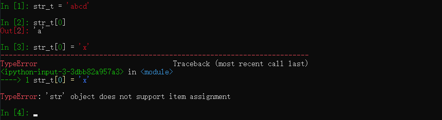

#### 2.4.3.5 编码和解码

　　在 Python 中，有 2 种常用的字符串类型，分别为 str 和 bytes 类型，其中 str 用来表示 Unicode 字符，bytes 用来表示二进制数据。str 类型和 bytes 类型之间就需要使用 encode() 和 decode() 方法进行转换。

　　注意，如果编码时采用的不是默认的 UTF-8 编码，则解码时要选择和编码时一样的格式，否则会抛出异常

### 2.4.4 字符串涉及到的常用方法

　　在第一章曾经提到过，在遇到不会的方法时，我们可以使用`dir`和`help`函数来进行说明文档读取，如下所示：

```python
test = '人生苦短'

dir(test)

['__add__', '__class__', '__contains__', '__delattr__', '__dir__', '__doc__', '__eq__', '__format__', '__ge__', '__getattribute__', '__getitem__', '__getnewargs__', '__gt__', '__hash__', '__init__', '__init_subclass__', '__iter__', '__le__', '__len__', '__lt__', '__mod__', '__mul__', '__ne__', '__new__', '__reduce__', '__reduce_ex__', '__repr__', '__rmod__', '__rmul__', '__setattr__', '__sizeof__', '__str__', '__subclasshook__', 'capitalize', 'casefold', 'center', 'count', 'encode', 'endswith', 'expandtabs', 'find', 'format', 'format_map', 'index', 'isalnum', 'isalpha', 'isascii', 'isdecimal', 'isdigit', 'isidentifier', 'islower', 'isnumeric', 'isprintable', 'isspace', 'istitle', 'isupper', 'join', 'ljust', 'lower', 'lstrip', 'maketrans', 'partition', 'replace', 'rfind', 'rindex', 'rjust', 'rpartition', 'rsplit', 'rstrip', 'split', 'splitlines', 'startswith', 'strip', 'swapcase', 'title', 'translate', 'upper', 'zfill']

help(test.title)  # 注意，使用 help() 查看某个函数的用法时，函数名后边不能带括号

----------------------------------resrult----------------------------------------------
Help on built-in function title:

title() method of builtins.str instance
    Return a version of the string where each word is titlecased.
    
    More specifically, words start with uppercased characters and all remaining
    cased characters have lower case.
```

　　接下来我们对字符串对象常用的方法进行下简单的介绍

#### 2.4.4.1 字母大小写与去空格操作

```python
name = ' achui '
print(name)  			# ' achui '
print(name.title())  	# ' Achui '  字符串首字母大写
print(name.upper())  	# ' ACHUI '  字符串全大写
print(name.lower())  	# ' achui '  字符串全小写
print(name.rstrip())  	# ' achui'   去除字符串尾部空白
print(name.lstrip())    # 'achui '   去除字符串首部空白
print(name.strip())     # 'achui'    去除字符串两端空白
```

#### 2.4.4.2 字符串匹配操作

　　查找子字符串操作(find方法)

```python
test = '人生苦短'
# find方法寻找字符串中是否有符合条件的子字符串，并返回初次寻找的索引，没有则返回-1
print(test.find('生'))  # 1  
print(test.find('python'))  # -1		
```

　　查看一个字符串是否以特定的子字符串开头（startswith方法）

```python
test = '人生苦短'
test.startswith("人")  # True
test.startswith("生")  # False
```

　　查看一个字符串是否以特定的子字符串结尾（endswith方法）

```python
test = '人生苦短'
test.endwith("人")  # False
test.endwith("短")  # True
```

　　同 find() 方法类似，index() 方法也可以用于检索是否包含指定的字符串，不同之处在于，当指定的字符串不存在时，index() 方法会抛出异常

```python
test = '人生苦短'
test.index('1')
'''  res => 
Traceback (most recent call last):
  File "<stdin>", line 1, in <module>
ValueError: substring not found
''' 
test.index('生')  # res => 1
```

#### 2.4.4.3 统计字符串词频
　　通过字符串对象的count函数

```python
name = "achuiachui"
print(name.count("a"))  # 2
print(name.count("ac"))  # 2
print(name.count("x"))  # 0
```

#### 2.4.4.4 字符串的组合和切割
　　split() 方法可以实现将一个字符串按照指定的分隔符切分成多个子串，这些子串会被保存到列表中（不包含分隔符），作为方法的返回值反馈回来。

　　该方法的基本语法格式如下：

```python
str.split(sep,maxsplit)

# str：表示要进行分割的字符串；
# sep：用于指定分隔符，可以包含多个字符。此参数默认为 None，表示所有空字符，包括空格、换行符“\n”、制表符“\t”等。
# maxsplit：可选参数，用于指定分割的次数，最后列表中子串的个数最多为 maxsplit+1。如果不指定或者指定为 -1，则表示分割次数没有限制。
# 在 split 方法中，如果不指定 sep 参数，那么也不能指定 maxsplit 参数。
```

　　具体示例：

```python
name = "王-大-锤"
print(name.split('-'，1))  # res => ['王', '大-锤']
print(name.split('-'))  # res => ['王', '大', '锤']
```
　　join() 方法也是非常重要的字符串方法，它是 split() 方法的逆方法，用来将列表（或元组）中包含的多个字符串连接成一个字符串。
```python
newstr = str.join(iterable)

# 此方法中各参数的含义如下：
# newstr：表示合并后生成的新字符串；
# str：用于指定合并时的分隔符；
# iterable：做合并操作的源字符串数据，允许以列表、元组等形式提供。
```

　　具体示例：

```python
name = ['王', '大', '锤']
print("-".join(name.split(name)))  # res => ['王大锤']
```

### 2.4.5 字符串格式化
　　两种字符串格式化的方法，如下所示：	

1. 字符串格式化表达式：`’…%s…’ % (values)`

2. 字符串格式化方法： `‘…{}…’.format(values)`

   简单示例如下所示：

#### 2.4.5.1 字符串格式化表达式
这种格式化方式可能在将来的发布版本中被format方法所替代，这里我们简单介绍一下：
具体格式如下所示：
’…%s…’ % (values)
	运算符左侧的需要替代的对象具体格式如下所示：

	具体含义如下所示：

typecode的类型码如下所示（如果你不太确定应该用什么，%s永远起作用，它会把任何数据类型转换为字符串。）

	运算符右侧的值一般是元组的形式，如果左侧字符串中，指定了keyname这种形式，则右侧运算符之后可以跟字典如下所示：

#### 2.4.5.2 字符串格式化方法调用
format方法时字符串的内置方法，也是将来的标准之一。下面我们简单的介绍下这个内置方法。
基本格式：使用{}在字符串中占位，format中的参数给出具体的值，替换占位符号。

	{}中可以填写数字，用于指代一定的顺序，从0开始。
	
	Format还支持参数名和索引的调用如下所示：

Format还支持对数字等对象进行替换时，设置其格式，如下所示，了解一下即可，在web编程中并不常使用。

## 2.5 列表

```python
test = []
dir(test)
# ---------------------------------------------
['__add__', '__class__', '__contains__', '__delattr__', '__delitem__', '__dir__', '__doc__', '__eq__', '__format__', '__ge__', '__getattribute__', '__getitem__', '__gt__', '__hash__', '__iadd__', '__imul__', '__init__', '__init_subclass__', '__iter__', '__le__', '__len__', '__lt__', '__mul__', '__ne__', '__new__', '__reduce__', '__reduce_ex__', '__repr__', '__reversed__', '__rmul__', '__setattr__', '__setitem__', '__sizeof__', '__str__', '__subclasshook__', 'append', 'clear', 'copy', 'count', 'extend', 'index', 'insert', 'pop', 'remove', 'reverse', 'sort']
```


### 2.5.1 序列

1）序列是Python中最基本的数据结构。序列中的每个元素都分配一个数字 - 它的位置，或索引，第一个索引是0，第二个索引是1，依此类推。
2）序列是一系列具有位置顺序的对象的集合体，字符串，列表，元组是Python 中所有的序列。
3）属于序列的数据类型，拥有通用的方法，如迭代，索引查询，切片，长度计算（len()）等。
4）序列解析
通常所说的序列包括字符串，列表和元组，当序列中的值得个数是已知的，就可以使用不同的变量，来存储这些值，这叫做序列解析。实例如下所示：


### 2.5.2 列表的简介

1）列表通常包含多个元素，在命名的时候，建议制定一个复数形式的名称。
2）列表可以完成大多数集合类的数据结构实现。列表中元素的类型可以不相同，它支持数字，字符串甚至可以包含列表（所谓嵌套），字典，元组等。
3）列表属于可变数据类型

4）Python列表包含了0个或者多个其他对象的引用。列表是动态的，它会预先分配空间来存放，将会添加的对象（如下图所示）。

### 2.5.3 列表的基础操作

#### 2.5.3.1 创建列表与索引访问

创建一个列表，只要把逗号分隔的不同的数据项使用方括号括起来即可。访问列表可以按照索引的方式依次去访问列表的每个值。

结果：

#### 2.5.3.2 使用for循环遍历列表
利用for循环遍历列表。
实例：

结果：

#### 2.5.3.3 原位置修改列表中的值
列表支持基于原位置的修改，通过索引赋值的方式，我们可以修改列表中原位置的值（列表是可变的所以支持这种修改）
实例：

结果：

#### 2.5.3.4 列表切片
与所有序列相同列表也支持切片操作。简单示例如下所示：

### 2.5.4 列表中常用的方法

#### 2.5.4.1 添加列表中的值
- 方式一：列表末尾插值 `append(obj)`  

```python
# 通过append()方法实现末尾插值，该方法没有返回值，参数类型为obj类型。
# 添加的值是出现在列表的末尾的，即从列表末尾进行添加。


test = [1, 2, 3]
test.append(4)
print(test)  # res => [1, 2, 3, 4]
```

- 方式二：指定索引插值 `insert(index,obj)`

```python
test = [1, 2, 3, 4]
test.insert()
```


结果：

#### 2.5.4.2 删除列表中的值
方式一：通过del语句删除（删除对象的引用）
通过del语句进行删除列表中的某一个值。（使用del可删除任何位置处的列表元素，条件是知道其索引）

结果：

方式二：通过pop(index)删除，并获得删除元素的值
pop()方式在不给定索引的情况下默认使用的是-1,该方法返回的是列表的元素对象。
实例：

结果：

方式三：通过值删除元素（remove（obj）方法）
方法remove()只删除第一个指定的值，如果值多次出现，就需要通过循环来判断，是否删除了所有这样的值。(该方法没有返回值)
实例：

结果：

#### 2.5.4.3 确定列表长度（len()方法）
通过len()方法实现。

结果：

#### 2.5.4.4 拼接列表（通过“+”）
实例：

结果：

#### 2.5.4.5 重复列表（通过“*”）
实例：

结果：

#### 2.5.4.6 统计某元素出现次数（count()方法）
该方法的返回值是元素的次数。
实例：

结果：

#### 2.5.4.7 清空列表（clear()方法）
该方法没有返回值。
实例：

结果：

#### 2.5.4.8 查看某元素是否在列表中

#### 2.5.4.9 在现有列表末尾追加其他列表元素（extend(seq)函数）
extend(seq):该方法没有返回值，seq代表要合并的列表。

2.5.4.10 从列表中找出某个值第一个匹配项的索引位置（index(obj)）
index方法：该方法返回查找对象的索引位置，如果没有找到对象则抛出异常。

2.5.5 数值列表
2.5.5.1 range()函数
range(a,b)函数的作用是生成一系列的可迭代数字对象，a<=生成的数字<b。可以通过for循环遍历得到对象中的每个对象值。

2.5.5.2 创建数值列表
通过list()和range()函数创建数值列表。（list()函数可以直接将range()函数产生的数字转化为列表）（list()函数的主要作用是将元组转换为列表）
实例：

结果：

2.5.5.3 针对数值列表中的元素进行简单统计
实例：

结果：

2.5.6 列表排序 
2.5.6.1 反序排列列表（reverse()方法）
reverse()方法，不是指按与字母顺序相反的顺序排列列表元素，而只是反转列表元素的排列顺序，该方法永久的修改了列表的排列顺序。
实例：

结果：

2.5.6.2 永久排序sort()
list.sort(cmp=None, key=None, reverse=False)
cmp -- 可选参数, 如果指定了该参数会使用该参数的方法进行排序。
key -- 主要是用来进行比较的元素，只有一个参数，具体的函数的参数就是取自于可迭代对象中，指定可迭代对象中的一个元素来进行排序。
reverse -- 排序规则，reverse = True 降序， reverse = False 升序（默认）。
该方法没有返回值，但是会对列表的对象进行排序。

2.5.6.3 临时排序sorted()
不想改变原列表的顺序的情况下，使用sorted()代替sort()对列表排序。

2.6 元组
2.6.1 定义元组
1）Python 的元组与列表类似，不同之处在于元组属于不可变类型。元组占用的空间比较小，因为他是不可变的，所以性能上略优于列表。
2）元组创建很简单，只需要在括号中添加元素，并使用逗号隔开即可。
定义元组的操作所示:

定义单元素元组的时候需要在元素后加一个“,”，否则会被当解释器当做运算符。
2.6.2 元组的基本操作
1）在元组中也支持拼接，重复，索引，切片等操作，但是不支持原位置修改等操作。具体的操作与列表相似。
2）元组的元素不允许被删除，但是你可以删除整个元组，通过del语句。
3）同时元组也不被允许使用clear()和copy()函数，但是你可通过，切片进行复制。当然你也可以对元组变量进行重新赋值，达到修改元组的目的。
4）元组支持count', 'index'和方法，同时也可以使用内置的len()方法。
5）元组虽然内部元素不可更改，但是可以更改它引用的可变对象的值。

	6）元组也可以进行解包操作。
2.7 字典
2.7.1 字典基本定义
	字典属于可变类型对象，并且是无序的，值可包含一切对象（嵌套），键只允许为不可变对象，使用{}创建一个字典，每个键值对用逗号分隔，键与值使用：分隔，字典中的键不允许重复。以下为字典的简单操作：

2.7.2 字典基本操作
2.7.2.1 原位置修改字典的值
序列通常通过索引去访问序列中的值，而字典通过键去访问值，以下为原位置修改字典中的值。

2.7.2.2 获得键，值，键值对的可迭代对象

	可以通过list()函数将可迭代的对象一次都生成出来。
2.7.2.3 访问字典的元素
访问不存在的键时，会抛出异常，这时我们可以使用get()函数去访问，不存在键时，返回None类型。

	get()方法中也可以显示的指定返回值，如下所示：
	
	也可以使用for循环遍历字典中的键

2.7.2.4 字典的合并操作
使用update()函数，进行字典合并，参数中的字典会将重复的值直接覆盖掉原字典中的键值对。具体操作如下所示:

2.7.2.5 删除清空字典操作
删除字典元素，清空字典元素，删除字典操作：

## 2.8 集合

### 2.8.1 集合的概念

- 集合只能用来保存不重复的元素，即集合中的元素都是唯一的，互不相同，同时集合只能保存不可变类型，而不能保存可变类型对象;
- 集合使用{}和，来包含集合中的元素，集合中的元素是无序的;
- 创建集合时可以使用set()和{}，但是创建空集合只能使用set()，因为{}已经被字典占用了。（set() 函数为 Python 的内置函数，其功能是将字符串、列表、元组、range 对象等可迭代对象转换成集合）;
- Python 中有两种集合类型，一种是 set 类型的集合，另一种是 frozenset 类型的集合，它们唯一的区别是，set 类型集合可以做添加、删除元素的操作;

2.8.2 set类型集合的基本操作


2.8.3 set集合做交集、并集、差集运算

2.8.4 不可变的frozenset集合
其实set类型的集合，是可变类型的，具体可以查看如下示例：

集合的元素的要求是元素不可变，所以在set集合当中，只能添加frozenset类型的集合为set集合的元素。

2.9 None对象和bool类型
2.9.1 None对象
	None在python中是一个空的对象，python会为其分配内存空间，它也被应用在函数返回值等领域。它与False和空是不同的。
2.9.2 bool类型
1）Bool类型一般有两个值True和False，在逻辑层面是这两个值，他们也会被逻辑测试所直接引用（如if语句的逻辑测试），实际上他们分别代表1和0。
2）通过bool()函数可以把任意类型转换为True和False。
3）其他对象类型在逻辑测试中代表的布尔值规则分别如下所示：
	- 数字如果等于零则为假的，反之为真；
	- 其他对象如果为空则为假，反之为真；
	- None类型为假。