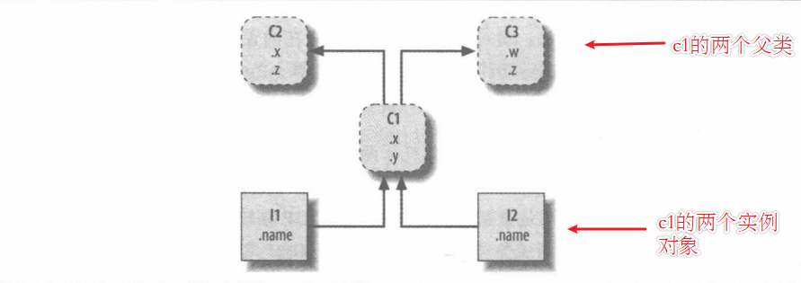

注意，如果该类没有显式指定继承自哪个类，则默认继承 object 类（object 类是 Python 中所有类的父类，即要么是直接父类，要么是间接父类）。另外，Python 的继承是多继承机制（和 C++ 一样），即一个子类可以同时拥有多个直接父类。

# 4 Python3面向对象

## 4.1 面向对象中的基本概念

**类的定义**
Python中一切皆对象，前面我们介绍了各种内置对象，以及函数对象，这里我们将要介绍一种通过class语句创建的对象，这种对象被称为类  

**实例对象的定义**
像调用函数一样，通过类名和括号的方式，就可以调用类，通过类的调用产生的对象被称为实例对象

**类的实例化**
由类生成实例的过程被称为类的实例化，一个类可以生成无限个实例，每一个实例都有其单独的命名空间，用于保存其自身特有的数据，而类本身也有自己的命名空间，用来保存用于共享的数据

**继承的概念**
在Python中我们使用对象时通常通过`object.attribute`这种形式来访问和使用对象的属性，如调用字符串中的各种方法，而对于类和实例来说这样的方式也是适用的，在使用时，Python解释器会拿着属性名在继承树中去寻找，而下到上，从左到右。而这个继承树是我们通过代码实现的将类和实例自动连接在一起，而搜索的这个过程被称为继承。每一次通过句点运算进行调用对象属性的时候，就会触发一次新的搜索，示例如下所示：

	类树中较高位置的类被称为父类（也叫基类），而较低位置的类为子类（也叫派生类），图示中C2和C3是C1的父类，C1是他两的子类，而I1和I2是C1类的实例。在类中属性通常有两种，一种是显式的位于代码的顶层的赋值操作，被称为类的特征，而其他的函数实现描述了类的行为，在类中也被称为方法。当然有些书里这个特征也被叫做属性，行为叫做方法。
	我们通过object.attribute去访问类树中属性，object可以是类也可以是类的实例，一般情况下通过实例去访问类树，如I2.w，如果w是一个特征，它会在类树中的C3中找到，此时I2.w会被自动转换为C3.w,并返回计算结果，如果w是一个行为（也就是一个函数），它会执行如下步骤：
- 在类树中寻找该方法（找到C3.w()这个方法）；
- 将实例传入该方法中，方法中通过self去指代这个实例对象，从而调用实例对象中的特征数据（可以理解为C3.w(I2)）。
	上述的行为是python解释器自动执行的，当然你也可以手动的达到该效果，就是通过类调用而不通过实例调用，直接C3.w(I2)，他们运行的结果是一致的。
	object.attribute这种形式的调用，每执行一次都会搜索一次类树。
	从本章开始，我们将依托于这种继承关系，结合python基于动态类型的多态属性，学会编写很多自定义的类，而通过对这些类和其实例的组合利用生成更复杂的程序结构，而提高程序的复用性。
4.1 类与实例
4.1.1 类
1）类是在python中实现一种新的对象，并支持继承的代码结构和部件，类是python面向对象程序设计的主要工具。概括的来说，类就是一些函数的包，这些函数大量的使用并处理内置对象（如列表等）。
2）python中通过class语句创建的对象被称为类，类的主要优点是代码的封装，生成多个实例，以及通过继承，来定制差异化的子类，实现不同的功能。类也可以进行运算符的重写，所谓的运算符的重写，就是python中提供了一些特殊的方法，这些方法映射内置对象的运算，比如我们在内置对象中可以进行+运算，那我们自定义的类，生成的实例，通过在类中重写这些特殊的方法（也被称为钩子），也可以使我们的实例支持这些运算，并返回我们的代码处理后的结构。这些特殊的方法通常命名为__X__。
4.1.2 实例
类似于函数的调用，我们通过类名加括号，就可以生成一个实例对象，如果类中重写了__init__函数，则需要在实例化的过程中，在括号中传参，生成的实例是带有自身特征的对象，而类则是处理这些特征数据的程序。以下简单的给出一个类的实例化过程。

4.1.3 实例与类的关系
类是产生实例的蓝图，由类产生实例的过程被称为类的实例化，而这个被产生的对象被称为类的实例。 
	类和实例以及类的父类一起组成了类树，用于属性的搜索，也就是我们常说的继承操作。类在类名后面的括号中指定要链接的父类，多个父类用逗号隔开，而实例在创建时自动的链接到创建它的类。
4.2 创建一个简单的类
4.2.1 新式类与经典类
一些资料中经常出现这两个名词，我们这里简单的介绍一些，首先python中实现了一个名为object的类，这个类提供了一些类常规的特征和行为，而新式类和经典类的区别如下：
1）如果一个类是object的子类，则称这个类为新式类，如果一个类没有继承object，则称为经典类（这种情况只出现在python2.x中）。
2）在python3.x中，所有的类都是我们所谓的“新式类”，不管它们是否显式的继承自object类，python3.x中所有的类都继承自object类。
4.2.2 创建类的规范
	1）类名使用大驼峰命名法，且不包含下划线，如（HelloWord），单一模块内可以包含一个或者多个类，在同一个模块中定义多个类的时候，两个类应该间隔两个空行。
	2）使用class关键字生成一个类，类名后面的括号中可填入其他类名用作继承，多个类名依次用逗号隔开，既python支持多继承。（这样也就生成了类树）。
4.2.3 self的含义
1）在定义类的过程中，实例方法，如构造函数，都要求将 self 参数作为方法的第一个参数。因为类中通过self去指代不同的实例对象从而在实例对象调用实例方法时，可以在方法中调用属于实例对象的特征数据。
2）事实上，Python 只是规定，无论是构造方法还是实例对象相关联的方法，最少要包含一个参数，并没有规定该参数的具体名称。之所以将其命名为 self，只是程序员之间约定俗成的一种习惯，遵守这个约定，可以使我们编写的代码具有更好的可读性。
3）通过实例对象调用实例方法时，实例方法的第一个参数self会自动引用当前处理的实例，既调用的主体，如I.getName(),会直接在运行中体现为，C.getName(I)(其中I是C的实例，getName是一个实例方法)
4.2.4 __init__构造方法
该方法被称为构造方法，用于初始化实例对象时使用，每当创建一个类的实例对象时，Python解释器都会自动调用它，为实例对象生成实例的特征数据。即便不手动为类添加任何构造方法，Python也会自动为类添加一个仅包含self 参数的构造方法，当然初始化的实例是一个空的对象。
__init__函数是一个最常用的运算符重写示例，几乎在所有的类中我们都会使用它去初始化实例对象。
4.2.5 类中的方法和特征数据
4.2.5.1 类变量
类变量指的是在类中，但在各个类方法外定义的变量，有些教材也把类变量叫做类属性。类变量通常用来记录与这个类相关的特征，而不会用来记录具体的实例对象特征。类变量的调用方式有 2 种方式，既可以使用类名直接调用，也可以使用类的实例对象调用。但是不推荐使用第二种方法去调用类变量。

	为什么不推荐使用实例对象去调用类变量？
因为类变量为所有实例化对象共有，通过类名修改类变量的值，会影响所有的实例对象。而通过实例对象原位置修改可变类型的类变量时可达到同样的效果，但是如果类变量是不可变类型的时候，由于不可变类型不支持原位置修改操作，如果使用赋值操作，这时类变量依旧指向了原对象，而实例对象通过赋值操作在对象中创建了一个与类变量同名的变量指向了新的对象，而起不到修改的目的。对于赋值操作，原位置修改最好的方式使用类去调用类变量达到同步修改的效果。另一个不推荐使用实例对象调用类变量的原因是类中，实例变量和类变量可以同名，但这种情况下使用类对象将无法调用类变量，它会首选实例变量，这也是不推荐“类变量使用对象名调用”的原因。
4.2.5.2 类方法
Python 类方法和实例方法相似，它最少也要包含一个参数，只不过类方法中通常将其命名为 cls，Python 会自动将类本身绑定给 cls 参数，和 self 一样，cls 参数的命名也不是规定的（可以随意命名），只是 Python 程序员约定俗称的习惯而已。类方法推荐使用类名直接调用，当然也可以使用实例对象来调用，不推荐使用实例对象去调用类方法。

	装饰器@classmethod会告诉python解释器这是一个类方法。而没有装饰器的情况下，解释器会把一个类方法识别为实例对象的方法。
4.2.5.3 静态方法
静态方法，其实就是我们学过的函数，和函数唯一的区别是，静态方法定义在类这个空间（类命名空间）中，而函数则定义在程序所在的空间（全局命名空间）中。静态方法没有类似 self、cls 这样的特殊参数，因此 Python 解释器不会对它包含的参数做任何类或实例的绑定。也正因为如此，类的静态方法中无法调用任何类属性和类方法。静态方法需要使用＠staticmethod修饰。静态方法的调用，既可以使用类调用，也可以使用实例对象调用。

4.2.5.4 实例方法
通常情况下，在类中定义的方法默认都是实例方法。实例方法最大的特点就是，它最少也要包含一个 self 参数，用于绑定调用此方法的实例对象（Python 会自动完成绑定）。实例方法通常会用实例对象直接调用，当然，Python 也支持使用类名调用实例方法，但此方式需要手动给 self 参数传值（这种调用方法的方式被称为“非绑定方法”）。
4.2.2.5 实例变量
在类中我们可以通过构造方式去初始化实例对象的实例变量。而实例变量的访问使用实例对象去进行访问。
4.2.6 动态绑定增加类和实例属性（了解）
在python中我们可以动态的为类和实例增加方法和属性数据，一般实例方法和类方法，以及静态方法都是保存在类对象的空间内的，而实例属性保存在实例的空间内，类属性也保存在类对象的空间内，这时我们可以在类的外部动态的给类增加属性，实例也可以为自己增加属性和行为，但是应该注意，类不可以为自己动态的增加实例方法，应为无法传递self参数，静态方法和类方法也不建议虽然可以运行，但是会提示一些警告信息。

4.2.7 有名对象和匿名对象
类的实例化后，赋值给一个变量，这个叫做有名对象，而如果直接实例化，没有赋值给一个变量这叫做匿名对象，这个跟python自身有关系，变量只是对对象的引用，而属性和方法属于对象本身。

4.2.8 特殊的属性
1）对象内置的__dict__属性，提供了一个字典，将所有命名空间对象中的属性都存储为键/值对。
2）类的__bases__序列提供了父类元组。
	3）实例的__class__属性提供了实例到创建它的类的链接。

4.3 运算符重载（未完成）
运算符重载意味着在某个类的方法中拦截内置的操作，当类的实例出现在内置操作中时，python会自动调用你的方法，并且你的方法的返回值会作为相应操作的结果。Python中提供了一些特殊的钩子方法，这些钩子方法是与内置的运算操作所映射的，当你重写这些钩子方法时，就可以返回你自己的结果，当然如果没有重写这些方法，在实例涉及到这些内置运算的操作时，时不会进行响应的。如下我们看一个减法的例子：

运算符重载中最常用的方法应该是__init__方法，其他的常用方法，我们在下面做一个简要的说明。

4.3.1 __repr__

4.3.2 __getattr__

4.3.3 __iter__和__next__
通过前面迭代器协议的学习，我们可以知道重载这两种方法可以自定义可迭代对象。

1.3.3 类中的内置方法

4）__new__方法：给对象分配内存，在单例设计模式下，重写该方法实现单例设计。
5）__doc__方法：文档方法可以查看方法，类的注释等。
6）__mro__方法：类的内置方法，用于在多继承的情况下，查看属性，方法的执行顺序
7）

4.4 封装，继承，多态（未完成）
4.5.1 封装
4.5.1.1 封装的概念
简单的理解封装（Encapsulation），即在设计类时，刻意地将一些属性和方法隐藏在类的内部，这样在使用此类时，将无法直接以object.attribute的形式调用这些属性（或方法），而只能用未隐藏的类方法间接操作这些隐藏的属性和方法。就好比使用电脑，我们只需要学会如何使用键盘和鼠标就可以了，不用关心内部是怎么实现的，因为那是生产和设计人员该操心的。
封装机制保证了类内部数据结构的完整性，因为使用类的用户无法直接看到类中的数据结构，只能使用类允许公开的数据，很好地避免了外部对内部数据的影响，提高了程序的可维护性。除此之外，对一个类实现良好的封装，用户只能借助暴露出来的类方法来访问数据，我们只需要在这些暴露的方法中加入适当的控制逻辑，即可轻松实现用户对类中属性或方法的合理操作。并且，对类进行良好的封装，还可以提高代码的复用性。
4.5.1.2 私有化属性

类变量的特点是，所有类的实例化对象都同时共享类变量，也就是说，类变量在所有实例化对象中是作为公用资源存在的。类方法的调用方式有 2 种，既可以使用类名直接调用，也可以使用类的实例化对象调用。
如果要让内部属性不被外部访问，可以把属性的名称前加上两个下划线__，在Python中，实例的变量名如果以__开头，就变成了一个私有变量（private），只有内部可以访问，外部不能访问，也就是说我们在实例化对象后，属性既不可以被外部访问，也不可以被修改，这样就确保了外部代码不能随意修改对象内部的状态，这样通过访问限制的保护，代码更加健壮。
在我们要修改和访问属性时，我们可以提供一个get和set方法，来确保外部代码可以访问属性。
双下划线开头的实例变量是不是一定不能从外部访问呢？其实也不是。不能直接访问__varname是因为Python解释器对外把__varname变量改成了_classname__varname，所以，仍然可以通过_classname__varname来访问__varname变量,但是强烈建议你不要这么干，因为不同版本的Python解释器可能会把__name改成不同的变量名。
总的来说就是，Python本身没有任何机制阻止你干坏事，一切全靠自觉。通过这种私有机制，我们还可以在实例对象中区分不同类为实例对象添加的同名属性。如下所示：

4.5.1.3 property函数和property装饰器
封装过后的类属性（行为和状态）虽然无法通过这种通用的object.attribute形式进行访问，但是通过将属性名修改为_classname__varname这种形式可正常访问，当然这是一种杠精的行为，python提供了property函数将属性句点访问与set和get方法进行了映射，这样我们在使用object.attribute形式访问属性，看起来跟以前的访问时一样的。
property() 函数的基本使用格式如下：
属性名=property(fget=None, fset=None, fdel=None, doc=None)

4.5.2 继承
4.5.2.1 继承简介
4.5.2.2 重写（override）
通过继承的概念我们可以在类树中寻找到父类中已有方法进行调用，如果父类的方法不满足我们当前的需求，可以对父类的方法进行扩展，我们在前面提到过扩展父类的两种方式，如果我们对父类的所有内容都不满意，可以直接重写父类方法，因为处于类树的下层，所以会调用时直接调用子类中重写的方法，而不会调用父类的方法。
4.5.2.3 多继承
如果在多继承中，父类之间存在多种同名属性和方法时，python是怎么确定执行内个属性和方法呢，这就涉及到：MRO(方法搜索顺序)，可以通过python的类的内置属性__mro__查看类树的搜索顺序。多继承时找到第一个属性时就停止搜索，从而调用该属性。(MRO是新式类的搜索方式，在python3中都使用新式类，所以都采用MRO搜索)

4.2.6 扩展父类方法
4.2.6.1 显式的在子类中扩展父类方法
前面我们讲到过，调用实例方式时，一种是通过python自动传递引用给self参数的，实例对象调用实例方法的方式，另一种是通过手动的传值方法，就是通过类去调用实例方法。我们通过类调用实例方法可以达到，扩展分类方法的目的，而不需要把父类的代码粘贴到实例方法中去扩展。

	这种显示的扩展方法，简单明了，我们可以不依赖继承的顺序，直接指定我们想要的父类扩展，当然python也提供super方法去调用父类方法，但是这种显式的方式比较常用。
4.2.6.2 super函数扩展父类方法

通过上面的特殊属性，可以编写一个可复用的类，用于__repr__方法的重写。
具体代码如下所示：

4.5.3 多态
Python把对某个对象在某种语法下的合理性交给那个对象自身判断，这种依赖类型的行为称为多态（操作的意义取决于被操作的对象）。而其他编程语言如java等，多态的实现可能是通过类中的方法重载实现的，这在python中是无法实现的，基于动态类型的python同名的变量只会依次覆盖。

4.5.4 组合

4.5.5 抽象父类
抽象父类应该是用来实现接口的。

4.5 属性管理（未完成）
通常我们使用如下代码去访问属性。可能你有许多个实例都是依靠这种方式进行实例属性的访问和修改的。

	此时我们就遇到了一个问题，如果你的类中的代码需要进行修改，比如你觉得属性最好实用私有属性，并提供公有的get和set方法去访问他，这时你需要修改你实例调用属性的全部方法，这将是一个很大的工程，假设你有先见之名，一开始就设置好了私有属性，提供了各种各样的get和set方法，但是你在调用时需要明确这些方法是干什么的，在代码中要显式的把这些方法写出来，这也是一个折磨人的过程。

于是属性管理的方案应用而生，我们依旧采用属性句点的方式去访问这些属性，而通过拦截属性访问，进行路由的方式将我们的属性句点访问映射成公有的方法，这样既实现了简单的调用逻辑，又可以提高我们程序的内聚性，修改代码时不再有那么多的苦恼，以下为简单的示例：

4.5.1 属性管理的多种方案
实现我们前面讲的轻松愉快的方案，有多种实现方式，如下所示：

4.5.2 property函数
	Property函数允许我们把一个特定属性的获取，设置和修改操作指向我们所提供的函数或方法，使得我们能够插入在属性访问时自动运行的带，或是拦截属性的删除，并且如果愿意的话还可以为属性提供文档，其基本的语法如下所示：
通过下面的语法，将会在调用时，自动拦截属性访问，并决定是否进行路由操作。
attribute = property(fget=None, fset=None, fdel=None, doc=None)
简单的示例如下所示：

4.5.3 描述符
4.5.3.1 描述符简介
描述符提供了拦截属性访问的另一种替代方法。描述符协议允许我们把一个特定属性的获取，设置和删除操作指向我们提供的一个单独的类的实例方法，这使得我们能插入代码，在属性获取和赋值时自动运行，拦截拦截属性删除，以及在需要时为属性提供文档。一个类可以将属性管理全权委托给描述符类。
描述符编写成单独的类，并且针对想要拦截的属性访问操作提供明确指定的访问器方法，当以相应的方式访问赋值了描述符类实例的属性时，描述符类中的获取设置和删除等方法就会自动运行。
4.5.3.2 描述符协议
描述符类基于以下 3 个特殊方法，换句话说，这 3 个方法组成了描述符协议：
__set__(self, obj, type=None)：在设置属性时将调用这一方法。
__get__(self, obj, value)：在读取属性时将调用这一方法。

__delete__(self, obj)：对属性调用 del 时将调用这一方法。
4.5.2.3 描述符分类
其中，实现了 setter 和 getter 方法的描述符类被称为数据描述符；反之，如果只实现了 getter 方法，则称为非数据描述符。
预留
4.6 装饰器
4.6.1 装饰器定义
装饰是为函数和类指定管理或扩增代码的一种方式（装饰器的作用就是为已经存在的函数或对象添加额外的功能。）。Python装饰器通常分为两种函数装饰器和类装饰器。装饰器的本质是将被装饰的函数传递给装饰器函数，并将装饰器返回的函数赋值给最初的函数名。Python也内置了一些函数装饰器，用来指明静态方法和类方法或是定义property这些操作。以下我们将要以函数装饰器为主要介绍对象。
4.6.2 简单的函数装饰器
函数装饰器的特点是需要符合闭包的特点，并同时在装饰器内部调用被装饰函数。简单示例如下所示：

我们实现了一个简单的装饰器函数，并用它装饰了test函数，发现在未调用test函数时，test函数已经在装饰器的作用下进行了初始化，此时的test已经指向了wrapper函数引用的对象。
4.6.3 装饰有参函数

由上面的被修饰的无参函数可知，如果我们要装有参函数，则需要为wrapper赋予与test函数相同的形参列表，只有这样在第6步之后，我们才可以正常的调用被修饰函数，因为test函数声明了形参，所以我们的wrapper也需要与其呼应。

可以通过逆向参数解析，将装饰器变成为万能接参装饰器，如下所示：（参数列表中应该把**kwargs这个字典类型的参数也加入上，这样才可以接受被装饰函数的任何参数）

4.6.4 多层装饰器
	被装饰的函数，可以有多个装饰他的函数，初始化的顺序是离被装饰函数最近的装饰器依次向上调用，知道最后一个装饰器的返回值赋值给被装饰函数。具体示例如下所示：

4.6.5 带参数的装饰器
装饰器函数本身也支持传递参数，但是需要在装饰器函数的外部加一层参数，用于接收装饰器自身传递的参数。示例如下所示：

4.6.6 类装饰器
预留
4.7 元类
预留