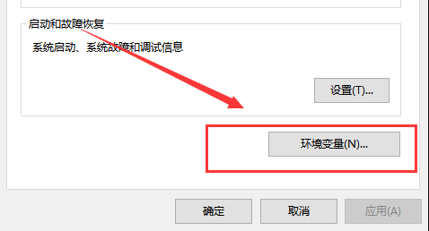

# python环境搭建与项目包管理

## 1. 说明

- 本篇主要介绍在python程序开发过程中涉及到的环境管理问题，包括多版本共存，虚拟环境等安装使用；
- 实验环境是`fedora32`， 涉及到的python版本主要是3系列，不涉及2系列；
- 容器中运行python环境的内容放入到docker相关篇章中进行说明；

## 2. 安装python

### 2.1 python官方安装手册

- [python官方安装指导](https://docs.python.org/zh-cn/3/using/index.html)

*因为`fedaro32`默认自带`python3.8`版本，如果需要安装多个`python`版本，在稍后的介绍中使用`pyenv`工具进行安装，这里演示windows上如何安装`python3`*

### 2.2 windows下安装python3

​		在windows下安装python后，你会得到Python解释器（就是负责运行Python程序的,可以看作是代码与计算机硬件之间的一个软件逻辑层，官方的python解释器用C语言实现，名为Cpython），一个命令行交互环境，还有一个简单的集成开发环境(他的名字叫做IDLE)。当然还包括一些依赖的库和相关库文件的文档，以及Python文档。

#### 2.2.1 下载python3

​		首先进入官方的下载界面(这里安装的是`python3.7.1`)


​		在页面底部选择对应的版本进行下载，推荐选择可执行文件,进行下载，版本与你的windows版本一致即可（64位系统，要下载64可执行程序，32位的系统，下载32的可执行文件即可）


#### 2.2.2 安装python3

​		在安装时可以选择自定义安装和默认安装方式，如下图，上面的是默认安装，下面的是自定义安装。根据需要进行安装即可,一般推荐自定义安装。在自定义安装中，基本都是next即可，有一点需要注意的是，你安装的时候，可以为电脑中所有用户都安装这个环境，如果有需要，勾选中即可，当然你忘记了也没有什么关系。


​		安装好后，试一试python是否安装成功。


　　当然你也可以直接进入到交互模式中查看python的版本号


#### 2.2.3 输出hello world

　　当你上面的都顺利进行完以后，你可以在交互模式中，编写一个简单的小程序，为你的python之旅开启一个良好的开端。（cmd控制台中，输入python进入交互模式）（传说它可以为你带来好运啊！）


　　当你顺利的输出了这个语句的时候，证明你的python环境无误的安装成功了，你可以进一步的开始你的学习之旅了。（在交互式命令行下输出是不需要额外的使用print函数的，交互式命令行在python语言中是很重要的调试测试工具，可以快速的验证进行一些验证和测试）

> `>>>`：意味着输出来自终端会话（Cpython解释器的提示符）。*

####  2.2.4 手动配置环境变量

　　在交互命令行中，你无法运行python，可能是安装时没有勾选添加环境变量的选择，导致你在控制台中输入python后，控制台提示你，类似没有发现该命令的一些提示，不要慌，这里教你如何手动配置环境变量。（当然老旧的版本的安装程序时不提供自动配置的，所以这个小节的配置还是很重要的）

　　1. **首先计算机右键属性**


　　2.  **选择高级系统设置**


　　3. **选择环境变量**



　　4. **编辑系统环境变量path**


　　5. **将你的pyhton安装路径添加进去即可（第一行第二行都要添加）**


### 2.3 pyenv工具使用

​		pyenv是一个 python 版本管理工具，可以方便的在工作环境中安装、管理和切换不同版本的python环境，在fedora32下，python默认的安装版本是3.8，我们可以通过pyenv这个项目安装不同的python版本来编写程序。

**安装pyenv:**

```shell
sudo curl https://pyenv.run | bash  # 使用自动安装脚本进行安装

### 项目参考文档 

# https://github.com/pyenv/pyenv # pyenv项目地址
# https://github.com/pyenv/pyenv-installer  # pyenv自动安装项目

### 安装时可能出现的问题

# 1）无法解析域名问题
curl: (7) Failed to connect to raw.githubusercontent.com port 443: 拒绝连接 # 错误现象
sudo vim /etc/hosts # 编辑hosts文件
199.232.4.133 raw.githubusercontent.com  # 将ip和域名手动写入hosts文件

# 2）安装完成后需要将环境变量添加到配置文件中

# vim ~/.bashrc
# setting pyenv
export PATH="/home/achui/.pyenv/bin:$PATH"
eval "$(pyenv init -)"
eval "$(pyenv virtualenv-init -)"
```


#### 1.2.1 不同的搭建环境方式

		常见的构建开发环境的包管理方式有如下三种，可以根据实际需要进行选择：

- pip+virtualenv+requirements.txt

- Pipenv

- Docker


		这里按照《**Flask Web开发实战：入门、进阶与原理解析**》书中介绍的pipenv工具提供的方法代替常用的`pip&venv&requirements.txt`模式，如果你了解Docker相关内容，也可以通过Dockerfile构建运行项目的容器。

#### 1.2.2 **Pipenv**

		Pipenv是基于pip的Python包管理工具，它的出现解决了旧的pip+virtualenv+requirements.txt的工作方式的弊端，是pip,pipfile,和virtualenv的结合体。(python3.3以上版本virtualenv已经不常使用，较常使用的是python标准库中的venv模块)

1. **安装pipenv**

```shell
sudo dnf install pipenv # 在宿主环境上（Fedora32），安装pipenv包管理工具

# pipenv --help linux上获取帮助
# https://github.com/pypa/pipenv # 项目地址
# https://pipenv-fork.readthedocs.io/en/latest/ # 项目帮助文档
```

2. **创建项目根目录，使用pipenv初始化项目虚拟环境**

```shell
mkdir test
cd test
pipenv install # 初始化虚拟环境（使用宿主默认python解释器）

###指定python版本
# 可以通过--python参数设置虚拟环境依赖的python版本，前提是宿主环境中安装了该版本的python解释器
# pipenv --python 3.7 # 创建一个依赖python3.7的虚拟环境

###指定虚拟环境创建位置 
# 默认创建的虚拟环境在~/.local/share/virtualenv目录下
# ls -alh ~/.local/share/virtualenv
# drwxrwxr-x. 5 achui achui 4096  7月  5 16:41 test-i16OVB7J
# PIPENV_VENV_IN_PROJECT

#########console
$ls -alh
总用量 16K
drwxrwxr-x.  2 achui achui 4.0K  7月  5 16:41 .
drwx------. 25 achui achui 4.0K  7月  5 16:40 ..
-rw-rw-r--.  1 achui achui  138  7月  5 16:41 Pipfile
-rw-r--r--.  1 achui achui  453  7月  5 16:41 Pipfile.lock

# 当目录下不存在以下文件时，pipenv install会创建以下文件，并创建虚拟环境
# Pipfile记录了项目依赖包列表
# Pipfile.lock记录了固定版本的详细依赖包列表

pipenv --venv
```

3. **显示的激活和退出虚拟环境**

```shell
cd test
pipenv shell # 激活虚拟环境

(test) Time:04:46:16     User:achui     Dir:~/test
$pip list
Package    Version
---------- -------
pip        20.1.1
setuptools 47.3.1
wheel      0.34.2

exit # 退出虚拟环境
```

4. **安装依赖包和查看依赖环境**

```shell
pipenv install flask==1.1.1 # 切入到虚拟环境中运行

pipenv graph # 使用graph命令查看当前项目依赖环境

#### console
Flask==1.1.1
  - click [required: >=5.1, installed: 7.1.1]
  - itsdangerous [required: >=0.24, installed: 1.1.0]
  - Jinja2 [required: >=2.10.1, installed: 2.11.2]
  - Werkzeug [required: >=0.15, installed: 1.0.1]
MarkupSafe==1.1.1

#### tip
# 1） pipenv install的使用避免了手动安装生成requirements.txt文件的过程，在初始化的过程自动安装依赖
```

$ pip install <某个包的名称>

这会从PyPI（Python P

Package

Index，Python包索引）上下载并安装指定的包。

PyPI（[https://pypi.org](https://pypi.org/)）是一个Python包的在线仓库，截至2018年5月，共有13万多个包存储在这里。

现在使用pip安装Pipenv：

```shell
$ pip install pipenv

$pyenv --help
Usage: pyenv <command> [<args>]

Some useful pyenv commands are:
   activate    			Activate virtual environment
   commands    			List all available pyenv commands
   deactivate   		Deactivate virtual environment
   doctor      			Verify pyenv installation and development tools to build pythons.
   exec        			Run an executable with the selected Python version
   global      			Set or show the global Python version(s)
   help        			Display help for a command
   hooks       			List hook scripts for a given pyenv command
   init        			Configure the shell environment for pyenv
   install     			Install a Python version using python-build
   local       			Set or show the local application-specific Python version(s)
   prefix      			Display prefix for a Python version
   rehash      			Rehash pyenv shims (run this after installing executables)
   root        			Display the root directory where versions and shims are kept
   shell       			Set or show the shell-specific Python version
   shims       			List existing pyenv shims
   uninstall   			Uninstall a specific Python version
   --version   			Display the version of pyenv
   version     			Show the current Python version(s) and its origin
   version-file   		Detect the file that sets the current pyenv version
   version-name   		Show the current Python version
   version-origin   	Explain how the current Python version is set
   versions    			List all Python versions available to pyenv
   virtualenv   		Create a Python virtualenv using the pyenv-virtualenv plugin
   virtualenv-delete   	Uninstall a specific Python virtualenv
   virtualenv-init   	Configure the shell environment for pyenv-virtualenv
   virtualenv-prefix   	Display real_prefix for a Python virtualenv version
   virtualenvs   		List all Python virtualenvs found in `$PYENV_ROOT/versions/*'.
   whence      			List all Python versions that contain the given executable
   which       			Display the full path to an executable

See `pyenv help <command>' for information on a specific command.
For full documentation, see: https://github.com/pyenv/pyenv#readme
```


