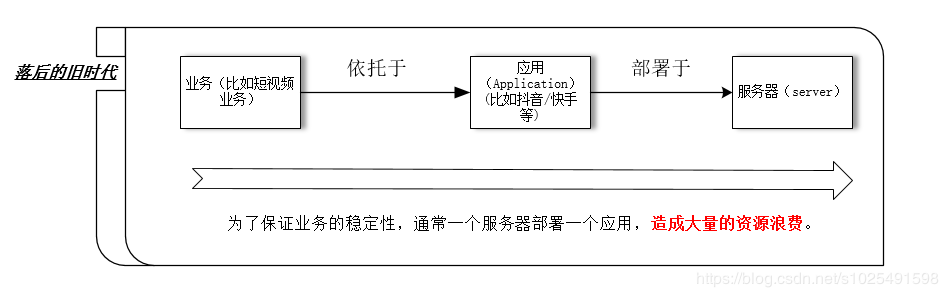
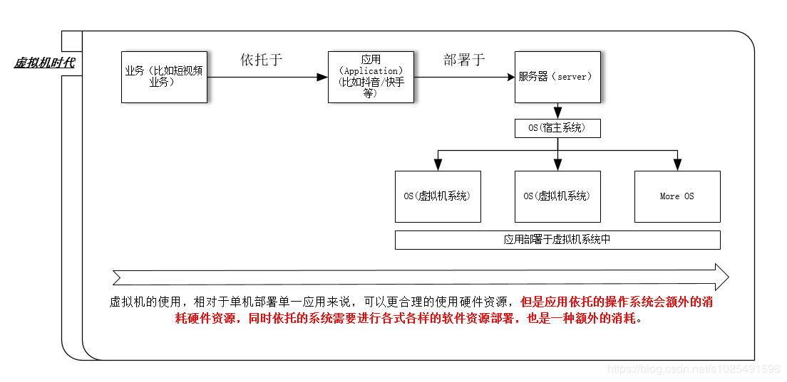
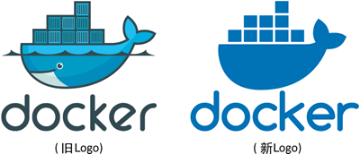
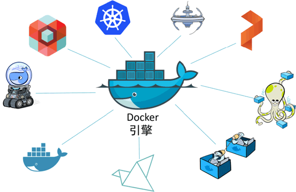
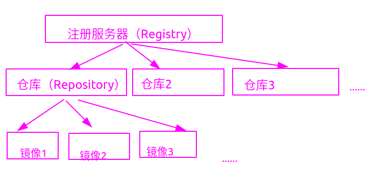
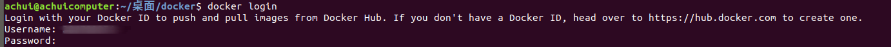
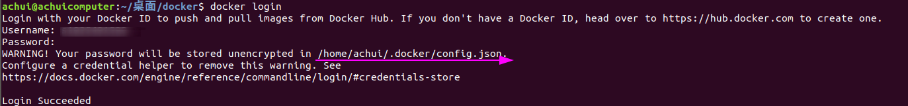

# 1-docker简介与基础操作

[TOC]

## 1 docker简介

### 1.1 容器的发展过程

#### 1.1.1 单服务器承载单一应用的时代

​		这种承载形式，如下图所示，虽然可以满足承载业务的需求，但是极大的浪费了计算机的硬件资源，造成了额外的资源消耗，毕竟硬件资源和电力等的消耗，极大的增加了项目成本。



#### 1.1.2 虚拟机时代

​		虚拟机的诞生，使得在单一服务器中稳定的部署多个应用，成为可能，通过虚拟机的使用，可以极大的增加硬件资源的利用率，极大的降低了公司和项目中的硬件资源开销。虚拟机的应用形式如下所示：



​		虽然虚拟机的出现极大程度上，帮助我们更好，更合理的使用硬件资源，但是，虚拟机在宿主系统之上，依托于专用操作系统，来承载不同的应用，承载应用的虚拟机系统可能需要授权，比如windows系列的系统，在商业领域都是需要付费的，否则容易吃到律师函，当然家庭领域也是需要付费的。如果你使用linux的免费发行版如Ubuntu server，Centos这类系统去承载应用，虽然免去了付费的过程，但是操作系统本身就是一个软件，它也会消耗硬件资源，同时虚拟机的构建本质上依托于各种虚拟机管理平台，所以针对不同管理平台，虚拟机的移植性较差，而且虚拟机的启动也较为缓慢。所以，虚拟机去承载应用的做法依然不是一个完美的解决办法。

#### 1.1.3 容器时代

​		对于大型的公司，它们使用容器技术来代替虚拟机方案，容器可以共享宿主机系统的资源，这样我们就省去了部署应用的专用操作系统，如虚拟机中的虚拟操作系统，这样做的好处更进一步提升了硬件利用率，同时节省了软件资源的开销。容器还具有快速启动，方便移植等多种优点，但是容器技术虽然很好，但是容器技术的实现却很复杂，不是每个公司都可以承载这样的技术落地，造成的结果就是饱汉子不知饿汉子饥，容器技术无法大面积普及，所以，我们依旧停留在虚拟机时代，直到Docker技术的出现。

​		容器可以理解为运行在操作系统上的用户空间，所以也被称之为操作系统级虚拟化（因为这种依赖于宿主系统内核的特性，导致容器只能运行与底层宿主系统相同或相似的操作系统）。

​		以下为传统的软件虚拟化与容器的基本架构对比。


#### 1.1.4 Docker的含义

​		`Docker`一词通常指Docker公司，**Docker的容器运行时和编排引擎**，Docker开源项目(Moby)；

##### 1.1.4.1 Docker公司

>  提示：“Docker”一词来自英国口语，意为码头工人（Dock Worker），即从船上装卸货物的人。




##### 1.1.4.2 Docker的容器运行时和编排引擎

​		`Docker`是一种运行在操作系统上的软件，用于创建，管理和编排容器；这是Docker一词的常见含义；

​		Docker引擎从17.03 版本之后分为 CE（Community Edition: 社区版） 和 EE（Enterprise Edition: 企业版），我们比较常用的是社区版；



##### 1.1.4.3 Docker的开源项目

​		`Docker`一词也会用于指代开源 Docker 项目；

​		Moby 项目的目标是基于开源的方式，发展成为 Docker 上游，并将 Docker 拆分为更多的模块化组件；


##### 1.1.4.4 OCI

​		OCI 是一个旨在对容器基础架构中的基础组件（如镜像格式与容器运行时）进行标准化的管理委员会;

​		OCI 在 Linux 基金会的支持下运作，Docker 公司和 CoreOS 公司都是主要贡献者;

​		Docker 1.11 版本中，Docker 引擎架构已经遵循 OCI 运行时规范了;


####  1.1.5 `Docker`

​		Docker是现代容器技术中的一种，意味着现代容器技术有很多中，不仅是Docker，只是Docker比较流行，Docker是一个能够把开发的应用程序自动部署到容器中的开源引擎，在进行学习Docker前，我们先进行一些相关内容理解，如下所示：

- 运行中的容器共享宿主机的内核，意味着Linux系统下的容器，是不能在windows上应用的，但是目前windows版本下的容器，会在windows上系统上产生一个虚拟的linux系统，用来承载容器，这样本质上容器调用的还是linux的内核；
- kubernetes是一种容器编排软件，默认采用Docker作为默认容器运行时，可以简单的理解为容器的管理软件；
- Docker从17.03 版本之后分为 CE（Community Edition: 社区版） 和 EE（Enterprise Edition: 企业版），我们用社区版就可以了；
- docker基于go语言,采用C/S架构；


### 1.2 Docker简介

#### 1.2.1 镜像的基础概念

1. Docker 镜像是用于创建 Docker容器的模板（docker镜像可以看做是类，而容器可以看做是实例对象），一个镜像可以生成一个或多个容器；
2. 镜像由多层组成，每层叠加后，从外部看起来就像是一个独立的对象，当不同的镜像包括相同的层时，本地仅存储了层的一份内容，减小了存储空间；
3. Docker的每个镜像都有自己的唯一ID，我们可以通过引用镜像整体的ID或者镜像的名称来使用镜像；

#### 1.2.2 容器的基础概念

1. 容器是基于镜像启动的，即Docker 容器通过 Docker 镜像来创建；
2. 一个容器中可以运行一个或者多个应用程序的进程（容器是独立运行的一个或一组应用，以及它们的运行态环境）；
3. Docker 运行容器前需要本地存在对应的镜像，如果镜像不存在本地，Docker 会从镜像仓库下载（默认是 从Docker Hub 公共注册服务器中的仓库下载，也可以设置自定义镜像仓库进行下载）;
4. 容器与镜像不同的地方是，镜像是静态的只读文件，而容器带有运行时需要的可写文件层，同时容器中的应用进程处于运行状态（镜像是只读的，容器在启动的时候创建一层可写层作为最上层）；
5. 容器的唯一标识是短UUID或者 长UUID， 或者容器的名称，三者都是可以唯一的标识一个容器的；
6. docker在每次容器创建的时候，都会为这个容器生成一个随机的名称，

#### 1.2.3 仓库的基础概念

​		docker的镜像仓库服务是可配置的，默认使用`Docker Hub`  ，一个镜像仓库服务下包含多个镜像仓库，一个镜像仓库下又可以包含多个镜像，`Docker Hub`中的镜像仓库又分为官方镜像仓库和非官方镜像仓库，

1. Docker 仓库用来保存镜像，可以理解为代码控制中的代码仓库；
2. 仓库注册服务器上往往存放着多个仓库，每个仓库中又包含了多个镜像，每个镜像有不同的标签（tag），用于区分镜像；
3. 目前Docker Hub这个注册服务器上维护着大量的仓库，是当前最大的镜像存放服务器，其地址为：<https://hub.docker.com>；
4. Docker Hub中的仓库大致分为两类，一类为官方维护的顶层仓库(其中的镜像被称为根镜像)，一类为用户自己的用户仓库，用户仓库通常的命名为userName/registorName;
5. 通常，一个仓库会包含同一个软件不同版本的镜像，而标签就常用于对应该软件的各个版本。我们可以通过 <仓库名>:<标签> 的格式来指定具体是这个软件哪个版本的镜像。如果不给出标签，将以 latest 作为默认标签；



### 1.3 安装Docker

​		较新的docker版本是跨平台的，在Linux，Mac，Windows都是可以安装运行的。在不同的平台上通过不同的方式都可以安装docker，以下介绍最常用的安装方式。

#### 1.3.1 windows下安装docker

##### 1.3.1.1 windows下安装docker的注意事项

1. windows上安装docker，要求windows的版本为windows10（不包括家庭版，因为家庭版不支持Hyper-V），并且要为64位的版本，同时docker只提供CE版本。

2. 需要启用操作系统的Hyper-V和容器特性，并且BIOS设置中需要开启硬件虚拟化支持（教新的电脑，一般都是默认支持和开启的）。

> 注：
>
> 开启容器特性和Hyper-v 的方式：
>
> 应用和功能 -> 程序和功能 -> 启用或关闭windows功能 -> 确认Hyper-V和容器已勾选。

#### 1.3.2 linux下安装docker

##### 1.3.2.1 ubuntu下安装docker

​		通过官方脚本安装docker

```shell
wget -qO- https://get.docker.com/ | sh
```

##### 1.3.2.2 centos下安装docker

```shell
# 安装docker
sudo yum install -y yum-utils device-mapper-persistent-data lvm2
sudo yum-config-manager --add-repo http://mirrors.aliyun.com/docker-ce/linux/centos/docker-ce.repo
sudo yum install docker-ce docker-ce-cli containerd.io

# 重载docker服务和启动docker
systemctl daemon-reload
systemctl start docker.service
```

#####  1.3.2.3 linux中配置docker

​		将指定的普通用户添加到docker组中，以通过普通用户去使用docker

```shell
sudo usermod -aG docker your-user  # 将普通用户添加到docker用户组
newgrp docker  # 刷新用户组
```

#### 1.3.3 判断docker安装是否成功

​		通过`docker version`的运行可以检测客户端和服务端是否正常运行，以及是否可以正常通信(有时docker服务可能未启动，导致无法正常通信,或者是当前操作用户没有操作权限)

```console
$ docker version
--------------------------------------------------------------------------------
Client: Docker Engine - Community
 Version:           19.03.10
 API version:       1.39
 Go version:        go1.13.10
 Git commit:        9424aeaee9
 Built:             Thu May 28 22:18:06 2020
 OS/Arch:           linux/amd64
 Experimental:      false

Server: Docker Engine - Community
  Engine:
  Version:          18.09.1
  API version:      1.39 (minimum version 1.12)
  Go version:       go1.10.6
  Git commit:       4c52b90
  Built:            Wed Jan  9 19:06:30 2019
  OS/Arch:          linux/amd64
  Experimental:     false
```

#### 1.3.4 查看docker帮助命令

​		在终端中输入docker可以获得所有参数，使用`docker command --help`可以获取某一个具体的命令使用方法(当然直接在bash中输入docker，会获得关于docker的所有命令信息)

​		例如查看`pull`命令如何使用：

```console
$ docker pull --help
------------------------------------------------------

Usage:docker pull [OPTIONS] NAME[:TAG|@DIGEST]

Pull an image or a repository from a registry

Options:
  -a, --all-tags                Download all tagged images in the repository
      --disable-content-trust   Skip image verification (default true)
  -q, --quiet                   Suppress verbose output
```

### 1.4 升级docker引擎

##### 1.4.1 升级引擎的步骤

1. 停止 Docker 守护程序。

2. 移除旧版本 Docker。

3. 安装新版本 Docker。

4. 配置新版本的 Docker 为开机自启动。

5. 确保容器重启成功。

## 2 镜像，容器，仓库的基本操作

​		容器，镜像操作相关的命令涉及到很多的参数，所以在使用的时候一定要多`docker command --help`。

​		容器和镜像涉及到的命令应该尽量采用`docker image`和`docker container`进行区分，而不要简写成`docker`。

### 2.1 镜像相关操作

#### 2.1.1 查看镜像信息

##### 2.1.1.1 查看镜像的列表

​		通常我们通过`docker images`或`docker image ls`命令列出当前docker主机中所包含的镜像（通常刚安装好的docker主机，是没有镜像存在的），如下所示：

```console
$ docker images
-----------------------------------------------------

REPOSITORY          TAG                 IMAGE ID            CREATED             SIZE
ubuntu              18.04               4e5021d210f6        3 days ago          64.2MB
```

> **REPOSITORY** : 镜像来源于哪一个仓库
> **TAG** : 镜像标签，用于标识同一个仓库的不同镜像
> **IMAGE ID** ： 镜像的ID，唯一标识镜像， ID相同证明指向了同一个镜像
> **CREATE** ： 镜像最后的更新时间
> **SIZE** ： 镜像的大小，由于docker会复用不同镜像中的相同的层，所以实际大小比该值小

##### 2.1.1.2 查看某一个镜像的详细信息

​		通过`inspect`命令可以获取镜像的详细信息包括，制作者，适用架构，镜像中的各个层级的相关信息等。

```console
$ docker inspect ubuntu:18.04
----------------------------------------------------------------------------------------------
[
    {
        "Id": "sha256:4e5021d210f65ebe915670c7089120120bc0a303b90208592851708c1b8c04bd",
        "RepoTags": [
            "achuiubuntu:study",
            "myubuntu:gaga",
            "ubuntu:18.04",
            "ubuntu:latest"
        ],
        "RepoDigests": [
            "ubuntu@sha256:bec5a2727be7fff3d308193cfde3491f8fba1a2ba392b7546b43a051853a341d"
        ],
-----------------内容太长省略------------------------------------------------------------------
```

##### 2.1.1.3 查看镜像的构建历史

​		镜像都是由多层构建而成，通过`history`命令可以查看各层的构建历史。

```console
docker history jenkins:latest
IMAGE               CREATED             CREATED BY                                      SIZE                COMMENT
cd14cecfdb3a        22 months ago       /bin/sh -c #(nop) COPY file:a4f750618f51f00d…   7.59kB              
<missing>           22 months ago       /bin/sh -c #(nop) COPY file:9f0a7faf8951842e…   3.96kB              
<missing>           22 months ago       /bin/sh -c #(nop)  ENTRYPOINT ["/bin/tini" "…   0B                  
<missing>           22 months ago       /bin/sh -c #(nop) COPY file:1a774b24a2bbd880…   1.23kB              
<missing>           22 months ago       /bin/sh -c #(nop) COPY file:26c3c5818bc87662…   5kB                 
<missing>           22 months ago       /bin/sh -c #(nop)  USER [jenkins]               0B                  
<missing>           22 months ago       /bin/sh -c #(nop)  ENV COPY_REFERENCE_FILE_L…   0B                  
-----------<snip>--------------------
```

#### 2.1.2 获取镜像

##### 2.1.2.1 获取镜像的命令

​		Docker运行容器之前需要本地存在对应的镜像，如果镜像不存在，Docker会从用户指定的镜像仓库服务器中的镜像仓库拉取对应的镜像（镜像仓库未配置默认使用Docker Hub）;

​		官方的镜像仓库服务器中官方的镜像仓库在一级目录下，非官方的镜像仓库在二级目录下，拉取镜像的时候仓库如果为非官方仓库，则需要在仓库名前显式的将二级目录标识写出来; 

​		从Docker Hub外的其他镜像仓库服务器拉取镜像的时候需要显式的标识出服务器的DNS；

```shell
docker [image] pull <repository>[:<tag>]   # 未指定tag时，默认使用latest标签，latest标签并不一定代表最新的镜像

# 从docker hub中拉取非官方镜像时通常需要将nigelpoulton显示的标出
docker image pull nigelpoulton/<repository>:<tag>  # 通常非官方仓库都处于docker hub的二级空间下

# 从其他的镜像仓库服务中拉取镜像，需要显示的将镜像仓库服务的DNS标注出来
docker image pull gur.io/nigelpoulton/<repository>:<tag>  # 示例从谷歌镜像仓库服务中拉取镜像
```

​		***注意事项***

- 以上拉取操作均是在未配置其他镜像仓库服务的情况下，使用默认的Docker Hub进行镜像拉取操作时的注意事项

​		以下演示从官方仓库Docker Hub拉取ubuntu18.04的镜像：

- NAME代表仓库名称，而TAG代表标签名，如我们不配置具体的注册服务器时，默认从docker hub中的仓库拉取镜像，而在不指定TAG的时候（TAG往往用来标识版本信息），默认下载latest版本的镜像。镜像的名称一般由仓库名和标签名两部分构成，中间以冒号进行间隔。

##### 2.1.2.2 获取镜像演示

```shell
docker pull ubuntu:18.04
```

​		过程大致如下所示：

```console
$ docker pull ubuntu:18.04
--------------------------------------------------------------------------------
18.04: Pulling from library/ubuntu
5bed26d33875: Pull complete
f11b29a9c730: Pull complete
930bda195c84: Pull complete
78bf9a5ad49e: Pull complete
Digest: sha256:bec5a2727be7fff3d308193cfde3491f8fba1a2ba392b7546b43a051853a341d
Status: Downloaded newer image for ubuntu:18.04
docker.io/library/ubuntu:18.04
```

​		由于从官方的注册服务器中拉取镜像的时候，可以省略注册服务器的地址，所有上述的拉取命令完整表述应为如下所示：

```shell
docker pull registry.hub.docker.com/ubuntu:18:04
```

#### 2.1.3 镜像别名

​		docker中允许一个镜像信息有多个名称，通过`tag`命令可以对当前已有镜像进行别名设置，示例如下所示（别名的本质是多个tag指向了同一个镜像信息，他们的ID都是同一个）：

```console
$ docker tag ubuntu:18.04 achuiubuntu:study
----------------------------------------------------

REPOSITORY          TAG                 IMAGE ID            CREATED             SIZE
achuiubuntu         study               4e5021d210f6        4 days ago          64.2MB
myubuntu            gaga                4e5021d210f6        4 days ago          64.2MB
ubuntu              18.04               4e5021d210f6        4 days ago          64.2MB
ubuntu              latest              4e5021d210f6        4 days ago          64.2MB
```

#### 2.1.4 镜像的搜索

​		通过`search`命令可以在docker hub中搜索相关的镜像

```console
$ docker search mysql
NAME                              DESCRIPTION                                     STARS          OFFICIAL            AUTOMATED
mysql                             MySQL is a widely used, open-source relation…   9587           [OK]                
mariadb                           MariaDB is a community-developed fork of MyS…   3486           [OK]                
mysql/mysql-server                Optimized MySQL Server Docker images. Create…   702                                     [OK]
centos/mysql-57-centos7           MySQL 5.7 SQL database server                   76                                      
mysql/mysql-cluster               Experimental MySQL Cluster Docker images. Cr…   69                                      
centurylink/mysql                 Image containing mysql. Optimized to be link…   61                                      [OK]
deitch/mysql-backup               REPLACED! Please use http://hub.docker.com/r…   41                                      [OK]
-----------------<snip>---------------------              
```

​		***注意事项***

- 一般在安装镜像的时候，通常选用星级较高，官方提供的镜像，较为稳妥；

#### 2.1.5 镜像的删除和清理

##### 2.1.5.1 镜像的删除

​		使用`docker rmi `或者`docker image rm`可以删除镜像

```shell
$ docker image rm myubuntu:gaga  # 删除myubuntu:gaga这个镜像
$ Untagged: myubuntu:gaga  # 成功删除时的提示
```

***注意事项：***

- 当删除一个镜像的时候，使用镜像ID进行删除，会先删除指向该镜像的所有标签，然后删除镜像本身，而使用仓库名和标签删除时，只会删除这个标签的引用，当这个标签是镜像的最后一个标签的时候，会将镜像一起删除；
- 当镜像创建的容器存在的时候是无法将镜像删除的,使用参数`-f`,可以强制删除拥有容器的镜像，正确的删除流程应该是先删除镜像创建的容器，然后在删除镜像，而不是使用强制参数；

##### 2.1.5.2 镜像的清理

​		通过`prune`可以删除临时镜像，配合参数`-a`参数，可以将无用镜像也全部删除， 镜像删除的时候会有提示信息，如果不需要提示信息可以加`-f`进行强制删除。

```shell
docker image prune  # 清除临时镜像
```

***注意事项***

- 临时镜像又叫做悬虚镜像，没有标签的镜像就是悬虚(dangling)镜像，使用`docker image ls`命令时，悬虚镜像的registor和tag列都显示`<none>`，出现这种现象的原因是，构建了一个新的镜像，并且为该镜像打了一个已存在的标签，此时旧的标签会被新镜像所占用，旧的镜像就变成了悬虚镜像。

#### 2.1.6 镜像的创建

​		创建镜像有很多方法，用户可以从 Docker Hub 获取已有镜像并更新生成自己的镜像，也可以利用本地文件系统创建一个。

通常创建镜像的方法有三种：

- 基于已有镜像的容器创建
- 基于本地模板导入
- 基于Dockerfile创建

##### 2.1.6.1 通过容器创建新的镜像

​		使用`docker commit`命令来通过已有容器，创建新的镜像

```shell
Usage: docker commit [OPTIONS] CONTAINER [REPOSITORY[:TAG]]

Create a new image from a container's changes

Options:
  -a, --author string    Author (e.g., "John Hannibal Smith <hannibal@a-team.com>")  # 作者信息
  -c, --change list      Apply Dockerfile instruction to the created image
  -m, --message string   Commit message  # 提交时的描述信息
  -p, --pause            Pause container during commit (default true)
  
# 演示：

docker container commit -m "add a project dir" -a "achui" 7b4b4f337dac python:latest
```

***注意事项***

- 其中，-m 来指定提交的说明信息，跟我们使用的版本控制工具一样；-a 可以指定更新的用户信息；参数指定为用来创建镜像的容器的 ID和最后指定目标镜像的仓库名和 tag 信息。创建成功后会返回这个镜像的 ID 信息。

##### 2.1.6.2 导入本地镜像

​		参见2.2.5节

##### 2.1.6.3 基于dockerfile创建镜像

​		通过这种方式创建镜像，是我们比较常使用的方式，参见第二篇笔记

#### 2.1.7 镜像迁移

​		通过`save` 和`load`进行镜像迁移

``` shell
docker image save -o <file_name> <register>:<tag>  # 将指定的镜像导出成文件
docker image load -i <file_name>  # 导入镜像
```

#### 2.1.8 镜像上传

​		将自己做好的镜像上传到docker hub使用push命令即可， 需要注册docker hub账号

```console
docker image push user/<registor>:<tag> 
```

### 2.2 容器的相关操作

#### 2.2.1 涉及容器生命周期操作

##### 2.2.1.1 容器的创建和运行

>  创建容器的方式主要有两种，一种是先创建后运行，一种是创建和运行一起进行。

​		通过`create`命令可以创建一个容器(通过该命令创建的容器处于停止状态)，具体演示如下：

```console
docker container create [OPTIONS] IMAGE [COMMAND] [ARG...]
-------------------------------------------------------------------------------
docker container create --name achui_test_con ubuntu:18.04
```

​		通过`start`命令开运行一个处于停止状态的容器

```console
Usage:  docker container start [OPTIONS] CONTAINER [CONTAINER...]

Start one or more stopped containers

Options:
  -a, --attach               Attach STDOUT/STDERR and forward signals
      --detach-keys string   Override the key sequence for detaching a container
  -i, --interactive          Attach container's STDIN
```

​		通过`run`命令创建一个容器，并运行，演示如下所示：

```shell
docker container run [OPTIONS] IMAGE [COMMAND] [ARG...]
-------------------------------------------------------------------------------
docker run -it ubuntu:18.04 /bin/bash
# -i 参数保证了容器中的STDIN是开启的（只有标准输入开启我们才可以进行交互）
# -t 参数会让docker为容器分配一个伪tty终端，用于交互
```

​		使用`docker container run`时，容器的初始化过程如下：

1. 检查是否有所需镜像，没有则从默认仓库下载
2. 通过镜像创建一个容器，并启动该容器
3. 分配一个文件系统给容器，并在只读的镜像层外面挂载一个可读写层
4. 通过宿主机的网桥接口桥接一个虚拟接口到容器中去
5. 从网桥的地址池配置一个IP地址给容器
6. 执行用户指定的应用程序
7. 执行完毕后容器被自动终止

##### 2.2.1.2 创建守护容器

​		通过`-d`参数，来将容器放到后台运行，即守护式容器，守护式容器没有交互式会话，非常适合运行应用程序和服务，大多数时候我们都需要以守护式来运行我们的容器， `docker container run`命令支持`-d`参数；

```shell
# 容器中的进程需要常驻，否则容器消亡
docker container run -d --name nasa -it ubuntu:18.04 /bin/bash
```

##### 2.2.1.3 容器的终止与暂停

​		一个容器中的应用退出后，容器的使命完成，则容器会自动终止，或者使用以下命令手动控制容器状态

- 通过`pause`命令暂停运行中的容器
- 通过`unpause`命令恢复被暂停的容器
- 通过`stop`命令终止一个容器的运行
  - docker stop命令会向Docker容器进程发送SIGTERM信号。如果你想快速停止某个容器，也可以使用docker kill命令来向容器进程发送SIGKILL信号
- 通过`restart`命令可以重启一个容器

##### 2.2.1.4 删除容器

​		默认情况下`rm`命令，只能删除已终止或者已退出的容器，但是可以通过`f`参数，强制删除正在运行当中的容器

```console
Usage:  docker rm [OPTIONS] CONTAINER [CONTAINER...]

Remove one or more containers

Options:
  -f, --force     Force the removal of a running container (uses SIGKILL)
  -l, --link      Remove the specified link
  -v, --volumes   Remove anonymous volumes associated with the container
```

​		通过`prune`命令可以将终止状态的容器全部删除掉

```console
[achui@localhost ~]$ docker container prune
WARNING! This will remove all stopped containers.
Are you sure you want to continue? [y/N] y
Total reclaimed space: 0B
```

#### 2.2.2 附着到容器

​		当容器在后台常驻时（守护式容器），可以通过命令切入容器当中去

##### 2.2.2.1 attach命令

​		当多个窗口中使用`attach`命令，附着到同一个容器的时候，所有的窗口都会同步显示，当某个窗口因命令阻塞时，其他窗口也无法执行其他操作，所以该命令不常使用。

```console
Usage:  docker attach [OPTIONS] CONTAINER

Attach local standard input, output, and error streams to a running container

Options:
      --detach-keys string   Override the key sequence for detaching a container
      --no-stdin             Do not attach STDIN
      --sig-proxy            Proxy all received signals to the process (default true)
```

##### 2.2.2.2 exec命令

​		exec的好处就是不会影响其他链接到该容器的用户，可以通过`docker exec` 命令在容器内部额外启动新进程，可以在容器内运行的进程有两种类型：后台任务和交互式任务。后台任务在容器内运行且没有交互需求，而交互式任务则保持在前台运行。对于需要在容器内部打开 shell 的任务，交互式任务是很实用的，使用参数`i`和`t`。

```shell
#-------------------------用法简单说明-----------------------------------

Usage:  docker exec [OPTIONS] CONTAINER COMMAND [ARG...]

Run a command in a running container

Options:
  -d, --detach               Detached mode: run command in the background
      --detach-keys string   Override the key sequence for detaching a container
  -e, --env list             Set environment variables
  -i, --interactive          Keep STDIN open even if not attached
      --privileged           Give extended privileges to the command
  -t, --tty                  Allocate a pseudo-TTY
  -u, --user string          Username or UID (format: <name|uid>[:<group|gid>])
  -w, --workdir string       Working directory inside the container

#------------------------实例--------------------------------------------

# 这里的-t 和-i 标志为我们执行的进程创建了 TTY 并捕捉STDIN
docker container exec -it test_container /bin/bash

# 这里的-d标志表明需要运行一个后台进程
docker container exec -d test_contaiber touch /test
```

​		如果进入一个容器内，`ctrl pq`组合键退出容器，但是容器依旧保存运行，或者使用`exec`命令切入容器时，可直接退出当前进程。

#### 2.2.3 查看容器

##### 2.2.3.1 查看容器的列表

​		通过`ps`命令可以查看当前容器的列表信息，具体用法如下所示：

```shell
docker ps # 查看当前正在运行的容器
docker ps -a # 查看当前系统中容器的列表
docker ps -l  # 列出最后一次运行的容器（不管是正在运行还是已经停止了）
```

##### 2.2.3.2 查看容器详情

```shell
docker container inspect <容器标识>
```

##### 2.2.3.3 查看容器内进程

```shell
docker container top <容器标识>
```

##### 2.2.3.4 查看容器的资源使用情况

```shell
docker container stats <容器标识>
```

##### 2.2.4.5 查看容器的输出日志

```shell
docker container logs <容器标识>  # 可以获取容器的输出信息

# 可以持续刷新容器的日志，使用参数-f,这与tail -f命令非常相似
# 还可以使用-t标志为每条日志项加上时间戳
docker container logs -f <容器标识>
```

#### 2.2.4 容器的命名

​		在创建容器的时候，如果不显示的为容器指定一个名称，Docker会随机的为容器起一个名称，用于标识容器，使用参数`name`,可以在创建新容器时，为容器指定名称，而不是通过docker随机赋予，注意起名时应该注意命名规范，名称由大小写字母，数字，下划线和横线，圆点组成。容器的名称具有唯一性。如下所示：

```shell
docker run --name ahcui_container -it ubuntu:18.04
```

#### 2.2.5 导入和导出容器

​		导入和到出容器主要的作用是迁移容器

​		通过`export`命令可以导出任何状态的容器

```console

Usage:  docker container export [OPTIONS] CONTAINER

Export a container's filesystem as a tar archive

Options:
  -o, --output string   Write to a file, instead of STDOUT  # 用来指定导出的tar文件的文件名
```

​		通过`import`命令可以导入打包成tar的容器，导入后的容器被生成镜像，而非可运行的容器

```console
Usage:  docker image import [OPTIONS] file|URL|- [REPOSITORY[:TAG]]

Import the contents from a tarball to create a filesystem image

Options:
  -c, --change list      Apply Dockerfile instruction to the created image
  -m, --message string   Set commit message for imported image
```

> 实际上，既可以使用docker load命令来导入镜像存储文件到本地镜像库，也可以使用docker[container]import命令来导入一个容器快照到本地镜像库。这两者的区别在于：容器快照文件将丢弃所有的历史记录和元数据信息（即仅保存容器当时的快照状态），而镜像存储文件将保存完整记录，体积更大。此外，从容器快照文件导入时可以重新指定标签等元数据信息。

### 2.3 仓库

#### 2.3.1 Docker Hub

##### 2.3.1.1 镜像拉取和上传的演示

​		前面介绍过镜像默认是从Docker Hub中进行拉取的，而且并不需要进行任何的认证，我们通过`pull`命令就可以拉取到自己想要的镜像。

​		上传镜像到Docker Hub，则需要登录认证，才可以进行上传，在命令行中登录docker hub时需要先行进行注册，如果你还没有注册可以根据提示跳转到相关页面进行注册。（登录了docker hub后才可以把自己的镜像推送到docker hub上）



​		登录成功后，doker会把认证的信息保存在用户的家目录下



##### 2.3.1.2 在Docker Hub中搜索镜像

​		搜索操作并不需要提前登录，在不登录的状态下也可以进行正常的登录操作。以下演示搜索jenkins镜像：

```console
$ docker search jenkins
---------------------------------------------------------------------------
NAME              DESCRIPTION                                STARS               OFFICIAL            AUTOMATED
jenkins          Official Jenkins Docker image                4715                  [OK]
jenkins/jenkins  The leading open source automation server    1971
-----------------------------内容太多省略---------------------------------------
```

​		也可以直接到`docker hub`上直接搜索

<https://hub.docker.com/>

#### 2.3.2 第三方镜像市场

​		从第三方下在镜像时要显示的标明镜像仓库服务的服务器地址，参见2.1.2.1


如果由于某种错误而导致容器停止运行，我们还可以通过——restart标志，让Docker自动重新启动该容器。——restart标志会检查容器的退出代码，并据此来决定是否要重启容器。默认的行为是Docker不会重启容器。

$ sudo docker run ——restart=always ——name daemon_dave -d ubuntu /
bin/sh -c "while true; do echo hello world; sleep 1; done"

在本例中，——restart 标志被设置为 always。无论容器的退出代码是什么，Docker都会自动重启该容器。除了always，我们还可以将这个标志设为on-failure，这样，只有当容器的退出代码为非 0 值的时候，才会自动重启。另外，on-failure 还接受一个可选的重启次数参数

——restart=on-failure：5

这样，当容器退出代码为非0时，Docker会尝试自动重启该容器，最多重启5次。

3.13 深入容器

除了查看容器，你还可以通过浏览/var/lib/docker目录来深入了解Docker的工作原理。该目录存放着Docker镜像、容器以及容器的配置。所有的容器都保存在/var/lib/docker/containers目录下。

3.14 删除容器

需要注意的是，运行中的Docker容器是无法删除的！你必须先通过docker stop或docker kill命令停止容器，才能将其删除。

删除所有容器

docker rm `docker ps -a -q`

上面的 docker ps 命令会列出现有的全部容器，-a 标志代表列出所有（all）容器，而-q标志则表示只需要返回容器的ID而不会返回容器的其他信息。这样我们就得到了容器ID的列表，并传给了docker rm 命令，从而达到删除所有容器的目的。

4.1 什么是Docker镜像

Docker镜像是由文件系统叠加而成。最底端是一个引导文件系统，即bootfs，这很像典型的Linux/Unix的引导文件系统。Docker 用户几乎永远不会和引导文件系统有什么交互。实际上，当一个容器启动后，它将会被移到内存中，而引导文件系统则会被卸载（unmount），以留出更多的内存供initrd磁盘镜像使用。

实际上，Docker 镜像的第二层是root文件系统rootfs，它位于引导文件系统之上。rootfs可以是一种或多种操作系统（如Debian或者Ubuntu文件系统）。

在传统的Linux引导过程中，root文件系统会最先以只读的方式加载，当引导结束并完成了完整性检查之后，它才会被切换为读写模式。但是在 Docker 里，root 文件系统永远只能是只读状态，并且 Docker 利用联合加载（union mount）技术又会在 root 文件系统层上加载更多的只读文件系统。联合加载指的是一次同时加载多个文件系统，但是在外面看起来只能看到一个文件系统。联合加载会将各层文件系统叠加到一起，这样最终的文件系统会包含所有底层的文件和目录。
Docker 将这样的文件系统称为镜像

一个镜像可以放到另一个镜像的顶部。位于下面的镜像称为父镜像（parent image），可以依次类推，直到镜像栈的最底部，最底部的镜像称为基础镜像（base image）。最后，当从一个镜像启动容器时，Docker会在该镜像的最顶层加载一个读写文件系统。我们想在Docker中运行的程序就是在这个读写层中执行的。

当 Docker 第一次启动一个容器时，初始的读写层是空的。当文件系统发生变化时，这些变化都会应用到这一层上。比如，如果想修改一个文件，这个文件首先会从该读写层下面的只读层复制到该读写层。该文件的只读版本依然存在，但是已经被读写层中的该文件副本所隐藏。

通常这种机制被称为写时复制（copy on write

每个只读镜像层都是只读的，并且以后永远不会变化。当创建一个新容器时，Docker 会构建出一个镜像栈，并在栈的最顶端添加一个读写层。这个读写层再加上其下面的镜像层以及一些配置数据，就构成了一个容器。

4.2 列出镜像

Docker Hub 中有两种类型的仓库：用户仓库（user repository）和顶层仓库（top-level repository）。用户仓库的镜像都是由Docker用户创建的，而顶层仓库则是由Docker内部的人来管理的。

顶层仓库由Docker公司和由选定的能提供优质基础镜像的厂商（如Fedora团队提供了fedora镜像）管理，用户可以基于这些基础镜像构建自己的镜像。同时顶层仓库也代表了各厂商和 Docker 公司的一种承诺，即顶层仓库中的镜像是架构良好、安全且最新的。

4.4 查找镜像

仓库名；
● 镜像描述；
● 用户评价（Stars）——反应出一个镜像的受欢迎程度；
● 是否官方（Official）——由上游开发者管理的镜像（如fedora 镜像由Fedora 团队管理）；
● 自动构建（Automated）——表示这个镜像是由Docker Hub的自动构建（Automated Build）流程创建的。

4.5 构建镜像

现在我们并不推荐使用 docker commit 命令，而应该使用更灵活、更强大的Dockerfile来构建Docker镜像

构建镜像中很重要的一环就是如何共享和发布镜像。可以将镜像推送到Docker Hub 或者用户自己的私有Registry 中。为了完成这项工作，需要在Docker Hub 上创建一个账号

可以使用docker login 命令，如代码清单4-13 所示。
代码清单4-13 登录到Docker Hub
$ sudo docker login

你的个人认证信息将会保存到$HOME/.dockercfg文件

docker commit

我们先创建一个容器，并在容器里做出修改，就像修改代码一样，最后再将修改提交为一个新镜像。

需要注意的是，docker commit 提交的只是创建容器的镜像与容器的当前状态之间有差异的部分，这使得该更新非常轻量。

可以使用 docker inspect 命令来查看新创建的镜像的详细信息

4.6 将镜像推送到Docker Hub

Docker Hub也提供了对私有仓库的支持，这是一个需要付费的功能，你可以将镜像存储到私有仓库中，这样只有你或者任何与你共享这个私有仓库的人才能访问该镜像。这样你就可以将机密信息或者代码放到私有镜像中，不必担心被公开访问了。

$ sudo docker push static_web

这次我们使用了一个名为jamtur01/static_web的用户仓库，成功地将镜像推送到了Docker Hub。我们将会使用自己的用户ID，这个ID也是我们前面创建的，并选择了一个合法的镜像名（如youruser/yourimage）。

除了从命令行构建和推送镜像，Docker Hub 还允许我们定义自动构建（Automated Builds）。为了使用自动构建，我们只需要将 GitHub 或 BitBucket 中含有 Dockerfile 文件的仓库连接到Docker Hub 即可。向这个代码仓库推送代码时，将会触发一次镜像构建活动并创建一个新镜像。在之前该工作机制也被称为可信构建（Trusted Build）。

在 Docker Hub 中添加自动构建任务的第一步是将 GitHub 或者 BitBucket 账号连接到Docker Hub。具体操作是，打开 Docker Hub，登录后单击个人信息连接，之后单击 Add Repository -> Automated Build 按钮，如图4-5 所示。

为每次自动构建过程创建的镜像指定一个标签，并指定Dockerfile的位置。默认的位置为代码仓库的根目录下，但是也可以随意设置该路径。

最后，单击Create Repository 按钮来将你的自动构建添加到Docker Hub 中

不能通过docker push命令推送一个自动构建，只能通过更新你的GitHub或者BitBucket仓库来更新你的自动构建。

4.7 删除镜像

如果不再需要一个镜像了，也可以将它删除。可以使用 docker rmi 命令来删除一个镜像，如代码清单4-79所示。
代码清单4-79 删除Docker镜像
$ sudo docker rmi jamtur01/static_web

如果想删除一个 Docker Hub 上的镜像仓库，需要在登录 Docker Hub 后使用 Delete repository链接来删除。

4.8 运行自己的Docker Registry

显然，拥有Docker镜像的一个公共的Registry非常有用。但是，有时候我们可能希望构建和存储包含不想被公开的信息或数据的镜像。这时候我们有以下两种选择。
● 利用Docker Hub 上的私有仓库。
● 在防火墙后面运行你自己的Registry。
值得感谢的是，Docker公司的团队开源 了他们用于运行Docker Registry的代码，这样我们就可以基于此代码在内部运行自己的Registry。

sudo docker run -p 5000：5000 registry

该命令将会启动一个运行Registry应用的容器，并绑定到本地宿主机的5000端口。

## 3 数据存储

### 3.1 docker中将数据持久化的两种方式

​		在docker中实现数据持久化或者多容器共享数据，主要有以下两种方式:

- 数据卷 ： 容器内数据直接映射到本地主机环境

  - 数据卷（Data Volumes）是一个可供容器使用的特殊目录，它将主机操作系统目录直接映射进容器，类似于Linux中的mount行为。

  - 数据卷可以在容器之间共享和重用，容器间传递数据将变得高效与方便；

  - 对数据卷内数据的修改会立马生效，无论是容器内操作还是本地操作；

  - 对数据卷的更新不会影响镜像，解耦开应用和数据；

  - 卷会一直存在，直到没有容器使用，可以安全地卸载它。

- 数据卷容器： 使用特定容器维护数据卷

### 3.2 管理数据卷

#### 3.2.1 创建数据卷

​		Docker提供了volume子命令来管理数据卷

```console
[achui@localhost ~]$ docker volume --help

Usage:	docker volume COMMAND

Manage volumes

Commands:
  create      Create a volume
  inspect     Display detailed information on one or more volumes
  ls          List volumes
  prune       Remove all unused local volumes
  rm          Remove one or more volumes

Run 'docker volume COMMAND --help' for more information on a command.
```

​		使用`create`命令创建数据卷

```console
docker volume create test  # 创建一个名为test的数据卷

----------------------查看volume子命令下的命令的使用

[achui@localhost docker]$ docker volume create --help

Usage:	docker volume create [OPTIONS] [VOLUME]

Create a volume

Options:
  -d, --driver string   Specify volume driver name (default "local")
      --label list      Set metadata for a volume
  -o, --opt map         Set driver specific options (default map[])


```

​		查看`/var/lib/docker/volumes`路径下，会发现所创建的数据卷位置

#### 3.2.2 绑定数据卷

​		在创建容器的时候，可以使用`--mount`参数挂载数据卷，`--mount`参数支持三种类型的数据卷

- 使用`create`命令创建的普通数据卷（普通数据卷，映射到主机/var/lib/docker/volumes路径下），类型volume
- 绑定数据卷，映射到主机指定路径下（在创建容器时将主机本地的任意路径挂载到容器内作为数据卷，这种形式创建的数据卷称为绑定数据卷），类型bind
- tmpfs：临时数据卷，只存在于内存中。

本地目录的路径必须是绝对路径，容器内路径可以为相对路径。

。如果目录不存在，Docker会自动创建。

Docker挂载数据卷的默认权限是读写（rw），用户也可以通过ro指定为只读：

所以推荐的方式是

6.2 数据卷容器

直接挂载文件所在的目录到容器内。

数据卷容器

数据卷容器也是一个容器，但是它的目的是专门提供数据卷给其他容器挂载。

### 3.1 数据卷

数据卷类似于linux系统中的挂载行为，将宿主机的目录直接映射在容器当中。

## 4 端口映射与容器互联

首先需要明确在启动容器的时候，如果不指定对应参数，在容器外部是无法通过网络来访问容器内的网络应用和服务的。

### 4.1 容器与宿主机器的端口映射

在通过`create`或者`run`命令创建一个容器的时候，可以通过参数`P`或`p`来指定容器与宿主机的端口映射。

